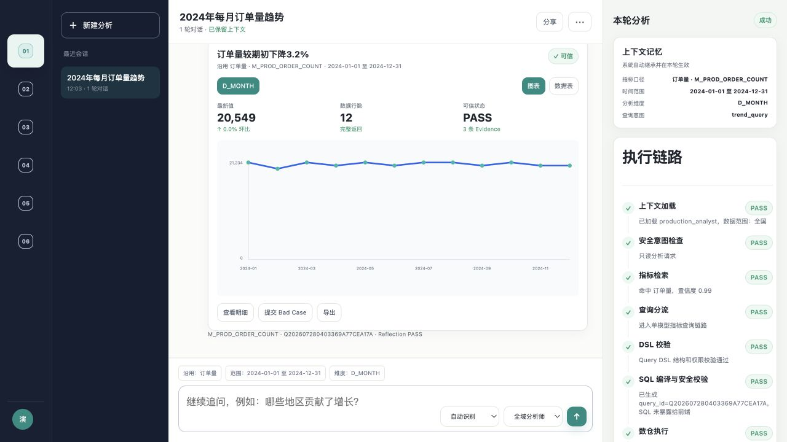
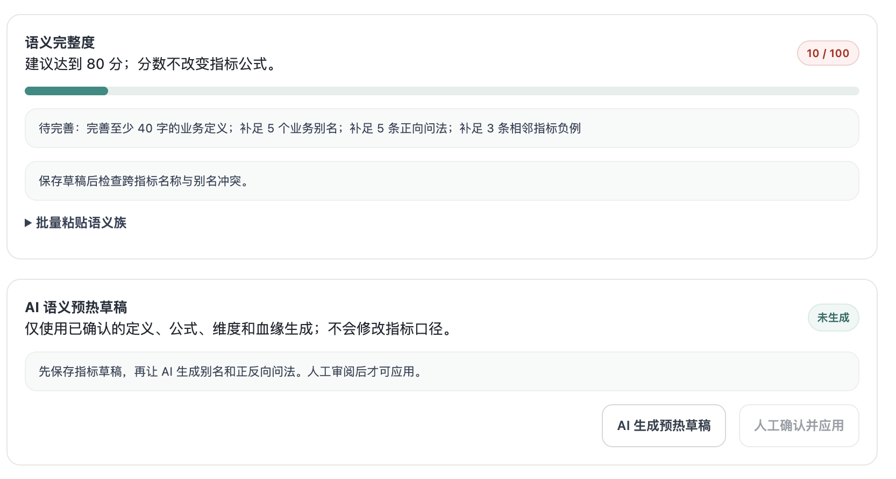
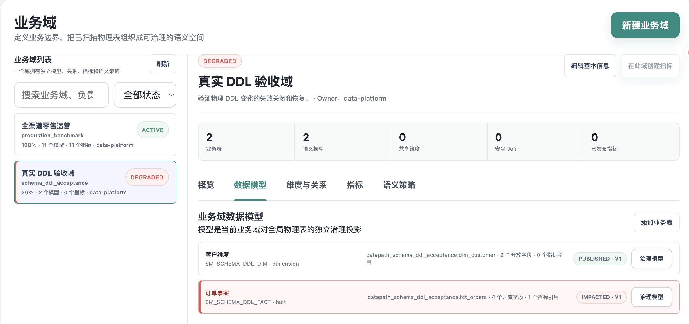
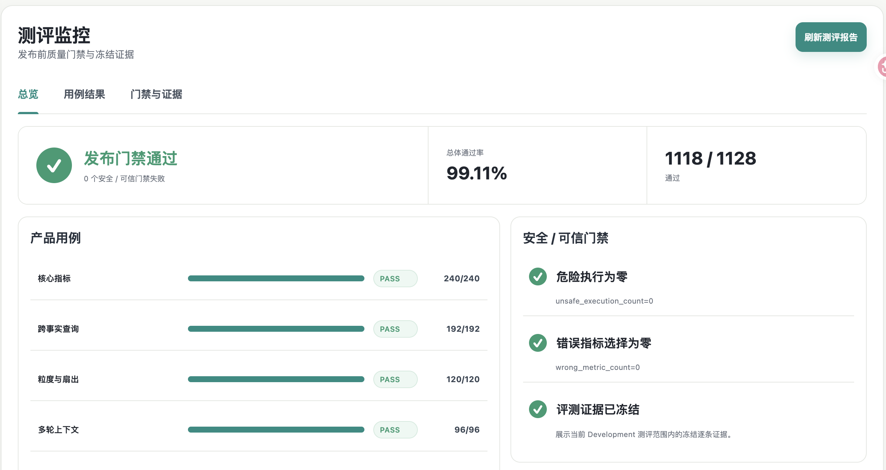

# DataPath

**面向企业数据场景的可信 ChatBI：让业务用户自然语言问数，让每个答案都经过指标、权限、Join、Schema 与证据校验。**

DataPath 不让大模型自由生成并执行 SQL。AI 负责理解业务表达，确定性系统负责口径与执行边界，在此基础上把 AI 语义预热、可信问数、Schema 影响管理和 Bad Case 回归串成持续演进的数据闭环。

[完整产品介绍（PPT）](document/showcase/完整产品介绍.pptx) ·
[完整产品介绍（PDF）](document/showcase/完整产品介绍.pdf)



## 它解决什么问题

企业问数真正困难的不是“生成一段能运行的 SQL”，而是确保系统始终选对指标、遵守权限、正确关联数据，并在底层结构变化后及时停止错误查询。

DataPath 将这些风险拆成四个产品能力：

| 能力 | 解决的问题 | 产品机制 |
| --- | --- | --- |
| AI 语义预热 | 新业务域缺少问法数据，冷启动慢 | 根据已确认业务事实生成别名、典型问法与反例，人工审核后生效 |
| 可信问数 | SQL 可运行，但指标、权限或 Join 可能错误 | 有限候选裁决 → Query DSL → 确定性校验与编译 → 只读执行 |
| Schema 影响管理 | 删字段、改类型后旧逻辑继续运行 | 自动传播影响，阻断过期模型、关系和指标，复核后重新发布 |
| Bad Case 数据闭环 | 用户点踩后，同类错误反复出现 | 保存错误现场，确认 Golden 契约，回归通过后才能发布修复 |

## DataPath 的不同

### 1. AI 在用户提问前就开始工作

传统问数产品往往等待线上问题暴露后再补充语义。DataPath 在指标发布阶段先生成可审核的语言资产，使新业务域在第一批用户提问前就具备基础语义覆盖。

### 2. 错误会沉淀成可回归的产品资产

反馈不止是一条点赞或点踩记录。DataPath 将问题关联到指标版本、DSL、血缘与结果，由工作人员确认正确契约，并用 Golden 回归防止问题复发。

### 3. 数据结构变化也是产品链路的一部分

真实数据环境持续变化。DataPath 在 Schema 变化发生时传播影响并失败关闭；即使物理字段恢复，也需要负责人复核相关语义资产后重新发布。

### 4. 概率能力与确定性边界分工

AI 处理自然语言理解和有限候选消歧；指标口径、权限、Join、SQL 编译与执行由确定性系统负责。安全性不依赖模型“自觉遵守”提示词。

## 已实现结果

| 项目资产 | 当前规模 |
| --- | ---: |
| 模拟生产数据 | 42 张表、442 个字段、约 792.5 万行 |
| 语义治理资产 | 11 个语义模型、10 个共享维度、6 条安全 Join |
| 指标资产 | 9 个单事实指标、2 个跨事实指标 |
| 语言资产 | 62 个审核别名、11 份语义档案、220 条向量 |
| 测评集 | 2,350 条 |
| Development 严格通过 | 1,118 / 1,128（99.11%） |

测评覆盖指标选择、查询形态、Oracle 结果、权限、安全、Evidence 与 Reflection；当前危险执行和错误指标选择均为 0。

[查看指标体系与测评方法 →](document/showcase/03-metrics-and-evaluation.md)

## 产品界面

<table>
  <tr>
    <th width="50%">AI 语义预热</th>
    <th width="50%">Schema 影响管理</th>
  </tr>
  <tr>
    <td width="50%"></td>
    <td width="50%"></td>
  </tr>
  <tr>
    <th width="50%">Bad Case 工作台</th>
    <th width="50%">测评监控</th>
  </tr>
  <tr>
    <td width="50%"></td>
    <td width="50%"></td>
  </tr>
</table>

## 技术架构

```text
业务用户 / 数据团队
        ↓
问数工作台 / 指标中心 / 质量运营
        ↓
FastAPI：权限、治理状态、DSL、Evidence、闭环门禁
        ↓
PostgreSQL：语义资产与版本    ClickHouse：只读分析执行
        ↓
Dify + DeepSeek：有限候选判断    BGE + pgvector：混合召回
```

## 本地运行

需要 Python 3.12、Docker Desktop 和 `uv`。

```bash
cp .env.example .env
uv sync
docker compose up -d
uv run alembic upgrade head
uv run python -m scripts.build_production_like_warehouse --profile production
uv run python -m scripts.grant_production_benchmark_access
NO_PROXY=127.0.0.1,localhost uv run uvicorn app.main:app \
  --host 127.0.0.1 --port 8000
```

打开 [http://127.0.0.1:8000/](http://127.0.0.1:8000/)。

### 验证

```bash
uv run pytest
uv run python -m scripts.validate_contracts
NO_PROXY=127.0.0.1,localhost uv run python -m scripts.smoke_chatbi_api
```

## 延伸文档

以下材料分别展开产品定义、方案判断、流程设计和质量机制：

| 类型 | 文档 | 内容 |
| --- | --- | --- |
| 产品全貌 | [完整产品介绍（PPT）](document/showcase/完整产品介绍.pptx) · [PDF](document/showcase/完整产品介绍.pdf) | 产品定位、功能链路、真实界面、产品特点与结果 |
| 产品定义 | [产品总体 PRD](document/showcase/09-product-prd.md) | 目标用户、产品范围、功能规则、异常状态与版本验收 |
| 市场判断 | [竞品分析](document/showcase/05-competitive-analysis.md) | 竞争格局、能力边界、差异化切口与建设优先级 |
| 流程设计 | [产品流程图](document/showcase/06-product-flows.md) | 产品全链路及不同角色的操作流程 |
| 权限治理 | [权限设计](document/showcase/08-permission-design.md) | 角色、资源、数据范围、服务端门禁与审计 |
| 数据验证 | [事件埋点方案](document/showcase/07-event-tracking-plan.md) | 事件字典、核心漏斗、指标口径与数据质量 |
| 专题需求 | [Bad Case 自助闭环 PRD](document/showcase/02-badcase-closure-prd.md) | 状态机、功能规则、归因、回归与验收标准 |
| 质量体系 | [指标体系与测评方法](document/showcase/03-metrics-and-evaluation.md) | 北极星指标、质量指标、评测集与结果判断 |

---

项目当前未声明开源许可证。
