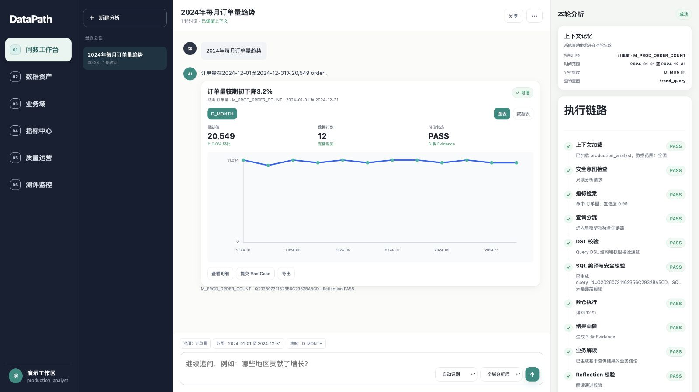
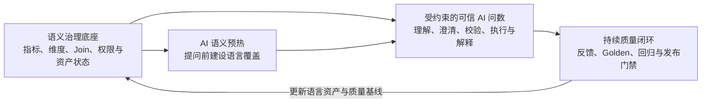

<p align="center">
  
</p>

# DataPath

**面向企业数据场景的可信 AI 问数产品：以语义治理为底座，通过受约束的问数链路生成可验证、可追溯的数据答案，并用 AI 语义预热和持续质量闭环提升产品质量。**

[产品概览](document/showcase2.0/01-datapath-product-overview.md)



## 为什么需要 DataPath

企业自然语言问数真正困难的不是生成一段可以运行的 SQL，而是让系统在真实业务环境中持续返回正确、合规且可以解释的数据答案。

普通 ChatBI 的产品链路通常存在三个断点：

| 阶段 | 关键问题 |
| --- | --- |
| 用户提问前 | 指标已经建设，但别名、真实问法和相邻指标边界覆盖不足 |
| 系统回答时 | 模型可能选错指标、忽略歧义，或在权限和资产异常时继续回答 |
| 用户反馈后 | 点踩和问题工单没有转化为可以持续运行的验证机制 |

DataPath 的整体解法是：**一个底座、一条主线、两个关键创新。**

## 产品全景



### 一个底座：语义治理

语义治理定义 AI 可以查询什么、如何计算以及何时不可用。DataPath 将业务域、语义模型、指标口径、维度、Join、权限、Schema 和资产版本组织为可执行的治理资产，为问数链路提供确定性边界。

这部分是企业级 AI 问数成立所必需的基础能力，不作为独立创新点展开。

### 一条主线：受约束的可信 AI 问数

DataPath 不让大模型自由生成并执行 SQL。AI 负责理解业务表达、处理上下文并在有限候选中裁决；确定性系统负责指标口径、权限、Join、查询结构、SQL 编译和只读执行。

```text
自然语言提问
→ 加载身份与会话上下文
→ 召回已治理且有权访问的指标
→ 有限候选裁决
→ 澄清 / 拒绝 / 继续
→ 生成 Query DSL
→ 确定性校验与编译
→ 只读执行
→ 返回答案、图表与 Evidence
```

每次问数必须进入明确的产品终态：

| 终态 | 含义 |
| --- | --- |
| `SUCCESS` | 指标、权限、查询结构、执行和 Evidence 均通过 |
| `CLARIFY` | 存在合理歧义或缺少必要条件，需要用户确认 |
| `REJECT` | 问题超出已治理范围或当前产品能力 |
| `BLOCKED` | 权限、Join、资产状态或安全门禁不允许执行 |

不确定时澄清，超出范围时拒绝，风险状态下失败关闭。产品目标不是回答所有问题，而是只交付通过约束和证据校验的答案。

[查看受约束的可信 AI 问数 PRD](document/showcase2.0/02-constrained-trusted-ai-query-prd.md)

## 关键创新一：AI 语义预热

指标建设完成，并不代表系统已经理解用户会怎样表达。传统方式通常在问数错误发生后补充别名和问法，导致新指标和新业务域存在明显的语言冷启动。

DataPath 将语义建设前移到用户提问之前：

```text
读取已确认的指标事实
→ 诊断语义完整度
→ AI 生成别名、正向问法与反例草稿
→ 人工审核
→ 冲突检查
→ 应用到检索资产
```

AI 只扩展语言表达，不修改指标公式、聚合方式和业务口径；未经人工审核的内容不能进入线上问数。

[查看 AI 语义预热 PRD](document/showcase2.0/03-ai-semantic-preheat-prd.md)

## 关键创新二：持续质量闭环

点赞、点踩只能表达用户态度，不能定义正确答案，也不能证明问题已经解决。DataPath 将用户反馈与原始 Query Run、指标版本、Query DSL、结果和 Evidence 绑定，经人工确认后形成可执行的 Golden 契约。

```text
用户提交反馈
→ 冻结原始运行现场
→ 确认有效 Bad Case
→ 分层归因
→ 建立人工 Golden 契约
→ 修复对应产品资产
→ 运行受影响回归
→ 通过发布门禁
→ 发布并监控复发
```

修复不能只让当前问题恢复正常。只有当前 Golden、受影响回归和安全门禁全部通过，新版本才允许发布。

[查看持续质量闭环 PRD](document/showcase2.0/04-continuous-quality-loop-prd.md)

## 一次可信问数如何完成

以“2024 年每月订单量趋势”为例：

1. 系统加载用户身份、业务域和会话上下文；
2. 在已发布且有权访问的指标中召回有限候选；
3. 候选存在歧义时要求用户澄清，不猜测业务意图；
4. 候选明确后生成受约束的 Query DSL；
5. 服务端校验指标、维度、时间、Join、权限和资产状态；
6. 校验通过后确定性编译参数化 SQL，并在只读连接中执行；
7. 页面返回趋势图，同时展示指标版本、查询范围和 Evidence；
8. 用户发现问题时，可以将本次运行直接提交为反馈，进入质量闭环。

这条链路中，AI 输出不能直接越过服务端规则进入数据执行。

## 已实现范围

- 数据源扫描、业务域、语义模型、共享维度和安全 Join；
- 指标定义、版本、发布状态、权限和血缘；
- AI 语义完整度诊断、预热草稿和人工审核；
- 自然语言问数、多轮上下文、有限候选裁决和澄清；
- Query DSL、权限与安全校验、确定性 SQL 编译和只读执行；
- 结果图表、Evidence、Reflection 和四类产品终态；
- 用户反馈、Bad Case、Golden 契约、回归测评与发布门禁；
- 测评总览、分类结果和安全门禁证据。

## 测评与验证

| 项目资产 | 当前规模 |
| --- | ---: |
| 模拟生产数据 | 42 张表、442 个字段、约 792.5 万行 |
| 语义治理资产 | 11 个语义模型、10 个共享维度、6 条安全 Join |
| 指标资产 | 9 个单事实指标、2 个跨事实指标 |
| 语言资产 | 62 个审核别名、11 份语义档案、220 条向量 |
| 测评集 | 2,350 条 |
| Development 严格通过 | 1,118 / 1,128（99.11%） |

测评覆盖指标选择、跨事实查询、查询粒度与扇出、多轮上下文、权限、安全、Evidence 和 Reflection。当前 Development 测评中的错误指标选择和危险执行均为 0。

这些结果用于验证受约束问数链路、确定性门禁和质量机制是否按照产品规则工作。

## 产品界面

| 产品部分 | 页面 | 主要功能 |
| --- | --- | --- |
| 语义治理底座 | 数据资产 | 配置数据源、扫描物理结构、查看 Schema 变化及影响范围 |
| 语义治理底座 | 业务域 | 划分业务边界，选择业务表，维护域内模型、开放字段、维度和语义策略 |
| 语义治理底座 | Join 治理 | 发现、验证并发布模型关系，控制跨事实查询和 Fanout 风险 |
| 语义治理底座 | 指标中心 | 检索指标，查看口径、公式、版本、维度、血缘和发布状态 |
| 语义治理底座 | 指标治理与发布 | 创建指标草稿，配置公式与维度，完成 AI 语义预热、冲突检查和版本发布 |
| 可信 AI 问数 | 问数工作台 | 自然语言提问、多轮追问、指标澄清、结果图表、数据表和上下文记忆 |
| 持续质量闭环 | 查询漏斗与运行指标 | 查看成功、澄清、拒绝和阻断分布，以及执行、Reflection、延迟和采用情况 |
| 持续质量闭环 | Bad Case 工作台 | 保存原运行现场，确认问题、分层归因并创建修复任务 |
| 持续质量闭环 | Golden 与回归 | 将确认问题沉淀为 Golden，重放目标用例和相关回归 |
| 持续质量闭环 | 测评监控 | 查看分类结果、安全门禁、冻结证据和发布状态 |

[查看产品页面截图](document/showcase2.0/06-product-page-gallery.md)

## 核心作品集文档

| 阅读目的 | 文档 |
| --- | --- |
| 理解整体产品 | [DataPath 产品概览](document/showcase2.0/01-datapath-product-overview.md) |
| 理解核心使用链路 | [受约束的可信 AI 问数 PRD](document/showcase2.0/02-constrained-trusted-ai-query-prd.md) |
| 理解提问前创新 | [AI 语义预热 PRD](document/showcase2.0/03-ai-semantic-preheat-prd.md) |
| 理解反馈后创新 | [持续质量闭环 PRD](document/showcase2.0/04-continuous-quality-loop-prd.md) |
| 理解竞品判断与产品取舍 | [竞品研究与产品决策](document/showcase2.0/05-competitive-research-and-product-decisions.md) |
| 查看产品页面 | [产品页面截图](document/showcase2.0/06-product-page-gallery.md) |

## 技术架构

```text
业务用户 / 数据团队
        ↓
问数工作台 / 指标中心 / 质量运营
        ↓
FastAPI：身份、权限、治理状态、Query DSL、Evidence、质量门禁
        ↓
PostgreSQL：语义资产与版本    ClickHouse：只读分析执行
        ↓
Dify + DeepSeek：有限候选判断    BGE + pgvector：混合召回
```

## 本地运行

需要 Python 3.12、Docker Desktop 和 `uv`。

```bash
cp .env.example .env
uv sync
docker compose up -d
uv run alembic upgrade head
uv run python -m scripts.build_production_like_warehouse --profile production
uv run python -m scripts.grant_production_benchmark_access
NO_PROXY=127.0.0.1,localhost uv run uvicorn app.main:app \
  --host 127.0.0.1 --port 8000
```

打开 [http://127.0.0.1:8000/](http://127.0.0.1:8000/)。

### 验证

```bash
uv run pytest
uv run python -m scripts.validate_contracts
NO_PROXY=127.0.0.1,localhost uv run python -m scripts.smoke_chatbi_api
```

---

项目当前未声明开源许可证。
