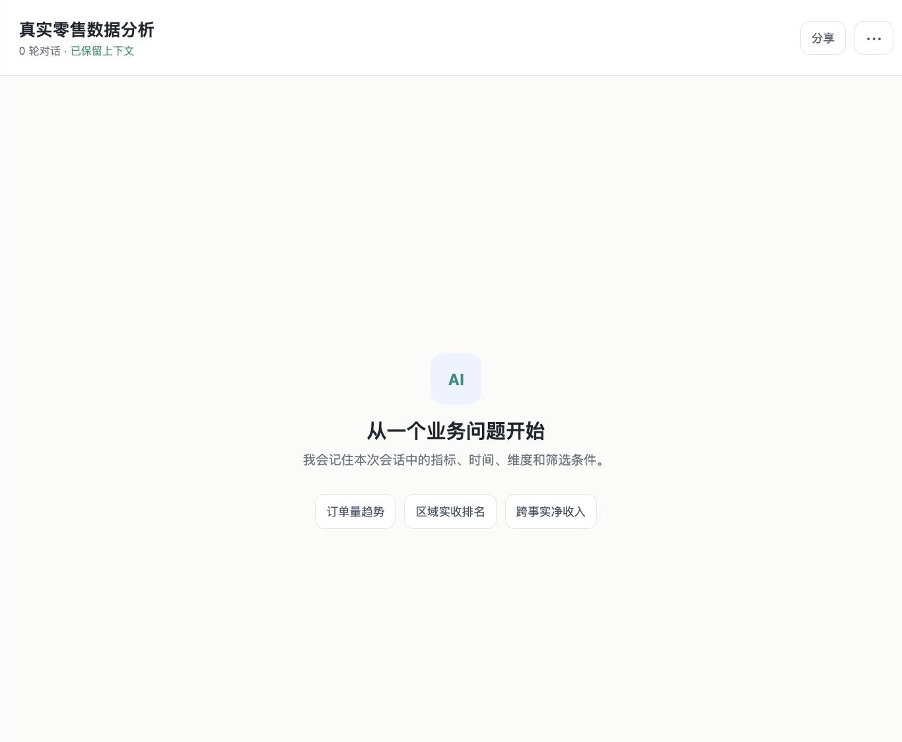
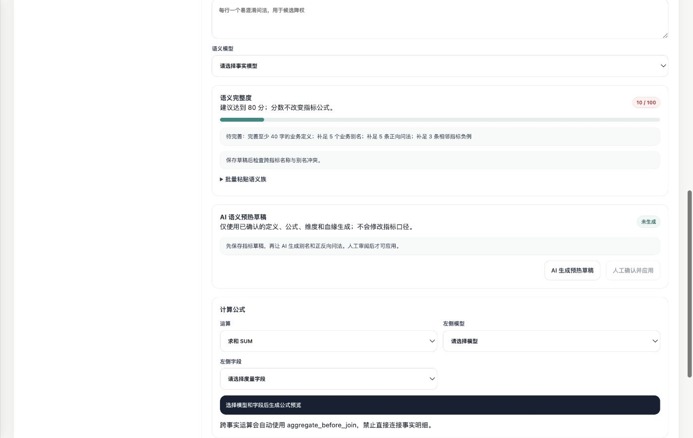
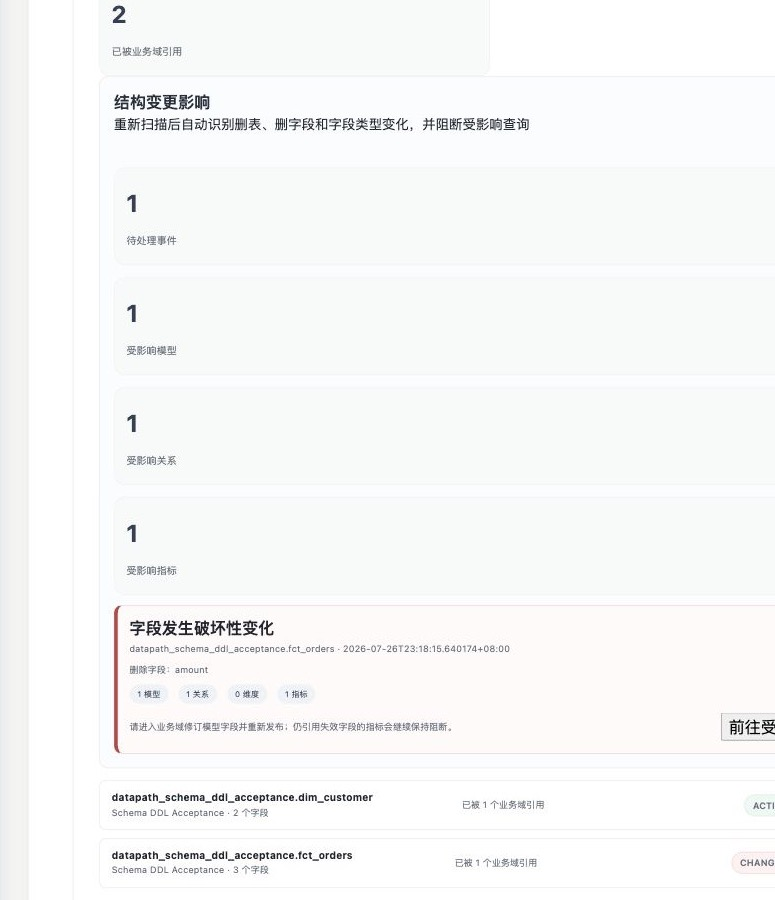
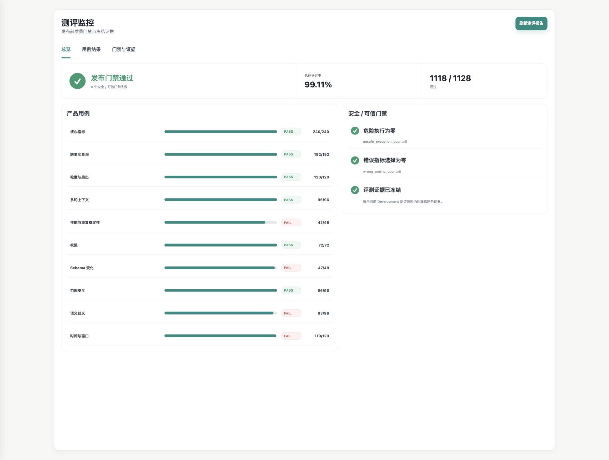

# DataPath

**让业务用户放心问数的可信 ChatBI。**

DataPath 将 AI 的语言理解能力与企业数据的确定性边界分开：AI 负责理解问题、扩展业务表达和生成解读；系统负责指标口径、权限、表关系、查询执行和发布门禁。

业务用户可以用自然语言完成临时分析，数据团队则通过同一产品治理业务事实、处理结构变化，并将真实错误沉淀为持续回归的产品资产。

> [查看 AI 产品经理作品集](document/showcase/DataPath-AI产品经理作品集.pptx) ·
> [阅读项目 Case Study](document/showcase/01-product-case-study.md) ·
> [查看完整文档](document/README.md)

## 一分钟看懂 DataPath

| 问题 | DataPath 的处理方式 |
| --- | --- |
| 业务用户不知道表名和字段名 | 使用自然语言描述指标、时间、维度和筛选条件 |
| 相似指标容易选错 | 从已发布语义资产中混合召回，模型只裁决有限候选 |
| SQL 能运行但口径可能错误 | 先生成受约束 DSL，再由后端确定性校验和编译 |
| 多表关联可能造成数据放大 | Join Graph 治理基数、关联键和 Fanout 策略 |
| Prompt 无法保障权限 | 身份、业务域和数据范围由后端逐次校验 |
| 数据库结构发生变化 | 自动识别影响并阻断过期模型、关系和指标 |
| 用户反馈后问题反复出现 | Bad Case 形成 Golden，回归通过后才能发布新版本 |

## 产品如何工作

```text
连接只读数据源
→ 扫描表、字段和类型
→ 建立业务域与语义模型
→ 发布维度、Join 和指标
→ AI 生成语义预热草稿，工作人员审核应用
→ 用户用自然语言提问
→ 指标召回与有限候选裁决
→ DSL、权限、Schema、成本和安全门禁
→ 确定性编译并只读执行
→ Evidence、Reflection 与图表
→ 用户反馈、Bad Case、Golden 回归和版本发布
```

## 已实现的产品能力

### 1. 数据与业务事实治理

- 保存只读数据源连接并扫描物理结构；
- 在业务域中确认事实表、维度表、粒度、业务键和默认时间；
- 管理共享维度、开放字段和业务负责人；
- 将 Join 的关联键、基数、类型、Fanout 和发布状态作为治理资产；
- 管理指标定义、公式、单位、血缘、可用维度和不可变版本。

### 2. AI 语义预热

- 根据已确认的指标定义、公式、维度和血缘生成语义草稿；
- 批量生成别名、典型问法和容易混淆的反例；
- 计算语义完整度，提示别名、正例和反例缺口；
- 人工确认后才可应用，不允许 AI 修改计算口径；
- 使用名称、别名、中文词法、BM25、正反例和本地向量构建混合召回。

### 3. 可信在线问数

- 支持多轮追问以及指标、时间、维度和筛选条件继承；
- 大模型只能选择后端提供的签名候选，或返回澄清与拒绝；
- 自然语言先转化为 Query DSL，不直接执行模型生成的自由 SQL；
- 后端检查指标版本、维度、过滤、Join、权限、Schema 和查询成本；
- 查询结果形成结构化 Evidence，Reflection 检查解读是否得到证据支持；
- 使用 `SUCCESS`、`CLARIFY`、`REJECT`、`BLOCKED` 表达四类产品终态。

### 4. 上线后的质量运营

- 识别删表、删字段和字段类型变化；
- 将影响传播到业务域、语义模型、关系和指标，并自动阻断查询；
- 用户反馈自动关联原指标版本、DSL、血缘和结果摘要；
- 工作人员确认正确终态、指标和结果，形成 Golden 契约；
- 修复发布前回归当前问题与受影响 Golden；
- 通过测评监控查看分类结果、安全门禁和冻结证据。

## 核心特点

### AI 预热解决冷启动

新业务域不必等待大量用户反馈后再逐条补关键词。系统先根据已确认的业务事实生成可审核的语言资产，让第一批用户提问前就具备基础语义覆盖。

### Bad Case 闭环积累企业能力

点赞和点踩只代表态度，不能定义正确答案。DataPath 保存错误现场，由工作人员确认正确契约，再通过受影响回归和版本门禁防止问题复发。

### Schema 影响管理接住真实变化

真实数据环境不会保持静态。字段删除或类型变化发生后，DataPath 会传播影响并失败关闭；即使物理字段恢复，也需要负责人复核并重新发布。

### 概率模型与确定性系统分工

AI 处理自然语言理解和有限候选消歧；指标口径、权限、Join、SQL 编译和查询执行由确定性系统负责。产品不依赖模型“自觉遵守”安全边界。

## 产品界面

### 问数工作台

业务用户围绕真实零售数据提问、追问，并查看上下文和执行状态。



### AI 语义预热

指标管理员查看语义完整度，生成预热草稿，并在人工审阅后应用。



### Schema 影响管理

重新扫描识别破坏性变化，并展示受影响模型、关系和指标。



### Bad Case 工作台

反馈进入问题队列，关联执行现场，并被转化为可验证的修复任务。


### 测评监控

同时展示总体严格通过率、分类结果以及不可被平均分抵消的安全门禁。



## 当前项目结果

### 产品资产

- 42 张数据表、442 个字段、约 792.5 万行模拟生产数据；
- 11 个语义模型、10 个共享维度；
- 6 条已发布安全 Join；
- 9 个单事实指标、2 个跨事实指标；
- 62 个审核别名、11 份语义档案和 220 条向量。

### 测评

| 数据集 | 数量 | 用途 |
| --- | ---: | --- |
| Development | 1,128 | 功能开发与当前能力测评 |
| Regression | 470 | 修复后的稳定性回归 |
| Locked | 752 | 冻结场景与历史能力验证 |
| 合计 | 2,350 | — |

当前 Development 测评结果为 **1,118 / 1,128，严格通过率 99.11%**。测评同时检查指标选择、查询形态、Oracle 结果、权限、安全、Evidence 和 Reflection；危险执行与错误指标选择为 0。

## 作品集文档

| 文档 | 内容 |
| --- | --- |
| [AI 产品经理作品集](document/showcase/DataPath-AI产品经理作品集.pptx) | 完整产品功能、运行证据、项目特点与结果 |
| [产品 Case Study](document/showcase/01-product-case-study.md) | 用户问题、产品目标、方案、取舍和项目结果 |
| [Bad Case 自助闭环 PRD](document/showcase/02-badcase-closure-prd.md) | 用户流程、状态机、功能规则与验收标准 |
| [指标体系与测评方法](document/showcase/03-metrics-and-evaluation.md) | 北极星指标、质量指标、评测集和结果判断 |
| [核心产品决策](document/showcase/04-product-decisions.md) | Text-to-SQL、人工治理、失败关闭和 Golden 等关键取舍 |

完整索引见 [项目展示目录](document/showcase/README.md)。

## 技术架构

| 层级 | 主要职责 |
| --- | --- |
| 前端 | 问数工作台、数据接入、业务域、指标中心、质量运营和测评监控 |
| FastAPI | 产品 API、权限、治理状态、DSL 校验、编译、Evidence 和闭环门禁 |
| PostgreSQL | 治理元数据、版本、语义资产、向量、会话、反馈和审计 |
| ClickHouse | 模拟生产分析仓库与只读查询执行 |
| Dify + DeepSeek | 受约束的候选判断和工作流编排 |
| BGE + pgvector | 本地语义向量与混合召回 |

## 本地启动

环境要求：

- Python 3.12；
- Docker Desktop；
- `uv`；
- 已导入并发布的本地 Dify Workflow。

```bash
cp .env.example .env
uv sync
docker compose up -d
uv run alembic upgrade head
uv run python -m scripts.build_production_like_warehouse --profile production
uv run python -m scripts.grant_production_benchmark_access
NO_PROXY=127.0.0.1,localhost uv run uvicorn app.main:app \
  --host 127.0.0.1 --port 8000
```

打开 [http://127.0.0.1:8000/](http://127.0.0.1:8000/)。

## 0→1 冷启动复现

以下命令会清空 `production_benchmark` 的治理和历史闭环状态，仅适用于本地验证环境：

```bash
uv run python -m scripts.reset_zero_to_one --confirm ZERO_TO_ONE_RESET
uv run python -m scripts.bootstrap_zero_to_one_governance
uv run python -m scripts.apply_zero_to_one_ai_preheat
uv run python -m scripts.freeze_zero_to_one_preheat
```

AI 预热只读取已发布业务元数据，不能修改公式、单位、血缘、权限或发布状态。

## 验证

```bash
uv run pytest
uv run python -m scripts.validate_contracts
NO_PROXY=127.0.0.1,localhost uv run python -m scripts.smoke_chatbi_api
```

完整 Dify 评测：

```bash
uv run python -m scripts.evaluate_dify_preheat \
  --run-label <new-report-name> \
  --capability-profile cross_fact_v1
```

## 项目目录

```text
app/                  FastAPI、治理、查询和质量闭环
frontend/             产品前端
data/                 语义预热与评测资产
reports/              测评和 Schema 验收证据
scripts/              环境构建、治理、预热和评测脚本
document/showcase/    对外作品集文档
```

## 安全边界

- 只执行已发布指标、已注册维度和已发布关系；
- 不接受任意 SQL、DDL/DML 或自由 Join；
- 身份与权限在每次请求中重新加载；
- AI 无权修改权限或执行令牌；
- ClickHouse 使用只读查询账号；
- 本地默认密码和开发环境放行规则不能直接用于生产环境。

项目当前未声明开源许可证。
