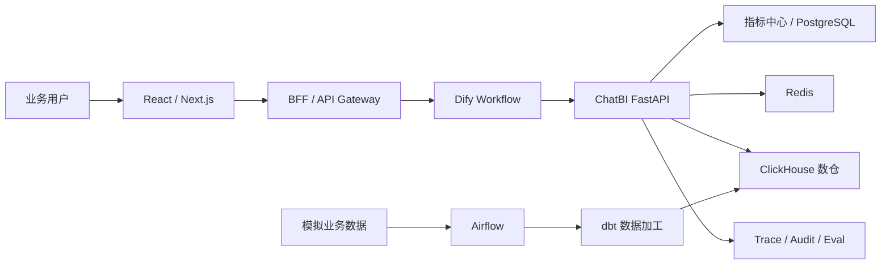

# DataPath：独立开发执行方案

> 项目定位：AI 产品经理作品集，同时提供可运行、可验证的工程闭环。
>
> 当前基础：已有可导入的 Dify ChatBI Workflow DSL，但其依赖的 7 个 `/api/chatbi/*` 接口、指标平台和数仓尚未实现。
>
> 方案原则：平台能力通用，演示场景具体；优先证明产品判断和闭环效果，不以堆叠大数据组件为目标。

## 1. 项目一句话定义

DataPath 是面向数据运营和数据分析师的可信 ChatBI Copilot：用户用自然语言提出查数和分析需求，系统基于统一指标口径生成语义查询，经确定性后端校验、编译并执行，再返回可追溯的数据、图表和业务解读。

核心价值不是“让大模型写 SQL”，而是：

1. 降低业务人员取数门槛。
2. 缩短从需求提出到获得数据结论的时间。
3. 用指标中心减少口径不一致。
4. 用 DSL、SQL Guard 和 Evidence 提升结果可信度。
5. 通过元数据配置支持不同业务域，避免为每个场景重做 AI 工作流。

## 2. 为什么适合作为 AI 产品经理作品集

项目应重点证明以下能力：

| AI 产品经理能力 | 项目中的证据 |
| --- | --- |
| 用户与场景抽象 | 将销售、投放等需求抽象为指标、维度、筛选、时间和比较意图 |
| AI 与确定性系统分工 | LLM 负责语言理解，后端负责指标、权限、SQL 和数值校验 |
| 产品范围控制 | 首版只做只读聚合分析，不做自动写回和复杂实时计算 |
| AI 质量管理 | 黄金问题集、指标识别率、SQL 正确率、Evidence Coverage、幻觉率 |
| 异常与降级设计 | 澄清、拒绝、审批、Data-only 等状态机 |
| 数据产品理解 | 数仓分层、指标口径、语义模型、血缘、数据质量和新鲜度 |
| 跨团队协作表达 | PRD、API 契约、状态图、验收标准和上线清单 |
| 迭代能力 | 用户反馈、Badcase 分类、回归评测和版本记录 |

面试时不应将项目描述为“完整替代企业 BI 平台”，而应描述为：完成了生产型 ChatBI 的核心闭环，并明确给出从作品集 MVP 演进到企业内部平台的路径。

## 3. 目标用户和核心任务

### 3.1 目标用户

- 业务运营、增长运营、广告投放运营。
- 产品、市场、销售和业务管理者。
- 需要频繁响应业务取数需求的数据分析师。

### 3.2 核心任务

- 查询某个时间范围的业务指标。
- 按地区、渠道、商品等维度拆分。
- 做同比、环比、趋势和 TopN 分析。
- 了解异常发生在哪里、哪些维度贡献最大。
- 查看指标定义、数据更新时间和计算口径。
- 在存在歧义时选择正确指标，而不是接受模型猜测。

### 3.3 首版非目标

- 不支持用户或 AI 提交任意 SQL。
- 不支持数据修改、营销触达、预算调整等写操作。
- 不建设完整企业 SSO、RBAC 和行列级权限后台。
- 不建设实时流计算平台。
- 不同时实现多种真实数仓连接器。
- 不追求覆盖所有行业指标。
- 不用 Spark、Kafka、Iceberg、Trino 等组件装饰架构。

## 4. 产品通用性如何证明

平台不能依靠“什么场景都可以用”这一句口号证明通用性，而应做到：

```text
新增业务域
→ 注册语义模型和表关系
→ 配置维度、指标、公式和别名
→ 同步检索索引
→ 自动进入原有 Dify + DSL + Compiler 链路
```

首版选择两个演示业务域：

### 4.1 电商经营域

事实数据：订单、订单明细、支付、退款。

维度数据：日期、商品、品类、用户、地区、渠道。

核心指标：GMV、销售额、订单量、客单价、支付转化率、退款率、毛利额、毛利率、新客数和复购率。

### 4.2 广告投放域

事实数据：曝光、点击、消耗、转化和归因订单。

维度数据：日期、平台、账户、广告计划、素材和渠道。

核心指标：曝光量、点击量、CTR、CPC、CPM、转化率、CPA、ROI 和 ROAS。

两个业务域应共用同一套 Query DSL、Validator、Compiler、Profiler 和 Dify Workflow。新增投放域时不修改核心链路，是通用性的关键验收证据。

## 5. 产品信息架构

首版前端建议包含六个页面：

1. **AI 取数**：对话输入、澄清选择、执行进度、结果表格、图表和解读。
2. **指标市场**：按业务域浏览和搜索指标。
3. **指标详情**：定义、公式、单位、维度、来源、版本、Owner 和示例问题。
4. **指标管理**：创建、编辑、校验和发布指标。
5. **查询历史**：查看问题、DSL、状态、耗时、数据量和结果。
6. **反馈与评测**：提交结果反馈，展示黄金集运行和 Badcase 分类。

不单独建设复杂数仓管理 UI。数仓表和演示数据通过迁移、dbt 项目及管理 API 维护即可。

## 6. 系统架构



### 6.1 技术选型

| 模块 | 首版选型 | 选择理由 |
| --- | --- | --- |
| 前端 | React 或 Next.js + ECharts | 支持对话、管理后台和图表 |
| AI 编排 | Dify | 主链编排骨架已完成，适合展示 AI 编排与人工介入 |
| 业务后端 | FastAPI + Pydantic | 适合强类型接口、JSON Schema 和 AI 服务集成 |
| 指标元数据库 | PostgreSQL | 适合指标版本、关系和审计事务 |
| 数仓 | ClickHouse | 分析型查询能力强，单机 Docker 也可演示 |
| 数据加工 | dbt Core | 模型、测试、文档和血缘可版本化 |
| 调度 | Airflow | 演示批量数据任务、重跑、依赖和监控 |
| 缓存 | Redis | 查询状态、幂等、缓存和限流 |
| 监控 | OpenTelemetry + Prometheus/Grafana | 记录链路、耗时和错误 |
| 本地部署 | Docker Compose | 一键启动、便于作品集评审 |

### 6.2 控制平面与查询平面

控制平面负责：

- 数据源、业务域和语义模型。
- 指标、维度、别名、版本和状态。
- 质量规则、血缘和黄金评测集。

在线查询平面负责：

- 指标解析和歧义处理。
- Query DSL 校验。
- SQL 编译、Guard 和成本控制。
- 数仓执行、结果画像和 Evidence。
- AI 解读、Reflection 和降级。

两个平面分开，避免指标配置逻辑侵入每一次在线查询。

## 7. 数仓设计

### 7.1 首版分层

```text
ODS：原始订单、广告事件等模拟业务数据
DWD：清洗后的订单、支付、退款、曝光、点击和转化事实
DWS：按日、渠道、商品、广告计划等预聚合数据
ADS：可选，仅用于固定展示看板
```

不要求每一层都机械复制数据。只有能解释其业务价值、性能价值或数据质量价值时才新增模型。

### 7.2 数仓接口边界

ChatBI 不直接接受 SQL，应通过 `WarehouseAdapter`：

```text
WarehouseAdapter
├── explain(compiled_query)
├── execute(execution_token)
├── cancel(query_id)
├── get_status(query_id)
└── fetch_result(result_ref)
```

首版仅实现 `ClickHouseAdapter`。Query DSL 不包含 ClickHouse 物理表名和函数，从而保留未来扩展其他数仓的可能。

### 7.3 模拟数据要求

- 时间跨度至少 12 个月。
- 保留周末、节假日、季节性和活动峰值。
- 植入可解释异常，如某渠道成本暴涨或某品类退款率升高。
- 订单、退款、广告转化之间保持主外键和金额一致性。
- 数据生成脚本固定随机种子，确保评测结果可复现。

建议生成百万级明细，而不是仅放几十行 CSV。规模应足以展示聚合、Limit、缓存和查询性能，但不追求“大数据”标签。

## 8. 指标平台设计

### 8.1 核心实体

```text
business_domain
data_source
semantic_model
physical_table
physical_field
dimension
metric
metric_version
metric_alias
metric_dimension_relation
model_join_relation
data_quality_rule
golden_question
query_run
feedback
```

### 8.2 指标定义最小字段

- `metric_id`：稳定业务 ID。
- `metric_version`：不可变版本号。
- `name`、`aliases`、`description`。
- `business_domain`、`metric_type`、`unit`。
- `aggregation` 和确定性公式表达式。
- `semantic_model_id` 和默认时间字段。
- 允许的维度、过滤字段和枚举。
- 发布状态、Owner 和更新时间。
- 来源表字段与 Join 路径。

禁止直接把自由 SQL 作为指标定义。可以设计受限表达式 AST，例如：

```json
{
  "operator": "divide",
  "numerator": {"aggregation": "sum", "field_id": "gross_profit"},
  "denominator": {"aggregation": "sum", "field_id": "revenue"},
  "zero_policy": "null"
}
```

### 8.3 指标 API

管理与发现：

```text
GET    /api/metrics
POST   /api/metrics
GET    /api/metrics/{metric_id}
PUT    /api/metrics/{metric_id}
POST   /api/metrics/{metric_id}/versions
POST   /api/metrics/{metric_id}/publish
POST   /api/metrics/search
GET    /api/metrics/{metric_id}/lineage
GET    /api/dimensions
GET    /api/semantic-models
```

供非 AI 产品直接消费：

```text
POST   /api/metrics/query
POST   /api/metrics/validate-query
```

Dify 专用：

```text
POST   /api/chatbi/metrics/retrieve
POST   /api/chatbi/dsl/validate
```

`/api/metrics/query` 是重要作品集能力：它证明指标平台不是 Dify 的附属配置，而是可被报表、BI 和其他业务系统复用的独立服务。

## 9. ChatBI 后端接口

必须实现现有 Workflow 依赖的七个接口：

| 接口 | 职责 |
| --- | --- |
| `/api/chatbi/context/load` | 返回演示用户、工作空间和多轮上下文 |
| `/api/chatbi/metrics/retrieve` | 在已发布指标中召回、排序并给出门控状态 |
| `/api/chatbi/dsl/validate` | 校验指标、版本、维度、筛选、时间和 Limit |
| `/api/chatbi/query/compile` | 确定性生成 SQL、Fingerprint 和执行状态 |
| `/api/chatbi/query/execute` | 使用 Query ID 或签名凭证执行只读查询 |
| `/api/chatbi/result/profile` | 生成趋势、比较、异常、贡献度、图表和 Evidence |
| `/api/chatbi/reflection/validate` | 校验 AI 解读中的数字和 Evidence 引用 |

支持接口：

```text
POST /api/chatbi/query/{query_id}/cancel
GET  /api/chatbi/query/{query_id}
GET  /api/chatbi/results/{result_ref}
POST /api/chatbi/feedback
GET  /api/chatbi/evals/runs
POST /api/chatbi/evals/run
```

## 10. 用户与权限策略

首版不建设完整权限系统，但不能删除生产接口边界。

固定演示身份：

```text
workspace_id = demo
operator_id = public_demo_user
role = public_viewer
allowed_domains = [sales, advertising]
```

仍然保留：

- BFF 注入上下文，不让普通输入决定权限。
- ClickHouse 使用只读账号。
- `workspace_id`、`operator_id` 和 `query_id` 写入审计。
- 敏感字段不进入指标平台和 LLM。
- 所有查询强制 Limit、超时和只读 Guard。

项目说明中应诚实标注：当前为公开演示权限模型，生产演进需要 SSO、RBAC、行列级权限和脱敏策略。

## 11. Dify Workflow 必改项

在接入后端的同时修复以下问题：

1. `context_ok=false` 必须立即终止。
2. `need_clarification=true` 必须进入 Human Input。
3. 人工候选选择必须绑定 `metric_id + metric_version`。
4. DSL 的 `CLARIFY` 应允许二次澄清，而不是直接结束。
5. Dify 不应持有可直接执行的完整 SQL。
6. 审批应绑定 Query Fingerprint，并生成短期 Approval Token。
7. Execute 之后增加状态解析和失败门控。
8. 大结果返回 `result_ref`，不把全部数据放入 Dify Prompt。
9. `profile_ok=false` 时进入受控 Data-only 降级。
10. Revision 后决定再次 Reflection 或明确限制为一次修订。
11. 统一所有 End 节点的响应 Envelope。
12. 全链传递 `request_id`、`trace_id`、`query_id`。

首版可不实现真实高风险审批，但审批协议和状态机应保留，并通过模拟高成本查询演示。

## 12. AI 产品评测体系

### 12.1 黄金问题集

建议准备 80～120 条问题：

- 40 条电商经营问题。
- 30 条广告投放问题。
- 10 条多轮追问。
- 10 条指标歧义问题。
- 10 条无权限、无指标、超范围或 Prompt 注入问题。

每条包含：

```text
用户问题
目标指标和版本
目标维度、筛选和时间
期望 DSL
期望结果摘要
允许澄清或拒绝的条件
```

### 12.2 核心指标

| 层级 | 评测指标 |
| --- | --- |
| 指标理解 | Top1 Accuracy、Recall、MRR、错误自动通过率、澄清率 |
| DSL | Structural Match、Validator Pass Rate、字段越权率 |
| SQL | Execution Accuracy、结果一致率、Guard 拦截率 |
| 解读 | 数字一致率、Evidence Coverage、幻觉率、因果越界率 |
| 产品 | 端到端成功率、平均完成时间、人工介入率、用户满意度 |
| 工程 | P50/P95 延迟、错误率、缓存命中率、Token 和单次查询成本 |

### 12.3 Badcase 分类

```text
QUERY_UNDERSTANDING
METRIC_RETRIEVAL
METRIC_AMBIGUITY
DSL_GENERATION
VALIDATION
SQL_COMPILATION
WAREHOUSE_EXECUTION
DATA_QUALITY
INTERPRETATION
REFLECTION
UX
```

每次修改 Prompt、指标别名、检索或规则后都运行回归集，展示版本前后的变化。这比单纯展示一个成功 Demo 更能体现 AI 产品能力。

## 13. 独立开发路线图

以下按每周约 15～20 小时估算。若全职开发，可相应压缩；里程碑完成条件比日期更重要。

### 第 1 周：范围、原型和契约

- 完成 PRD、用户旅程、信息架构和低保真原型。
- 确定两个业务域和 20～30 个首发指标。
- 固化 Query DSL 1.0、共享 Envelope 和错误码。
- 将 Dify 当前缺口转为任务清单。

交付：PRD、原型、架构图、API 草案、指标清单。

### 第 2～3 周：数仓和演示数据

- Docker Compose 启动 PostgreSQL、ClickHouse 和 Redis。
- 编写可复现的模拟数据生成器。
- 建立 ODS/DWD/DWS 模型。
- 加入 dbt 测试、数据新鲜度和异常数据样本。
- Airflow 完成生成、加工、测试和发布任务。

交付：可重建的演示数仓、数据字典和数据质量报告。

### 第 4～5 周：指标平台

- 建立指标、维度、模型、别名和版本表。
- 完成指标 CRUD、搜索、详情和发布 API。
- 完成 `/api/metrics/query`。
- 录入两个业务域的核心指标。
- 展示指标到模型、表和字段的血缘。

交付：独立可用的指标 API 和指标管理页面。

### 第 6～7 周：可信查询后端

- 完成 Context、Retrieval、DSL Validator。
- 完成 ClickHouse SQL Compiler、Guard 和 EXPLAIN。
- 完成 Execute、取消、查询状态和结果引用。
- 加入 Query ID、Fingerprint、幂等和审计。

交付：不用 Dify 也能通过 DSL 安全执行指标查询。

### 第 8 周：结果画像与 Evidence

- 实现同比、环比、趋势、TopN、异常和贡献度。
- 生成推荐图表 Schema。
- 定义强类型 Evidence。
- 实现确定性 Reflection 校验。

交付：查询结果可被 AI 安全解读，并能回溯每个数字。

### 第 9 周：Dify 联调

- 修复 Workflow 的 fail-open 和状态机问题。
- 接通七个 ChatBI 接口。
- 验证 Human Input 暂停和恢复。
- 覆盖 PASS、CLARIFY、REJECT、BLOCK、REVISE 和 DATA_ONLY。

交付：Dify WebApp 端到端运行记录。

### 第 10 周：产品前端

- 完成 AI 取数、指标市场、指标详情和查询历史。
- 展示表格、图表、口径、数据时间和 Query ID。
- 加入复制、导出受控结果和反馈入口。

交付：可连续演示的产品界面。

### 第 11 周：评测和可观测性

- 完成黄金问题集和自动评测命令。
- 建立 Badcase 看板。
- 记录链路耗时、错误、模型 Token 和缓存。
- 进行 Prompt 注入、大查询、超时和非法 DSL 测试。

交付：基线评测报告和一次有数据支撑的迭代报告。

### 第 12 周：作品集包装

- 完善 README、一键启动、架构与部署说明。
- 录制 5～8 分钟演示视频。
- 编写产品复盘、关键决策和生产演进路线。
- 准备面试介绍、问题清单和真实边界说明。

交付：可以交给面试官独立理解和运行的项目包。

## 14. 优先级

### P0：作品集必须完成

- 两个业务域和可复现数仓。
- 20～30 个正式指标。
- 指标管理和标准指标查询 API。
- 7 个 Dify 后端接口。
- DSL Validator、Compiler、Guard 和只读执行。
- 表格、图表、Evidence 和基础 Reflection。
- 黄金问题集、评测报告和 Badcase。
- 一键启动、产品文档和演示视频。

### P1：明显提升完成度

- Airflow + dbt 完整任务链。
- 查询缓存、异步查询、取消和大结果引用。
- 指标血缘和数据新鲜度。
- 模拟审批、审计看板和多轮上下文。
- Prometheus/Grafana 可观测性。

### P2：只写演进方案或有余力再做

- 企业 SSO、RBAC、行列级权限。
- 多租户隔离。
- 第二种真实数仓 Adapter。
- 完整 OpenLineage/OpenMetadata 集成。
- Kubernetes 和高可用集群。
- 实时流数据和自动业务动作。

## 15. 验收标准

### 15.1 产品验收

- 用户能在不知道表结构和 SQL 的情况下完成查询。
- 指标歧义时系统澄清，不擅自猜测。
- 所有结果展示指标口径、时间范围和数据更新时间。
- 相同语义 DSL 的查询结果稳定一致。
- 查询失败时给出可理解的原因和下一步建议。

### 15.2 数据验收

- 首发指标均有定义、公式、单位、维度、版本和血缘。
- 电商和广告域均能通过配置进入同一查询链。
- 黄金问题的 SQL 结果与人工基准一致。
- 空值、除零、退款、跨天和时区场景有明确规则。

### 15.3 AI 验收

- LLM 不能创造指标 ID、物理表字段和 SQL。
- 所有数字结论引用 Evidence ID。
- 无证据的因果结论被降级或拦截。
- 未知指标进入澄清或拒绝状态。
- Prompt 注入不能改变权限、DSL Schema 和查询范围。

### 15.4 工程验收

- 一条命令启动主要依赖。
- 七个 ChatBI 接口均有契约测试。
- Dify 主要分支有端到端测试记录。
- 查询有 Limit、超时、取消、幂等和审计。
- README 明确演示能力与生产未实现能力。

## 16. 演示脚本

建议用五段式演示，而不是只录一次成功问答。

1. **自然语言取数**：查询最近 30 天各渠道销售额及环比。
2. **指标歧义**：询问“毛利”，系统要求选择毛利额或毛利率。
3. **跨业务域**：切换到广告域，查询各广告计划 ROAS，证明主链未修改。
4. **可信解释**：打开指标口径、Evidence、Query ID 和数据血缘。
5. **产品迭代**：展示一条 Badcase 如何进入评测集，以及优化前后的指标变化。

这五段分别证明效率、可靠性、通用性、可追溯性和 AI 产品迭代能力。

## 17. 面试表达建议

推荐叙事：

```text
我发现业务取数的主要矛盾不是不会写 SQL，
而是自然语言存在歧义、指标口径不统一、查询执行存在安全风险，
以及 AI 生成的数据结论难以验证。

因此我没有采用直接 NL2SQL，
而是把系统拆成语言理解、指标中心、语义 DSL、确定性编译、
数仓执行、Evidence 和 Reflection 七层。

我用两个业务域验证了新增场景主要依靠指标和语义模型配置，
并建立黄金问题集评估指标识别、SQL 结果和回答可信度。
```

必须诚实说明：

- 当前是独立开发的公开演示权限模型。
- ClickHouse 是首个 Adapter，不代表已经连接多种企业数仓。
- 模拟数据用于可复现测试，不代表真实业务数据规模。
- 生产级 SSO、多租户、高可用和完整数据治理属于演进路线。

## 18. 独立开发的范围控制规则

出现以下情况时，应优先删除范围而不是延长项目：

- 单个基础设施组件占用超过一周但无法提升核心演示。
- 一个功能无法对应用户价值、产品指标或面试证据。
- 为了“像大厂”引入无法解释其必要性的中间件。
- 同时维护多个数仓或多个前端方案。
- 在黄金问题集尚未建立前投入大量时间优化向量检索。

推荐时间分配：

| 工作类型 | 比例 |
| --- | ---: |
| 可运行产品与接口 | 45% |
| 数据、指标和 AI 评测 | 25% |
| PRD、原型、架构和决策记录 | 20% |
| 演示、README 和面试材料 | 10% |

## 19. 下一步立即执行

第一批任务应是：

1. 创建正式 PRD 和产品信息架构。
2. 确认首发的 20～30 个指标及公式。
3. 固化 Query DSL 1.0 JSON Schema。
4. 固化七个 ChatBI 接口的 OpenAPI 契约。
5. 建立 Docker Compose 基础环境。
6. 创建电商与广告模拟数据模型。
7. 将 Dify 的 12 个关键缺口转成可验收任务。

完成这批工作后再开始大规模写业务代码，可以显著减少返工。

## 20. 项目成功定义

该作品集成功，不是因为部署了最多组件，而是因为面试官能够清楚看到：

- 为什么需要这个产品。
- 为什么不能直接让 LLM 写 SQL。
- 产品如何支持不同业务域。
- 指标口径如何管理。
- 数据结果如何被验证和追溯。
- AI 效果如何量化和迭代。
- 当前系统哪些已实现、哪些属于生产演进。

最终应形成“产品决策有依据、AI 边界清楚、工程闭环真实、效果可以评测”的完整 AI 产品经理作品。
