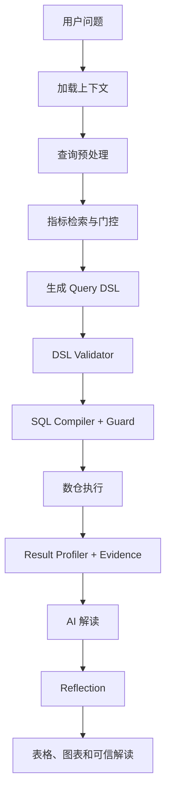

# DataPath PRD（历史基线）

> 文档版本：v1.0
>
> 产品阶段：作品集 MVP
>
> 目标角色：AI 产品经理
>
> 开发模式：独立开发
>
> 关联文档：
>
> - [独立开发执行方案](ai-data-operations-platform-execution-plan.md)
> - [Dify 完整链路上下文](dify-chatbi-complete-ai-context.md)
> - [首发指标目录](initial-metric-catalog.md)
> - [Query DSL 1.0 Schema](query-dsl-v1.schema.json)
> - [ChatBI OpenAPI 契约](chatbi-openapi.yaml)

## 1. 产品概述

### 1.1 产品定义

DataPath 是一套优先面向具备 SQL 基础的数据运营和数据分析师的可信 ChatBI Copilot。用户通过自然语言描述指标、维度、筛选和时间范围，平台在统一指标口径下生成语义 Query DSL，经确定性服务校验、编译并安全查询数仓，最终返回表格、图表、业务解读和可追溯证据。

### 1.2 核心问题

传统业务取数存在四类问题：

1. 业务人员不知道数据表、字段和 SQL。
2. “销售额”“毛利”“转化”等表达存在口径歧义。
3. 分析师被重复、低复杂度的取数需求占用。
4. 直接 NL2SQL 容易生成错误查询，且结果难以追溯和验证。

### 1.3 产品原则

- LLM 理解语言，但不拥有指标口径和 SQL 执行权。
- 指标中心是业务口径的唯一可信源。
- Query DSL 与数仓方言解耦。
- 所有数值结论能够回到 Query ID 和 Evidence ID。
- 无法确认指标、查询安全或结果证据时，澄清、拒绝或降级。
- 平台能力通用，首版通过电商经营和广告投放两个业务域验证。

## 2. 产品目标

### 2.1 MVP 目标

- 支持用户通过自然语言完成聚合、趋势、比较和 TopN 查询。
- 支持两个业务域，共 24 个首发指标。
- 支持指标搜索、详情、口径、版本、维度和血缘查看。
- 支持指标歧义澄清和非法查询拒绝。
- 支持表格、推荐图表、确定性画像和 AI 业务解读。
- 支持黄金问题集、自动评测和 Badcase 反馈。
- 提供可复现数据和一键启动的作品集演示环境。

### 2.2 非目标

- 不开放任意 SQL 输入或执行。
- 不支持数据写回、自动触达、预算调整和营销执行。
- 不建设完整企业身份、RBAC 和行列权限管理后台。
- 不建设实时流计算平台和企业级高可用集群。
- 不在 MVP 同时接入多种数仓。
- 不宣称替代成熟 BI、指标治理或数据开发平台。

## 3. 目标用户

| 用户 | 典型需求 | 当前痛点 | 平台价值 |
| --- | --- | --- | --- |
| 业务运营 | 查询销售、退款、用户和渠道表现 | 依赖分析师，需求排期长 | 自助完成标准分析 |
| 投放运营 | 查询成本、转化、ROI 和 ROAS | 多平台数据口径不一致 | 统一投放口径和趋势分析 |
| 业务负责人 | 查看经营变化和异常 | 报表固定，临时问题难回答 | 快速下钻和获得解释 |
| 数据分析师 | 响应重复取数并维护口径 | 低价值工作占用时间 | 将标准需求沉淀为指标产品 |

首版采用公开演示用户 `public_demo_user`。身份接口保留，但所有演示用户可查看两个业务域的非敏感聚合数据。

## 4. 核心用户故事

### 4.1 自然语言取数

作为业务运营，我希望输入“最近 30 天各渠道销售额和环比”，直接获得结果表格和趋势图，而无需知道数据表和 SQL。

验收条件：

- 系统识别销售额、渠道、最近 30 天和环比。
- 结果展示指标口径、数据更新时间和 Query ID。
- SQL 由后端 Compiler 生成，不由 LLM 生成。

### 4.2 指标澄清

作为业务运营，我输入“看看毛利”，希望系统提示选择毛利额或毛利率，避免返回错误口径。

验收条件：

- 未达到自动通过阈值时返回 `CLARIFY`。
- 候选只包含已发布且可见的指标。
- 用户选择显式绑定 `metric_id + metric_version`。

### 4.3 跨业务域查询

作为投放运营，我希望查询“上月各广告计划 ROAS Top10”，系统使用与电商经营相同的 AI 主链完成查询。

验收条件：

- 新业务域通过语义模型和指标配置接入。
- 不为广告域新增专用 Dify 分支。
- SQL Compiler 根据指标血缘选择广告模型。

### 4.4 可信解读

作为业务负责人，我希望知道“华东区 3 月毛利率下降”这一结论对应的数据和口径。

验收条件：

- 每条数值发现引用一个或多个 Evidence ID。
- Evidence 包含指标版本、值、单位、时间、维度和 Query ID。
- 无因果证据时不能输出确定因果结论。

### 4.5 指标发现

作为业务用户，我希望搜索“投产”，查看对应的 ROI 和 ROAS 定义、区别、计算方式和可用维度。

验收条件：

- 支持名称、别名和业务说明搜索。
- 指标详情展示公式、版本、Owner、来源模型和示例问题。
- 未发布指标不进入普通用户目录和 AI 候选。

### 4.6 Badcase 反馈

作为产品负责人，我希望标记“指标选错”“数据不对”“解释不可信”，并把问题加入回归集。

验收条件：

- 反馈关联 Query ID、Workflow Run ID 和用户问题。
- 反馈能够归入预定义 Badcase 类型。
- 修复后可以运行同一黄金问题验证变化。

## 5. MVP 功能范围

### 5.1 AI 取数工作台

| 功能 | P0 行为 |
| --- | --- |
| 自然语言输入 | 最长 4000 字，支持中文 |
| 查询理解 | 提取指标、维度、筛选、时间、比较和排序意图 |
| 指标门控 | PASS、LLM_DISAMBIGUATE、CLARIFY、REJECT |
| DSL 校验 | VALID、CLARIFY、DENY、INVALID |
| 执行门控 | READY、NEED_APPROVAL、BLOCKED |
| 结果展示 | 表格、推荐图表、口径、数据质量、Query ID |
| 业务解读 | Findings、Caveats、Next Actions，必须引用 Evidence |
| 降级 | 画像或解释不可信时返回 Data-only |
| 多轮追问 | 通过 `conversation_id` 加载上一轮指标、维度、筛选和时间 |

### 5.2 指标市场

- 业务域筛选。
- 指标名称、别名和定义搜索。
- 指标类型、单位和发布状态展示。
- 指标详情、版本、支持维度、血缘和示例问题。

### 5.3 指标管理

- 创建指标草稿。
- 配置指标名称、别名、定义、类型、单位和 Owner。
- 配置受限公式 AST、语义模型、时间字段和支持维度。
- 校验公式和模型关系。
- 生成不可变版本并发布。
- 已发布版本不可原地修改，只能创建新版本。

### 5.4 查询历史

- 展示原始问题、标准化问题、状态和创建时间。
- 展示指标版本、DSL、耗时、行数、缓存和数据质量。
- 默认不向 Dify 和普通用户暴露可执行 SQL 正文。
- 支持复用原问题和提交反馈。

### 5.5 评测与反馈

- 管理黄金问题及期望指标、DSL 和结果。
- 执行单条或全量评测。
- 展示指标识别、DSL、SQL、Evidence 和端到端指标。
- 将用户反馈转为待确认 Badcase。

## 6. 信息架构

```text
DataPath
├── AI 取数
│   ├── 新建查询
│   ├── 澄清/审批
│   ├── 表格/图表
│   └── 解读/Evidence
├── 指标市场
│   ├── 指标列表
│   └── 指标详情
├── 指标管理
│   ├── 语义模型
│   ├── 维度
│   ├── 指标草稿
│   └── 版本发布
├── 查询历史
└── 反馈与评测
    ├── 用户反馈
    ├── 黄金问题
    └── 评测运行
```

## 7. 核心业务流程

### 7.1 成功查询



### 7.2 失败与降级

| 场景 | 产品行为 |
| --- | --- |
| 上下文加载失败 | 结束查询，提示稍后重试 |
| 指标歧义 | 展示候选和口径，让用户选择 |
| 未知指标 | 提示未找到可用指标并推荐指标市场 |
| DSL 不完整 | 询问缺少的时间、维度或筛选条件 |
| 查询高成本 | 模拟审批或提示缩短时间范围 |
| 查询失败 | 返回 Query ID 和可重试提示，不生成业务结论 |
| 空数据 | 明确返回空结果，不生成趋势和异常 |
| 画像失败 | 只返回确定性表格和口径 |
| 解读不可信 | 返回 Data-only，不输出未经证实结论 |

## 8. Query DSL 1.0

Query DSL 描述业务查询，不描述 SQL。正式 Schema 见 `query-dsl-v1.schema.json`。

P0 支持：

- `aggregate_query`
- `trend_query`
- `comparison_query`
- `ranking_query`

P0 不支持：

- 任意明细查询。
- 任意 SQL 表达式。
- 用户定义 Join。
- 子查询、窗口函数和数据库方言函数。

示例：

```json
{
  "dsl_version": "1.0",
  "intent": "trend_query",
  "metrics": [
    {
      "metric_id": "M_SALES_GROSS_MARGIN_RATE",
      "metric_version": 1,
      "aggregation": "default"
    }
  ],
  "dimensions": [
    {"dimension_id": "D_MONTH"},
    {"dimension_id": "D_REGION"}
  ],
  "filters": [
    {
      "field_id": "D_SALES_CHANNEL",
      "operator": "eq",
      "values": ["offline"]
    }
  ],
  "time_range": {
    "start": "2026-01-01",
    "end": "2026-12-31",
    "timezone": "Asia/Shanghai"
  },
  "comparison": {"mode": "period_over_period"},
  "sort": [{"field_id": "D_MONTH", "direction": "asc"}],
  "limit": 500
}
```

## 9. 产品规则

### 9.1 指标规则

- AI 只能从检索返回的已授权候选中选择指标。
- 所有执行必须锁定指标版本。
- 指标公式由受限 AST 或确定性配置表达，不接受自由 SQL。
- 比率指标默认采用“先汇总分子分母，再相除”，不得直接平均行级比率。
- 指标变更生成新版本，历史查询保留原版本。

### 9.2 查询规则

- P0 单次最多 5 个指标、5 个维度、10 个筛选条件。
- 默认 Limit 500，最大 Limit 5000。
- 默认最大时间跨度 366 天；超出时进入审批或拒绝。
- 强制只读、单语句、参数绑定和表字段白名单。
- Executor 只执行 Compiler 保存并签名的查询，不信任请求中的任意 SQL。

### 9.3 解读规则

- AI 不重新计算指标。
- 数字、比例和时间结论必须引用 Evidence ID。
- 相关性不得表达为确定因果。
- 截断、空值、低完整度、数据延迟和指标版本必须进入 Caveat。
- Reflection 为 `BLOCK` 时只返回确定性数据。

## 10. 数据和演示范围

### 10.1 电商经营域

- 订单、订单明细、支付、退款、商品、用户、地区和渠道。
- 至少 12 个月、百万级明细。
- 植入季节性、活动峰值、退款异常和渠道波动。

### 10.2 广告投放域

- 曝光、点击、消耗、转化、归因订单、广告计划和素材。
- 与电商订单通过归因 ID 形成可验证关系。
- 植入成本上涨、点击异常和转化下降场景。

### 10.3 数据质量

- 主键唯一性。
- 外键关系有效性。
- 金额非负和币种一致。
- 点击不高于曝光，转化不高于点击。
- 退款不高于订单已支付金额。
- 数据更新时间和完整度写入执行结果。

## 11. 权限和安全边界

MVP 使用公开只读权限模型：

```text
workspace_id = demo
operator_id = public_demo_user
role = public_viewer
allowed_domains = sales, advertising
```

仍必须做到：

- Dify 不保存数仓高权限凭证。
- ClickHouse 使用只读账号。
- 前端不能提交物理 SQL、表名和权限结论。
- 无法加载上下文时 fail-closed。
- 敏感字段不进入指标平台、Prompt 和结果。
- `workspace_id`、`operator_id`、`query_id`、指标版本和 Fingerprint 被审计。

生产演进：SSO、RBAC、行列级权限、脱敏、审批签名、多租户隔离和密钥托管。

## 12. 非功能需求

### 12.1 性能目标

| 指标 | MVP 目标 |
| --- | ---: |
| 指标检索 P95 | ≤ 1 秒，不含外部 LLM |
| DSL 校验 P95 | ≤ 300 毫秒 |
| 编译与 Guard P95 | ≤ 1 秒，不含 EXPLAIN |
| 标准聚合查询 P95 | ≤ 5 秒 |
| 端到端简单查询 P95 | ≤ 15 秒 |
| 查询最大执行时间 | 120 秒 |

性能目标在本地演示硬件上测量并记录硬件配置，不冒充生产 SLA。

### 12.2 可靠性

- Query ID 作为执行幂等键。
- 外部接口未知状态进入安全默认分支。
- 执行失败不得生成业务解释。
- 评测和演示数据可重复生成。
- 指标版本、DSL 和查询结果可追溯。

### 12.3 可观测性

全链传递：

```text
request_id
trace_id
workflow_run_id
conversation_id
workspace_id
operator_id
query_id
sql_fingerprint
metric_versions
```

## 13. 成功指标

### 13.1 北极星指标

**可信自助查询成功率**：无需分析师介入，且指标、SQL 结果和 Evidence 均通过验证的查询数 / 有效查询总数。

### 13.2 产品指标

| 指标 | MVP 目标 |
| --- | ---: |
| 端到端有效查询成功率 | ≥ 85% |
| 错误自动通过率 | ≤ 2% |
| 有效问题平均完成时间 | ≤ 30 秒 |
| 可恢复澄清成功率 | ≥ 80% |
| 用户反馈可追溯率 | 100% |

### 13.3 AI 与数据指标

| 指标 | MVP 目标 |
| --- | ---: |
| 指标 Top1 Accuracy | ≥ 90% |
| DSL Validator Pass Rate | ≥ 90% |
| SQL Execution Accuracy | ≥ 95% |
| 数字一致率 | 100% |
| Evidence Coverage | 100% |
| 明确数值幻觉率 | 0% |

这些是作品集目标值，最终报告必须展示真实测量结果，而不是把目标值写成已达成。

## 14. 评测设计

首版建立 100 条黄金问题：

- 电商经营 40 条。
- 广告投放 30 条。
- 多轮追问 10 条。
- 指标歧义 10 条。
- 无指标、非法查询和 Prompt 注入 10 条。

每条保存用户问题、期望指标版本、维度、筛选、时间、DSL、结果摘要、允许状态和误差规则。

Badcase 分类：

```text
QUERY_UNDERSTANDING
METRIC_RETRIEVAL
METRIC_AMBIGUITY
DSL_GENERATION
VALIDATION
SQL_COMPILATION
WAREHOUSE_EXECUTION
DATA_QUALITY
INTERPRETATION
REFLECTION
UX
```

## 15. 版本计划

### MVP

- 两个业务域、24 个指标。
- ClickHouse 单数仓 Adapter。
- 七个 ChatBI API。
- Dify E2E、指标市场、指标管理、查询历史和评测。
- 公开只读权限。

### V1.1

- 查询缓存、异步查询、取消和大结果引用。
- 数据新鲜度、轻量血缘和审计看板。
- 模拟审批和更完整多轮上下文。

### 生产演进

- SSO、RBAC、行列级权限和脱敏。
- 多租户和多数仓 Adapter。
- 完整元数据、血缘、质量和发布审批。
- 高可用、资源隔离、容量治理和安全合规。

## 16. MVP 验收清单

- [ ] 电商和广告域均通过配置进入同一 ChatBI 主链。
- [ ] 24 个指标拥有定义、公式、版本、维度和血缘。
- [ ] 七个 ChatBI API 通过成功、4xx、5xx、超时和非法 JSON 契约测试。
- [ ] Query DSL 通过 JSON Schema 校验。
- [ ] LLM 不能提交物理 SQL、表名和字段名。
- [ ] Executor 不执行请求中未注册的 SQL。
- [ ] 指标歧义、未知指标、高成本和空结果拥有可演示分支。
- [ ] 每个数值 Finding 引用有效 Evidence ID。
- [ ] 100 条黄金问题可以一键回归。
- [ ] README 明确标出已实现能力和生产演进边界。

## 17. 待验证假设

| 假设 | 验证方法 |
| --- | --- |
| 业务用户能理解指标候选的差别 | 5 人可用性测试，记录选择正确率和耗时 |
| Query DSL 能覆盖高频标准取数 | 用 100 条黄金问题统计结构覆盖率 |
| 两个业务域足以证明配置化扩展 | 记录新增广告域需要修改的代码和配置 |
| Evidence 能提高结果信任 | 对比有无口径和证据时的信任评分 |
| 直接拒绝比错误自动通过更可接受 | 统计澄清、误拒绝和错误自动通过反馈 |

## 18. 项目事实边界

当前仓库已有 Dify Workflow DSL 和设计上下文，但七个 `/api/chatbi/*` 后端接口、指标平台、数仓、正式前端和端到端联调仍待实现。本文是 MVP 产品契约，不代表功能已完成。
