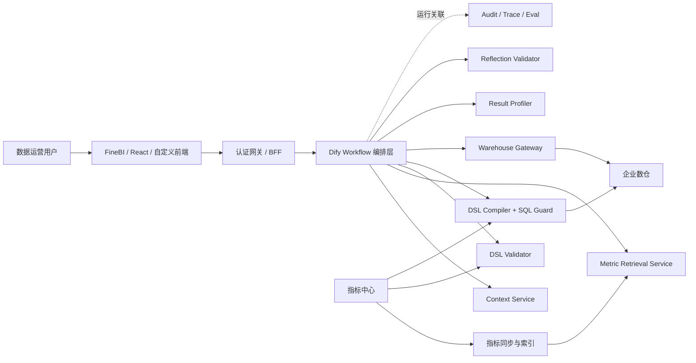
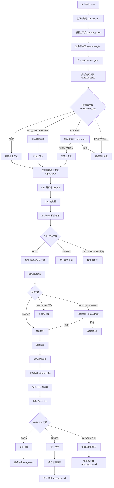

# Dify ChatBI 完整链路与项目上下文

> 文档用途：提供给其他 AI、研发、测试和架构评审人员，作为理解本仓库 Dify ChatBI 方案的单文件上下文。
>
> 最后核对日期：2026-07-08。
>
> 重要状态：本仓库已提供可导入 Dify 的 Workflow DSL 和完整设计契约；截至 2026-07-08，7 个 `/api/chatbi/*` 接口（Context、Metric Retrieval、DSL Validator、Compiler、Execute、Result Profiler、Reflection Validator）已在 FastAPI 中实现并通过真实 PostgreSQL/ClickHouse 集成测试。Dify 画布仍未完成导入联调，因此目前不是端到端生产系统。

## 1. AI 阅读规则

阅读和修改本项目时，必须先区分三类事实：

1. **Dify DSL 实际结构**：以 `dify-chatbi-workflow.zh-CN.dsl.yml` 为准。节点、边、变量、Prompt、Schema、HTTP 请求体和当前分支均属于可导入工作流的真实结构。
2. **Dify 目标设计**：以 `dify-chatbi-ai-orchestration.md` 为准。它包含生产目标、完整服务契约、安全要求及尚未全部反映到 DSL 的增强设计。
3. **仓库当前可运行代码**：以 `app/` 和 `tests/` 为准。当前主要运行时是 FastAPI + LangGraph，不等于 Dify Workflow 的外部后端。

发生冲突时采用以下优先级：

```text
代码与测试证明的现状
> 可导入中文版 Dify DSL 的实际结构
> Dify 设计文档中的目标方案
> 面试材料、产品规划和历史说明
```

不得把“设计中应该具备”写成“当前已经实现”，也不得把 LangGraph 节点与 Dify 节点混为一条运行链。

## 2. 项目一句话定义

这是一个面向数据运营团队的可信 ChatBI 系统：用户用自然语言提问，系统在统一指标口径和权限约束下生成语义 DSL，由确定性后端编译并安全执行 SQL，再基于结构化证据生成业务解读、图表配置、血缘和可审计结果。

核心原则：

```text
LLM 理解语言，但不拥有最终口径和执行权；
指标中心定义业务事实；
确定性服务完成校验、编译、权限和计算；
每个数字结论必须能回到查询与证据。
```

## 3. 目标用户、问题与边界

### 3.1 目标用户

- 数据运营、业务运营、增长运营、投放运营。
- 经营分析人员、数据分析师。
- 产品、市场、销售和业务管理者。

### 3.2 主要问题

- 自然语言中的“销售额”“毛利”“活跃”“转化”等表达存在口径歧义。
- 直接 NL2SQL 容易产生错误字段、错误 Join、权限绕过和不可追溯结果。
- 业务人员需要查询、图表、解释和建议，而不只是 SQL。
- 大模型生成的数字和因果结论必须被证据约束。
- 高风险查询、明细导出和敏感数据访问必须人工审批。

### 3.3 本方案不是

- 不是通用聊天机器人。
- 不是让 LLM 自由生成并直接执行 SQL 的 NL2SQL Demo。
- 不是将向量相似度直接当作指标识别置信度的简单 RAG。
- 不是把全量明细数据塞入 Prompt 后让模型自行统计。
- 不是由 Dify 保存数仓高权限凭证或实现正式行级权限。
- 不是已经部署并联通全部外部服务的成品。

## 4. 最关键的设计决策

### 4.1 LLM 输出 DSL，不输出 SQL

LLM 输出强类型语义 DSL，DSL 只描述：

- 使用哪个指标及版本。
- 使用哪些维度。
- 有哪些筛选条件。
- 时间范围和时区。
- 排序、聚合和 Limit。

SQL 由外部 Compiler 根据指标中心公式、数据模型关系、数据库方言和权限策略确定性生成。这样可以：

- 防止模型创造表名和字段名。
- 让指标口径、SQL 和血缘可版本化追踪。
- 在执行前做 Schema、权限、成本和安全检查。
- 将自然语言理解与数据执行安全隔离。

### 4.2 指标中心是唯一可信口径源

正式指标定义至少应包含：

- 指标 ID、名称、合法别名和业务说明。
- 公式、聚合方式、单位和时间口径。
- 指标版本、发布状态和 Owner。
- 支持的维度、过滤枚举和数据模型。
- 来源表、字段、Join 路径和血缘。
- 访问权限、脱敏规则和适用业务域。

LLM 的内部知识不能覆盖指标中心。

### 4.3 Dify 是编排层，不是数据安全边界

Dify 负责：

- Query 预处理和实体提取。
- 调用指标检索并按照离散状态分支。
- 在授权候选集合内消歧。
- Human Input 澄清和审批。
- 结构化 DSL 草稿。
- 调用校验、编译、执行、画像和 Reflection 服务。
- 基于 Evidence 生成和修订业务解释。

外部后端负责：

- 身份、权限和会话上下文。
- 指标检索、精排、概率校准和门控。
- DSL 校验、SQL 编译、SQL Guard 和 EXPLAIN。
- 数仓执行、缓存、大结果集存储和取消。
- 趋势、同比环比、异常和贡献度计算。
- Evidence 生成、Reflection 校验和正式审计。

### 4.4 默认安全失败

无法确认身份、指标、DSL、权限或执行安全时，应终止或降级，不应让模型猜测后继续。

## 5. 系统分层



### 5.1 控制平面

管理指标定义、版本、权限、数据模型、别名、检索索引和黄金评测集。指标变更应通过事件或定时对账同步到检索服务。

### 5.2 在线查询平面

执行自然语言理解、指标解析、DSL、编译、审批、查询、画像、解读和 Reflection。

### 5.3 反馈与治理平面

保存 Run ID、Query ID、候选、门控原因、DSL、SQL Fingerprint、血缘、Evidence、Reflection、用户反馈和 Badcase，驱动检索与规则优化。

## 6. 仓库中的 Dify 交付物

| 文件 | 用途 | 事实地位 |
| --- | --- | --- |
| `dify-chatbi-workflow.zh-CN.dsl.yml` | 中文画布、完整节点和边 | 当前 DSL 结构主依据 |
| `dify-chatbi-workflow.dsl.yml` | 英文画布 | 与中文版逻辑一致的导入版本 |
| `dify-chatbi-ai-orchestration.md` | 系统边界、目标链路和契约 | 目标设计依据 |
| `dify-chatbi-workflow-import.md` | 导入、环境变量和安全说明 | 部署操作依据 |
| `dify-chatbi-interview-guide.md` | 面试叙事与原理说明 | 辅助材料，不是实现依据 |
| 本文档 | 单文件 AI 上下文 | 汇总实际 DSL、目标设计和代码现状 |

## 7. Dify 应用元数据

| 属性 | 当前值 |
| --- | --- |
| DSL 版本 | `0.6.0` |
| 应用模式 | `workflow` |
| 中文应用名 | `ChatBI AI 编排器` |
| 节点数 | 40 |
| 边数 | 45 |
| LLM 节点 | 5 |
| HTTP 节点 | 7 |
| Code 节点 | 6 |
| Human Input 节点 | 2 |
| IF/ELSE 节点 | 4 |
| Variable Aggregator | 1 |
| 终止节点 | 8 |
| 文件上传 | 关闭 |
| LLM 默认模型 | `langgenius/deepseek/deepseek / deepseek-chat`，温度 0 |
| 会话变量 | 未配置；多轮上下文由外部 Context Service 提供 |

## 8. 环境变量与入口输入

### 8.1 Dify 环境变量

```text
CHATBI_API_BASE_URL
默认占位值：http://host.docker.internal:8000/api/chatbi

CHATBI_API_TOKEN
默认占位值：replace-me
类型：secret
```

导入后必须替换这两个值。`CHATBI_API_TOKEN` 不得提交真实凭证。

### 8.2 Workflow 入口变量

| 变量 | 类型 | 必填 | 含义 |
| --- | --- | --- | --- |
| `query` | paragraph | 是 | 用户原始问题，最长 4000 字符 |
| `workspace_id` | text | 是 | 工作空间或租户边界 |
| `biz_domain` | text | 是 | 业务域，如 `sales` |
| `conversation_id` | text | 是 | 多轮会话标识 |
| `timezone` | text | 是 | 时间解析时区，如 `Asia/Shanghai` |
| `identity_token` | text | 是 | BFF 签发的短期身份令牌 |

生产环境应由 BFF 注入 `workspace_id`、`conversation_id` 和 `identity_token`，不能信任普通用户手工填写的权限信息。

## 9. 实际 Dify 主链

下图严格反映当前中文版 DSL，不包含尚未实现的目标增强：



## 10. 阶段一：身份与上下文

### 10.1 `start`：用户输入

节点类型：Start。

只接收查询和请求上下文，不接收数据库连接、SQL、最终权限列表或行级权限表达式。

### 10.2 `context_http`：上下文加载

节点类型：HTTP Request。

```http
POST {{CHATBI_API_BASE_URL}}/context/load
Authorization: Bearer {{CHATBI_API_TOKEN}}
Content-Type: application/json
```

请求体：

```json
{
  "workspace_id": "WS001",
  "conversation_id": "C001",
  "identity_token": "server-issued-token"
}
```

期望响应：

```json
{
  "operator_id": "U1001",
  "allowed_domains": ["sales"],
  "role_ids": ["sales_analyst"],
  "row_policy_token": "short-lived-policy-reference",
  "last_query_context": {
    "metrics": [],
    "dimensions": [],
    "filters": [],
    "time_range": null
  }
}
```

`row_policy_token` 应是后端可验证的短期引用，不应在 Dify 展开真实行级权限规则。

### 10.3 `context_parse`：解析上下文

节点类型：Python Code。

输入：

```text
context_http.body
context_http.status_code
```

输出：

| 变量 | 类型 | 说明 |
| --- | --- | --- |
| `context_ok` | boolean | HTTP 为 2xx 且响应 JSON 非空 |
| `context_json` | string | 完整响应序列化后的 JSON 字符串 |
| `operator_id` | string | 操作人 ID |
| `last_query_context` | string | 上一轮查询上下文 JSON |

`context_gate` 使用 `context_ok` 做 fail-closed 门控：只有上下文成功才进入预处理，其余情况进入 `context_error_end`。所有 HTTP 节点同时使用 `sys.workflow_run_id` 透传 `X-Request-ID` 和 `X-Trace-ID`。

## 11. 阶段二：Query 预处理

### 11.1 `preprocess_llm`

节点类型：LLM Structured Output。

模型配置：`langgenius/deepseek/deepseek / deepseek-chat`，`temperature=0`，失败最多重试一次。

输入：

- `start.query`
- `start.biz_domain`
- `start.timezone`
- `context_parse.last_query_context`

职责：

- 标准化用户表达。
- 提取指标提及词、维度、筛选和值。
- 解析时间文本、起止时间和比较意图。
- 判断是否继承上一轮条件。
- 保留否定、排序、TopN 和多轮引用语义。

禁止：

- 生成指标 ID。
- 生成表名或字段名。
- 生成 SQL。
- 将不明确的指标口径强行确定。

实际 Structured Output Schema：

```json
{
  "normalized_query": "查询 2026 年线下渠道各区域每月毛利率",
  "metric_mentions": ["毛利率"],
  "dimension_mentions": ["区域", "月份"],
  "filter_mentions": [
    {"field": "渠道", "value": "线下"}
  ],
  "time_text": "2026 年",
  "time_start": "2026-01-01",
  "time_end": "2026-12-31",
  "comparison": "",
  "inherit_context": false
}
```

注意：实际 DSL 使用扁平的 `time_text/time_start/time_end`，不是设计文档示例中的嵌套 `time_expression`。

## 12. 阶段三：指标检索与置信度门控

### 12.1 `retrieval_http`：指标检索

节点类型：HTTP Request。

```http
POST {{CHATBI_API_BASE_URL}}/metrics/retrieve
Authorization: Bearer {{CHATBI_API_TOKEN}}
Content-Type: application/json
```

实际请求体：

```json
{
  "query": "查询 2026 年线下各区域每月毛利率",
  "normalized_query": "查询 2026 年线下渠道各区域每月毛利率",
  "workspace_id": "WS001",
  "biz_domain": "sales",
  "operator_id": "U1001",
  "context": {},
  "preprocess": {}
}
```

外部检索服务目标流程：

```text
工作空间 / 权限 / 发布状态 / 业务域前置过滤
→ 指标正式名称和合法别名精确匹配
→ BM25 关键词召回
→ Dense Embedding 语义召回
→ RRF 融合多路排名
→ Cross-Encoder 精排
→ 概率校准
→ Top1、Top2 Margin、指标类型冲突和规则信号
→ 离散 gate_status
```

为什么不能直接使用 Dify Knowledge Retrieval：指标解析不仅需要召回，还需要权限前置过滤、版本状态、类型冲突、概率校准、逐指标门控和可审计 Reason Code。普通知识检索的相似度不等同于“指标识别正确概率”。

期望响应：

```json
{
  "gate_status": "PASS",
  "mentions": [
    {
      "text": "毛利率",
      "selected_metric_id": "M_GROSS_MARGIN_RATE",
      "probability": 0.94,
      "candidates": [
        {
          "metric_id": "M_GROSS_MARGIN_RATE",
          "display_name": "主营业务毛利率",
          "metric_type": "ratio",
          "probability": 0.94
        }
      ]
    }
  ],
  "reason_codes": []
}
```

推荐候选对象至少包含：

```json
{
  "metric_id": "M_GROSS_MARGIN_RATE",
  "metric_version": 12,
  "display_name": "主营业务毛利率",
  "metric_type": "ratio",
  "unit": "%",
  "business_definition": "...",
  "probability": 0.94,
  "retrieval_sources": ["alias", "bm25", "dense"],
  "authorized": true
}
```

无权限候选必须在进入 Dify 和 LLM Prompt 前被移除。

### 12.2 RRF 分数与概率的区别

RRF 用于融合多个排名列表，分数只表示相对排名贡献，不能直接解释为 0 到 1 的正确概率。生产门控应使用黄金集将精排特征校准为概率，可采用 Platt Scaling、Isotonic Regression 或其他可验证方法，并单独评估不同业务域和指标类型。

门控可综合：

- 精确名称或别名命中。
- 校准后的 Top1 概率。
- Top1 与 Top2 的概率差。
- 金额、比例、数量等指标类型冲突。
- 时间、维度和业务域兼容性。
- 多轮上下文一致性。
- 候选是否为当前发布版本。
- 是否存在权限过滤导致的候选缺失。

### 12.3 `retrieval_parse`：解析检索决策

节点类型：Python Code。

允许状态：

```text
PASS
LLM_DISAMBIGUATE
CLARIFY
REJECT
```

非 2xx、非法 JSON、空响应或未知状态统一转为 `REJECT`。

输出：

| 变量 | 类型 | 说明 |
| --- | --- | --- |
| `gate_status` | string | 离散门控状态 |
| `retrieval_json` | string | 完整检索响应 JSON |
| `candidates_text` | string | 跨 mention 扁平化后前 5 个候选的展示文本 |
| `clarification_message` | string | 澄清消息，缺省为“请选择正确的指标口径。” |

### 12.4 `confidence_gate`：置信度门控

节点类型：IF/ELSE。它不计算概率，只消费后端状态。

| `gate_status` | 当前分支 | 行为 |
| --- | --- | --- |
| `PASS` | `pass_context` | 锁定检索结果并继续 |
| `LLM_DISAMBIGUATE` | `disambiguate_llm` | 在授权候选中做一次 LLM 消歧 |
| `CLARIFY` | `metric_clarify` | 暂停等待用户选择 |
| `REJECT` 或其他 | `reject_end` | 安全结束，不生成 DSL |

### 12.5 `pass_context`

节点类型：Template Transform。

输出：

```json
{"mode": "PASS", "retrieval": {}}
```

## 13. 阶段四：指标消歧与 Human Input

### 13.1 `disambiguate_llm`

节点类型：LLM Structured Output。

输入仅包含用户问题、预处理结果、授权候选和上一轮查询上下文。输出：

```json
{
  "selected_metric_id": "M_GROSS_PROFIT",
  "need_clarification": false,
  "reason": "用户表达的是金额而不是比例"
}
```

安全约束：

- 只能选择候选集合中的 `metric_id`，不能创建新 ID。
- 证据不足时应返回空 ID，并将 `need_clarification` 设为 `true`。
- 结果仍必须进入 DSL Validator。

当前缺口：DSL 没有根据 `need_clarification=true` 再次路由，消歧输出会直接进入聚合器。

### 13.2 `disambiguate_context`

```json
{"mode": "LLM_DISAMBIGUATE", "selection": {}, "retrieval": {}}
```

### 13.3 `metric_clarify`

节点类型：Human Input。投递方式为 Dify WebApp，超时 1 天。

当前动作：

```text
choose_candidate_1  → 选择候选 1
choose_candidate_2  → 选择候选 2
cancel              → 取消查询
```

界面会显示 `clarification_message` 和最多 5 条 `candidates_text`，但当前只有两个候选按钮。

生产要求：

- 只展示有权限候选，不暴露内部检索分数。
- 候选编号与 `metric_id + metric_version` 的映射必须不可变且可验证。
- 暂停期间权限、版本或候选变化时旧选择失效。

当前缺口：Human Input 只输出动作 ID，未显式输出选中的 `metric_id`；下游需要从 `action + retrieval` 推断映射。

### 13.4 `clarify_context`

```json
{"mode": "CLARIFY", "action": "choose_candidate_1", "retrieval": {}}
```

### 13.5 `resolution_aggregator`

节点类型：Variable Aggregator。将以下三个互斥分支合并为 `resolution_aggregator.output`：

```text
pass_context.output
disambiguate_context.output
clarify_context.output
```

概念上它等于 `resolved_metrics`，实际变量名仍是节点命名空间下的 `output`。

### 13.6 `reject_end`

取消、`REJECT`、非法状态和检索失败均进入该终态，输出：

```text
metric_reject_status
metric_reject_message
```

## 14. 阶段五：语义 DSL

### 14.1 两种 DSL 不可混淆

- Dify 应用导入 DSL 版本是 `0.6.0`。
- ChatBI 查询语义 DSL 的 `dsl_version` 示例是 `1.0`。

前者描述 Dify 画布，后者描述一次数据查询。

### 14.2 `dsl_llm`：DSL 解析器

节点类型：LLM Structured Output。

输入：`start.query`、`preprocess_llm.structured_output`、`resolution_aggregator.output` 和 `context_parse.context_json`。

实际 Schema 示例：

```json
{
  "dsl_version": "1.0",
  "intent": "aggregate_query",
  "metrics": [
    {
      "metric_id": "M_GROSS_MARGIN_RATE",
      "metric_version": 12,
      "aggregation": "default"
    }
  ],
  "dimensions": [
    {"dimension_id": "D_REGION"},
    {"dimension_id": "D_MONTH"}
  ],
  "filters": [
    {
      "field_id": "D_CHANNEL",
      "operator": "eq",
      "values": ["CHANNEL_OFFLINE"]
    }
  ],
  "time_range": {
    "start": "2026-01-01",
    "end": "2026-12-31",
    "timezone": "Asia/Shanghai"
  },
  "sort": [
    {"field_id": "D_MONTH", "direction": "asc"}
  ],
  "limit": 5000
}
```

| 字段 | 含义 | 最终约束方 |
| --- | --- | --- |
| `dsl_version` | 查询 DSL 协议版本 | Validator |
| `intent` | 聚合、明细、比较等意图 | Validator 白名单 |
| `metrics` | 指标 ID、版本、聚合 | 候选约束 + Validator |
| `dimensions` | 分组和展示维度 | Validator 兼容性校验 |
| `filters` | 字段、操作符、枚举值 | Validator |
| `time_range` | 起止日期和时区 | Validator |
| `sort` | 排序字段和方向 | Validator |
| `limit` | 结果上限 | Validator / Executor |

禁止输出 SQL、物理表字段、Join、未知指标 ID、权限表达式和数仓凭证。

当前 Dify Schema 没有为 `intent`、`aggregation`、`operator` 定义完整枚举，也没有设置数组最小项、日期格式和 `limit` 范围；这些必须由 Validator 确定性校验。

## 15. 阶段六：DSL Validator

### 15.1 `dsl_validate_http`

```http
POST {{CHATBI_API_BASE_URL}}/dsl/validate
Authorization: Bearer {{CHATBI_API_TOKEN}}
Content-Type: application/json
```

请求：

```json
{
  "workspace_id": "WS001",
  "operator_id": "U1001",
  "row_policy_context": {},
  "dsl": {}
}
```

Validator 必须校验：Schema、DSL 版本、指标 ID/版本/状态、业务域、维度兼容、多指标粒度、模型关系、过滤枚举、时间、Limit、工作空间和行列权限。

响应：

```json
{"status": "VALID", "normalized_dsl": {}, "message": ""}
```

### 15.2 `dsl_validate_parse`

允许 `VALID / CLARIFY / DENY / INVALID`。非 2xx、非法 JSON、空响应或未知状态统一转为 `INVALID`。

输出：

```text
validation_status
normalized_dsl_json
validation_json
message
```

### 15.3 `dsl_gate`

| 状态 | 当前实际行为 |
| --- | --- |
| `VALID` | 进入 SQL 编译 |
| `CLARIFY` | 进入 `dsl_clarify_end`，结束本次运行 |
| `DENY` | 进入 `dsl_deny_end` |
| `INVALID` 或其他 | false 分支进入 `dsl_deny_end` |

目标设计曾描述“二次 Human Input → 重新校验”，但当前 DSL 没有该节点和回路。

### 15.4 DSL 终态

```text
dsl_clarify_end → dsl_clarify_status, dsl_clarify_message
dsl_deny_end    → dsl_deny_status, dsl_deny_message
```

权限拒绝消息不应暴露受限指标、字段、角色规则和数据存在性。

## 16. 阶段七：SQL Compiler、Guard 与执行门控

### 16.1 `compile_http`

```http
POST {{CHATBI_API_BASE_URL}}/query/compile
Authorization: Bearer {{CHATBI_API_TOKEN}}
Content-Type: application/json
```

请求：

```json
{
  "workspace_id": "WS001",
  "operator_id": "U1001",
  "dsl": {},
  "permission_context": {}
}
```

Compiler 和 Guard 负责：

- 按指标公式和模型关系确定性生成 SQL。
- 适配目标数据库方言。
- 使用参数绑定，不拼接用户原文。
- 注入租户条件、行级权限和脱敏策略。
- 校验只读、表字段白名单、时间范围和扫描限制。
- 拒绝 DDL、DML、批量语句、注释绕过和危险函数。
- 执行 EXPLAIN 成本检查。
- 生成 Query ID、指标版本、血缘和 SQL Fingerprint。

期望响应：

```json
{
  "status": "READY",
  "query_id": "Q20260707001",
  "sql_fingerprint": "sha256:...",
  "metric_versions": {
    "M_GROSS_MARGIN_RATE": 12
  },
  "lineage": {
    "models": ["sales_profit_model"],
    "tables": ["fact_sales", "fact_cost"]
  },
  "estimated_cost": {
    "risk_level": "low",
    "estimated_rows": 120000
  },
  "message": ""
}
```

SQL 正文默认不应进入 LLM。若返回给 Dify 的完整响应包含 SQL，`compiled_json` 会原样保存，因此后端契约必须明确禁止敏感 SQL 或做脱敏。

### 16.2 `compile_parse`

允许状态：

```text
READY
NEED_APPROVAL
BLOCKED
```

非 2xx、非法 JSON、空响应或未知状态统一转成 `BLOCKED`。

输出：

```text
compile_status
query_id
compiled_json
message
```

### 16.3 `execution_gate`

| 状态 | 行为 |
| --- | --- |
| `READY` | 直接进入数仓执行 |
| `NEED_APPROVAL` | 暂停并进入人工审批 |
| `BLOCKED` 或其他 | 进入 `blocked_end` |

典型审批条件：明细查询、敏感列、大时间范围、高扫描成本、大批量导出、受监管数据或高风险业务域。

### 16.4 `execution_approval`

节点类型：Human Input；WebApp 投递；超时 1 天。

展示 Query ID 和 `compiled_json` 风险摘要，动作是：

```text
approve → 批准执行
reject  → 拒绝执行
```

生产审批证明至少应绑定：

```json
{
  "query_id": "Q20260707001",
  "sql_fingerprint": "sha256:...",
  "dsl_hash": "sha256:...",
  "permission_version": "PV12",
  "metric_versions": {"M_GROSS_MARGIN_RATE": 12},
  "approver_id": "U2001",
  "approved_at": "2026-07-07T10:00:00+08:00",
  "expires_at": "2026-07-07T10:30:00+08:00",
  "approval_token": "signed-token"
}
```

当前 DSL 只通过图的分支表达“已批准”，没有把审批人、审批 Token 或内容 Hash 传给执行接口。后端不能仅凭当前请求独立验证审批，这是生产缺口。

### 16.5 编译与审批终态

```text
blocked_end         → query_blocked_status, query_blocked_message
approval_reject_end → approval_query_id, approval_status
```

## 17. 阶段八：数仓执行

### 17.1 `execute_http`

```http
POST {{CHATBI_API_BASE_URL}}/query/execute
Authorization: Bearer {{CHATBI_API_TOKEN}}
Content-Type: application/json
Idempotency-Key: {{query_id}}
```

实际请求：

```json
{
  "workspace_id": "WS001",
  "operator_id": "U1001",
  "query_id": "Q20260707001",
  "execution_token": "signed-execution-token"
}
```

执行服务应根据 Query ID 重新校验：工作空间、操作人、权限版本、指标版本、SQL Fingerprint、审批证明和过期时间，不得接受任意 SQL。

期望响应：

```json
{
  "query_id": "Q20260707001",
  "status": "SUCCEEDED",
  "columns": [
    {"name": "month", "type": "date"},
    {"name": "gross_margin_rate", "type": "decimal", "unit": "%"}
  ],
  "rows": [],
  "row_count": 120,
  "execution_ms": 830,
  "cached": false,
  "truncated": false,
  "result_ref": null,
  "data_quality": {
    "freshness": "normal",
    "completeness": 0.99
  }
}
```

大结果集应保存在查询服务或对象存储，只把 Preview 和 `result_ref` 传给 Dify。Dify 不生成图片；图表由前端根据 `chart_spec` 渲染。

当前行为：执行节点关闭自动重试，读取超时 120 秒，以 Query ID 为幂等键，并传递 Compiler 签发的 `execution_token`。`execute_parse` 解析 HTTP 和业务状态，只有 `SUCCEEDED` 才通过 `execute_gate` 进入 Result Profiler；其余状态进入 `execute_failed_end`。

## 18. 阶段九：结果画像与 Evidence

### 18.1 `profile_http`

```http
POST {{CHATBI_API_BASE_URL}}/result/profile
Authorization: Bearer {{CHATBI_API_TOKEN}}
Content-Type: application/json
```

请求：

```json
{
  "workspace_id": "WS001",
  "query_id": "Q20260707001",
  "execution_result": {},
  "dsl": {}
}
```

Result Profiler 使用确定性程序完成：

- Headline 指标和数据预览。
- 趋势、同比、环比和累计变化。
- 异常点和数据质量说明。
- 维度贡献度和 TopN。
- 推荐图表类型、轴和系列。
- 每个可引用事实的 Evidence ID。

期望响应：

```json
{
  "headline_metrics": [],
  "trend_summary": [],
  "anomalies": [],
  "dimension_contributions": [],
  "chart_spec": {
    "type": "line",
    "x": "month",
    "y": "gross_margin_rate",
    "series": "region"
  },
  "evidence": [
    {
      "evidence_id": "E001",
      "statement": "华东区 3 月毛利率为 18.2%，环比下降 2.1 个百分点",
      "metric_id": "M_GROSS_MARGIN_RATE",
      "metric_version": 12,
      "value": 18.2,
      "unit": "%",
      "time_range": {"start": "2026-03-01", "end": "2026-03-31"},
      "dimensions": {"region": "华东"},
      "query_id": "Q20260707001"
    }
  ]
}
```

实际设计示例只要求 `{evidence_id, content}`，上面的类型、单位、版本和来源字段是生产严格校验所需的推荐增强。

### 18.2 `profile_parse`

输出：

```text
profile_ok
profile_json
evidence_json
chart_json
```

`profile_gate` 使用 `profile_ok` 做 fail-closed 门控：只有成功且可解析的 Profile 才进入业务解读；失败进入 `profile_failed_end`，不会把空对象交给 LLM。

## 19. 阶段十：业务解读

### 19.1 `interpret_llm`

节点类型：LLM Structured Output。

它只能读取：用户问题、已校验 DSL、结果画像和 Evidence。它不读取 SQL，不应读取全量明细。

输出：

```json
{
  "title": "2026 年线下区域毛利率分析",
  "findings": [
    {
      "text": "华东区 3 月毛利率出现明显下降。",
      "evidence_ids": ["E001"]
    }
  ],
  "caveats": [
    "结果采用主营业务毛利率第 12 版口径"
  ],
  "next_actions": [
    "进一步按商品品类下钻"
  ]
}
```

解释规则：

- 每个数字结论都引用 Evidence ID。
- 不得改写或重新计算数值。
- 必须保留单位、时间和口径限制。
- 无实验、机制或业务事件证据时，只能描述相关性和候选原因，不能断言唯一因果。
- 空数据、截断、低完整度和过期数据必须写入 Caveat。

## 20. 阶段十一：Reflection 与修订

### 20.1 `reflection_http`

```http
POST {{CHATBI_API_BASE_URL}}/reflection/validate
Authorization: Bearer {{CHATBI_API_TOKEN}}
Content-Type: application/json
```

请求包含工作空间、Query ID、标准化 DSL、完整画像和业务解读。

Validator 检查：

- Evidence ID 是否存在且可见。
- 数字、单位、时间、粒度和指标版本是否一致。
- 是否出现无权限或敏感信息。
- 是否遗漏数据质量、截断和口径限制。
- 是否把相关关系写成因果。
- 是否出现超出证据强度的绝对化结论。

响应：

```json
{
  "status": "REVISE",
  "issues": [
    {
      "code": "UNSUPPORTED_CAUSAL_CLAIM",
      "message": "缺少因果证据"
    }
  ],
  "revision_instruction": "将因果结论改为相关性描述"
}
```

### 20.2 `reflection_parse` 与门控

允许 `PASS / REVISE / BLOCK`。非 2xx、非法 JSON、空响应和未知状态统一转为 `BLOCK`。

输出：

```text
reflection_status
reflection_json
revision_instruction
```

| 状态 | 当前实际分支 |
| --- | --- |
| `PASS` | 最终渲染 |
| `REVISE` | 调用一次 Revision LLM，再进行第二次 Reflection；仅二次 `PASS` 才输出 |
| `BLOCK` 或其他 | 仅数据输出 |

### 20.3 `revision_llm`

只能依据 Reflection 指令修改表达，不得修改：

- 指标、版本或 DSL。
- 数字和单位。
- Evidence ID。
- 原有结论的证据范围。

输出 Schema 与 `interpret_llm` 相同。

修订结果通过 `revision_reflection_http` 再次调用同一确定性 Validator。二次结果仅 `PASS` 可进入 `revision_template`；`REVISE`、`BLOCK`、非 2xx、非法 JSON 和未知状态都进入独立的 `revision_data_only_template`，返回 Data-only。

## 21. 阶段十二：最终渲染和所有终态

### 21.1 `SUCCESS`

```json
{
  "status": "SUCCESS",
  "query_id": "Q20260707001",
  "interpretation": {},
  "chart_spec": {},
  "metric_context": {},
  "lineage": {}
}
```

由 `final_end.final_result` 输出。实际 `lineage` 变量装入的是完整 `compile_parse.compiled_json`，不一定只是血缘对象。

### 21.2 `REVISED`

```json
{
  "status": "REVISED",
  "query_id": "Q20260707001",
  "interpretation": {},
  "chart_spec": {},
  "metric_context": {}
}
```

由 `revision_end.revised_result` 输出，不含 `lineage`。

### 21.3 `DATA_ONLY`

```json
{
  "status": "DATA_ONLY",
  "query_id": "Q20260707001",
  "message": "AI 业务解读未通过校验，仅返回确定性数据结果。",
  "result_profile": {},
  "chart_spec": {},
  "reflection": {}
}
```

由 `data_only_end.data_only_result` 输出，不含 `metric_context` 和 `lineage`。

### 21.4 非成功终态

| 终态 | 输出变量 |
| --- | --- |
| 指标识别失败 | `metric_reject_status`, `metric_reject_message` |
| DSL 需要澄清 | `dsl_clarify_status`, `dsl_clarify_message` |
| DSL 被拒绝 | `dsl_deny_status`, `dsl_deny_message` |
| 查询被拦截 | `query_blocked_status`, `query_blocked_message` |
| 审批被拒绝 | `approval_query_id`, `approval_status` |

当前 8 个 End 节点没有统一响应 Envelope。API 调用方必须识别不同输出变量；生产增强应统一为：

```json
{
  "status": "SUCCESS|REVISED|DATA_ONLY|CLARIFY|DENIED|BLOCKED|CANCELLED|FAILED",
  "code": "stable_machine_code",
  "message": "中文用户消息",
  "trace_id": "T001",
  "workflow_run_id": "...",
  "query_id": "...",
  "data": {}
}
```

## 22. 52 个节点速查表

| # | Node ID | 中文标题 | 类型 | 关键输出或分支 |
| ---: | --- | --- | --- | --- |
| 1 | `start` | 用户输入 | Start | 6 个入口变量 |
| 2 | `context_http` | 上下文加载 | HTTP | `body/status_code` |
| 3 | `context_parse` | 解析上下文 | Code | `context_ok/context_json/operator_id/last_query_context` |
| 4 | `preprocess_llm` | 查询预处理 | LLM | `structured_output` |
| 5 | `retrieval_http` | 指标检索 | HTTP | `body/status_code` |
| 6 | `retrieval_parse` | 解析检索决策 | Code | `gate_status/retrieval_json/candidates_text/clarification_message` |
| 7 | `confidence_gate` | 置信度门控 | IF/ELSE | `PASS/DISAMBIGUATE/CLARIFY/false` |
| 8 | `pass_context` | 高置信上下文 | Template | `output` |
| 9 | `disambiguate_llm` | 指标候选消歧 | LLM | `structured_output` |
| 10 | `disambiguate_context` | 消歧上下文 | Template | `output` |
| 11 | `metric_clarify` | 指标澄清 | Human Input | `__action_id` |
| 12 | `clarify_context` | 澄清上下文 | Template | `output` |
| 13 | `resolution_aggregator` | 已解析指标上下文 | Aggregator | `output` |
| 14 | `reject_end` | 指标识别失败 | End | `metric_reject_*` |
| 15 | `dsl_llm` | DSL 解析器 | LLM | `structured_output` |
| 16 | `dsl_validate_http` | DSL 校验器 | HTTP | `body/status_code` |
| 17 | `dsl_validate_parse` | 解析 DSL 校验结果 | Code | `validation_*` |
| 18 | `dsl_gate` | DSL 校验门控 | IF/ELSE | `VALID/CLARIFY/DENY/false` |
| 19 | `dsl_clarify_end` | DSL 需要澄清 | End | `dsl_clarify_*` |
| 20 | `dsl_deny_end` | DSL 被拒绝 | End | `dsl_deny_*` |
| 21 | `compile_http` | SQL 编译与安全校验 | HTTP | `body/status_code` |
| 22 | `compile_parse` | 解析编译决策 | Code | `compile_status/query_id/execution_token/compiled_json/message` |
| 23 | `execution_gate` | 执行门控 | IF/ELSE | `READY/NEED_APPROVAL/false` |
| 24 | `execution_approval` | 执行审批 | Human Input | `__action_id` |
| 25 | `blocked_end` | 查询被拦截 | End | `query_blocked_*` |
| 26 | `approval_reject_end` | 审批被拒绝 | End | `approval_query_id/approval_status` |
| 27 | `execute_http` | 数仓执行 | HTTP | `body/status_code` |
| 28 | `profile_http` | 结果画像 | HTTP | `body/status_code` |
| 29 | `profile_parse` | 解析结果画像 | Code | `profile_ok/profile_json/evidence_json/chart_json` |
| 30 | `interpret_llm` | 业务解读 | LLM | `structured_output` |
| 31 | `reflection_http` | Reflection 校验器 | HTTP | `body/status_code` |
| 32 | `reflection_parse` | 解析 Reflection | Code | `reflection_status/reflection_json/revision_instruction` |
| 33 | `reflection_gate` | Reflection 门控 | IF/ELSE | `PASS/REVISE/false` |
| 34 | `final_template` | 最终渲染 | Template | `output` |
| 35 | `revision_llm` | 修订模型 | LLM | `structured_output` |
| 36 | `revision_template` | 修订结果渲染 | Template | `output` |
| 37 | `data_only_template` | 仅数据结果渲染 | Template | `output` |
| 38 | `final_end` | 最终输出 | End | `final_result` |
| 39 | `revision_end` | 修订输出 | End | `revised_result` |
| 40 | `data_only_end` | 仅数据输出 | End | `data_only_result` |

安全闭环新增 12 个节点：

| Node ID | 中文标题 | 类型 | 关键输出或分支 |
| --- | --- | --- | --- |
| `context_gate` | 上下文安全门控 | IF/ELSE | `context_ok=true/false` |
| `context_error_end` | 上下文加载失败 | End | `context_ok/context_error` |
| `execute_parse` | 解析执行结果 | Code | `execute_ok/execute_status/execute_json/execute_message` |
| `execute_gate` | 执行结果门控 | IF/ELSE | `SUCCEEDED/false` |
| `execute_failed_end` | 数仓执行失败 | End | `query_id/execute_status/execute_message` |
| `profile_gate` | 结果画像门控 | IF/ELSE | `profile_ok=true/false` |
| `profile_failed_end` | 结果画像失败 | End | `query_id/profile_ok/profile_error` |
| `revision_reflection_http` | 修订后二次 Reflection | HTTP | `body/status_code` |
| `revision_reflection_parse` | 解析二次 Reflection | Code | `reflection_status/reflection_json/revision_instruction` |
| `revision_reflection_gate` | 二次 Reflection 门控 | IF/ELSE | `PASS/false` |
| `revision_data_only_template` | 修订失败仅数据渲染 | Template | `output` |
| `revision_data_only_end` | 修订失败仅数据输出 | End | `data_only_result` |

节点类型准确统计：Start 1、HTTP 8、Code 8、LLM 5、IF/ELSE 8、Human Input 2、Template 7、Aggregator 1、End 12；总计 52 个节点、57 条边。

## 23. 变量作用域和概念映射

Dify 中相同名称的字段不会自动覆盖，因为变量属于节点命名空间。例如：

```text
preprocess_llm.structured_output
dsl_llm.structured_output
interpret_llm.structured_output
revision_llm.structured_output
```

概念变量与实际变量映射：

| 概念名称 | 实际 Dify 变量 |
| --- | --- |
| `request_context` | `start.*` |
| `loaded_context` | `context_parse.context_json` |
| `query_preprocess` | `preprocess_llm.structured_output` |
| `retrieval_result` | `retrieval_parse.retrieval_json` |
| `gate_decision` | `retrieval_parse.gate_status` |
| `resolved_metrics` | `resolution_aggregator.output` |
| `dsl_draft` | `dsl_llm.structured_output` |
| `normalized_dsl` | `dsl_validate_parse.normalized_dsl_json` |
| `compiled_query` | `compile_parse.compiled_json` |
| `execution_result` | `execute_http.body` |
| `result_profile` | `profile_parse.profile_json` |
| `business_interpretation` | `interpret_llm.structured_output` |
| `reflection_result` | `reflection_parse.reflection_json` |

JSON 对象经 Code 或 HTTP 节点后经常被序列化为字符串，再嵌入下一请求。修改模板时必须确认变量是对象还是 JSON 字符串，避免双重引号或无效 JSON。

## 24. HTTP 节点超时、重试和幂等

| 节点 | Connect | Read | Write | 自动重试 |
| --- | ---: | ---: | ---: | --- |
| Context Loader | 10s | 30s | 30s | 1 次 |
| Metric Retrieval | 10s | 45s | 30s | 1 次 |
| DSL Validator | 10s | 30s | 30s | 1 次 |
| Query Compiler | 10s | 45s | 30s | 1 次 |
| Warehouse Execute | 10s | 120s | 30s | 关闭 |
| Result Profiler | 10s | 60s | 30s | 1 次 |
| Reflection Validator | 10s | 30s | 30s | 1 次 |

共同请求头通过模板显式设置 Bearer Token。DSL 中的 `authorization: no-auth` 表示没有使用 Dify HTTP 节点内建认证配置，不表示接口无认证。

只有 Warehouse Execute 显式设置 `Idempotency-Key: query_id`。其他可重试服务必须是纯读或基于请求 ID 幂等。

## 25. 错误处理与降级目标

| 故障 | 安全目标 | 当前 DSL 情况 |
| --- | --- | --- |
| Context 失败 | 立即终止 | `context_gate` fail-closed，已实现 |
| 检索失败 | `REJECT`，不让 LLM 猜指标 | 已由解析节点实现 |
| LLM Structured Output 失败 | 重试一次后结束 | 配置了单次重试，缺统一错误终态 |
| DSL Validator 失败 | `INVALID` 并终止 | 已实现 |
| Compiler/Guard 失败 | `BLOCKED` | 已实现 |
| 审批超时或拒绝 | 不执行 | 拒绝分支存在，超时输出需联调 |
| Execute 超时/失败 | 返回 Query ID，不生成结论 | 没有执行结果门控，存在缺口 |
| 空数据 | 明确空结果，不生成趋势 | 依赖 Profiler，未在 DSL 强制 |
| Profiler 失败 | 立即终止且不进入 LLM | `profile_gate` fail-closed，已实现 |
| Reflection 失败 | Data-only | 非法结果会转 `BLOCK`，已实现 |
| Revision 再失败 | Data-only | 二次 Reflection 非 PASS 进入独立 Data-only 终态，已实现 |
| Audit 失败 | 高风险操作不得继续 | DSL 中没有 Audit 节点 |

## 26. 安全不变量

任何实现和修改都不得破坏以下规则：

1. Dify 不保存数仓管理员账号。
2. 数仓执行账号只读且最小权限。
3. 前端传来的权限结论不可信，后端必须重新加载。
4. 权限至少在检索、DSL 校验、编译和执行处重复验证。
5. 无权限指标不得进入候选、Prompt、澄清页面和最终答案。
6. LLM 不能输出或执行 SQL，SQL 必须来自 Compiler。
7. 执行服务不能接受用户或 LLM 提供的任意 SQL。
8. 用户文本、检索文档和历史上下文均是不可信输入，不能覆盖系统指令。
9. 全量明细和敏感字段默认不进入 LLM。
10. 高风险查询需要 Human Approval，审批后内容变化则审批失效。
11. 所有数值结论必须关联 Query ID 和 Evidence ID。
12. 无因果证据时禁止输出确定因果结论。
13. 失败时优先拒绝或降级，不能使用默认宽权限继续。

## 27. 可观测性与审计

Dify 运行日志用于工作流调试，不能替代正式审计。建议全链传递并记录：

```text
request_id
trace_id
workflow_run_id
conversation_id
workspace_id
operator_id
query_id
sql_fingerprint
metric_versions
```

审计事件至少包含：

- 原始和标准化 Query。
- 候选、概率、门控状态和 Reason Code。
- 人工澄清、审批动作、审批人和时间。
- DSL 草稿、标准化 DSL 和校验结果。
- Query ID、SQL Fingerprint、指标版本和血缘。
- 执行状态、耗时、行数、缓存、截断和数据质量。
- 业务解读引用的 Evidence ID。
- Reflection 问题、修订次数和最终降级状态。
- 模型、Token、节点耗时和外部服务错误码。

当前 DSL 没有 `/audit/events` 节点，也没有入口 `request_id/trace_id`。若外部服务没有隐式审计，则正式审计链尚未建立。

## 28. 多轮对话模型

当前 Dify Workflow 没有启用内部 Memory 和 Conversation Variables。多轮能力来自 `conversation_id` 与 Context Service：

```text
本轮入口 conversation_id
→ Context Service 加载 last_query_context
→ preprocess_llm 判断 inherit_context
→ 检索、DSL Validator 再次确认继承是否合法
```

可继承内容包括上一轮指标、维度、过滤和时间范围；不能继承过期权限、已失效指标版本或已过期审批。

## 29. Dify 链与当前 LangGraph 链的关系

这是两套独立编排，不是同一条链的不同叫法。

### 29.1 Dify 目标链

```text
自然语言 → 指标检索/门控 → 查询 DSL → Validator → Compiler/Guard
→ Warehouse → Profiler/Evidence → LLM Interpretation → Reflection
```

状态：设计和可导入 DSL 已存在；7 个专用后端接口均已实现并完成独立 HTTP smoke，Dify 本身尚未联调。

### 29.2 当前可运行 LangGraph 链

```text
planner
→ intent_classifier
→ metric_resolver
→ semantic_retrieve
→ sql_planner
→ sql_guard
→ memory_retrieve
→ tool_router
→ data_fetch
→ anomaly_detect
→ analysis
→ draft
→ reflection
→ final
```

Reflection 可回跳 `sql_planner`、`sql_guard`、`tool_router`、`data_fetch` 或 `analysis`。当前 `/chat` 调用这条 LangGraph 链。

LangGraph 现状主要是规则和模板驱动，不是 Dify 中 5 个 LLM 节点的本地实现。它有 14 个节点，而 Dify 画布有 40 个节点。

### 29.3 可复用但不能直接等价的现有能力

| 当前已有能力 | 对 Dify 后端可能的复用方向 | 仍需补齐 |
| --- | --- | --- |
| 指标/维度 CRUD | 指标中心基础数据 | 版本、别名、检索索引、校准、权限 |
| SQL Planner/Guard | Compiler/Guard 的部分逻辑 | 查询 DSL、方言、成本、签名执行 |
| `/queries/preview` 和 `/queries/execute` | 查询服务参考 | 路径和请求契约完全不同 |
| BM25、Dense、RRF 框架 | 指标检索参考 | 当前主要服务案例检索，需指标黄金集 |
| 异常检测和分析 | Result Profiler 参考 | 通用结果契约、Evidence Schema |
| Reflection | Validator 规则参考 | Dify 专用输入输出和确定性核验 |
| QueryLog | 审计基础 | 全链 Trace、候选、审批和 Evidence |

不能把现有 `/queries/execute` 当作 Dify 所需 `/api/chatbi/query/execute`：路径、请求模型、认证、幂等和安全凭证均不同。

## 30. 当前实现状态矩阵

| 能力 | 状态 | 说明 |
| --- | --- | --- |
| Dify 中文 Workflow DSL | 已有产物 | 可导入骨架，52 节点、57 条边，已补关键 fail-closed 安全链 |
| Dify 编排设计和导入说明 | 已有产物 | 契约较完整，但与实际 DSL 存在差异 |
| Dify 模型凭证和正式模型 | 待 Cloud 配置 | DSL 已统一为 `deepseek-chat`；仍需在目标 Dify Cloud 工作空间安装 Provider 并配置凭证 |
| `/api/chatbi/context/load` | MVP 已实现 | 固定公开演示身份、工作空间、会话上下文和不透明策略 Token |
| `/api/chatbi/metrics/retrieve` | 基线已实现 | 已发布指标、名称/别名和歧义门控可用；Hybrid Retrieval 与概率校准仍待实现 |
| `/api/chatbi/dsl/validate` | MVP 已实现 | Query DSL 1.0、指标版本、维度、筛选、排序和时间范围校验可用 |
| `/api/chatbi/query/compile` | MVP 已实现 | 受限指标 AST、字段/表白名单、参数绑定、Fingerprint 和服务端 SQL 存储可用 |
| `/api/chatbi/query/execute` | MVP 已实现 | 按 Query ID 加载服务端 SQL，只读 ClickHouse 执行；请求中的 `compiled_query` 被忽略 |
| `/api/chatbi/result/profile` | MVP 已实现 | 从服务端 Query Run 生成 Headline、趋势、z-score 异常、维度贡献、Chart Spec 和强类型 Evidence |
| `/api/chatbi/reflection/validate` | MVP 已实现 | 服务端反查 Query/Profile/Evidence，校验引用、数字、单位、时间、指标版本、数据限制、因果越界和敏感信息，输出 PASS/REVISE/BLOCK |
| Dify Human Input 联调 | 未验证 | 需在目标 Dify WebApp 测试暂停/恢复 |
| Dify 端到端运行 | 未完成 | 无导入、发布和运行记录 |
| 正式 Audit Service | 部分实现 | PostgreSQL `audit.query_run` 已保存 DSL、SQL、Fingerprint、血缘、成本和结果；DSL 仍无 Audit 节点 |
| FastAPI ChatBI 本地链 | MVP 已实现 | 7 个接口通过 TestClient 和真实 HTTP smoke |
| 指标/维度平台 | 基础已实现 | PostgreSQL 实体、Alembic Revision 和 6 个已发布指标种子已存在；管理 CRUD UI/API 待实现 |
| SQL 编译、Guard、执行、Query Run | MVP 已实现 | 当前为 ClickHouse 单 Adapter 和公开演示权限模型 |
| 报表、Excel、案例、异常、评测 API | 未实现 | 不属于当前精简仓库已验证能力 |
| 真实企业 Auth/SSO/RBAC/行列权限 | 未完成 | AccessPolicy 当前不足以形成生产授权链 |
| 真实数仓 Connector 与凭证治理 | 未完成 | 当前主要是本地演示数据源 |
| 持久化 LangGraph Checkpoint | 未完成 | 当前使用 InMemorySaver |
| Alembic 正式 Revision | 已实现 | Control Plane、Profile/Evidence 和 Reflection Validation 三阶段 Revision 已应用且 `alembic check` 无漂移 |

### 30.1 当前 LangGraph 的演示性质

当前 LangGraph 中规划、意图识别、指标解析、分析和 Draft 主要由关键词规则与模板实现。OpenAI 主要用于可选 Embedding 和评测 Judge；无 Key 时 Embedding 可回退到确定性 Hash。语义指标查询失败时存在内置示例指标回退，数据查询也可能读取 `merchant_orders` 演示表。

这些能力证明工程结构和本地闭环，但不能作为 Dify 生产链已完成的证据。

### 30.2 记忆、权限和迁移边界

- Conversation、Fact、Business Context 服务有代码和部分测试，但当前 Chat 主链没有完整写入和沉淀闭环。
- Conversation 查询接口虽接收 `workspace_id`，当前查询条件没有完整使用它，不能声称已完成严格工作空间隔离。
- AccessPolicy 当前主要有列表接口，尚未按 Operator/Role 在查询链中形成完整强制授权。
- SQL Tool 的敏感列脱敏主要是固定规则，不等于执行数据库中配置的 `masking_rule`。
- 数据库启动仍使用 `Base.metadata.create_all`；Alembic 只有框架文件，没有正式迁移 Revision。

## 31. 实际 DSL 与目标设计的已知差异

以下内容是其他 AI 最容易误判的地方：

1. **应用类型**：实际是 `workflow`，设计文档有时称 Chatflow。
2. **入口字段**：实际没有 `frontend_context`，而有必填 `identity_token`。
3. **时间 Schema**：实际是扁平 `time_text/time_start/time_end`。
4. **Context 失败**：已由 `context_gate` fail-closed；仍需在目标 Dify 版本完成导入运行验证。
5. **多指标门控**：目标要求逐 Mention 门控，实际只有一个全局 `gate_status`。
6. **候选扁平化**：不同 Mention 的候选会合并成一个最多 5 条的展示列表。
7. **消歧再澄清**：`need_clarification` 有字段但没有对应分支。
8. **Human Input 选择**：展示最多 5 条但只有候选 1、候选 2 两个按钮。
9. **候选映射**：人工动作没有显式绑定选中的指标 ID 和版本。
10. **DSL 二次澄清**：目标图有二次 Human Input；实际 `CLARIFY` 直接 End。
11. **DSL Schema**：Dify 只约束结构，完整业务枚举和范围仍未定义。
12. **SQL 暴露**：Dify 的 `compiled_json` 会保存编译响应；当前后端响应不返回 SQL，只返回 Query ID、Fingerprint、血缘、成本和执行 Token。
13. **审批证明**：审批动作、审批人、Hash 和 Token 没有传到 Execute。
14. **执行凭证**：Dify 已停止发送 `compiled_query` 并传递 Compiler 签发的 `execution_token`；高风险人工审批仍缺服务端签发的 `approval_token`。
15. **执行失败**：已增加 Execute Parse/Gate，非 `SUCCEEDED` 不进入 Profiler。
16. **大结果集**：实际把 `execute_http.body` 整体嵌入 Profiler 请求，未定义字节/行数阈值。
17. **画像失败**：已增加 Profile Gate，失败不进入业务解读 LLM。
18. **Evidence**：后端已实现类型、单位、指标版本、时间、维度、计算方法和源行号 Schema；Reflection 服务已使用这些字段，Dify 的解释链尚未联调验证。
19. **Revision 复验**：已增加二次 Reflection；非 PASS 进入独立 Data-only 终态。
20. **输出 Envelope**：8 个 End 的输出变量和数据结构不统一。
21. **最终字段**：目标示例中的 `data_preview`、`suggested_questions` 等未出现在实际模板。
22. **Audit**：目标设计有 Audit Service，实际 DSL 无调用节点。
23. **Trace**：入口和服务请求没有统一 `request_id/trace_id`。
24. **后端**：7 个 `/api/chatbi/*` 接口均已实现；尚缺 Dify 画布导入后的端到端运行证据。
25. **模型依赖**：DSL 硬编码模型名且 `dependencies` 为空，导入后必须人工选择工作空间已安装模型。

## 32. 一次完整成功请求示例

用户输入：

```text
查询 2026 年线下各区域每月毛利率
```

### 32.1 加载上下文

```json
{
  "operator_id": "U1001",
  "allowed_domains": ["sales"],
  "row_policy_token": "RPT001",
  "last_query_context": {}
}
```

### 32.2 Query 预处理

```json
{
  "normalized_query": "查询 2026 年线下渠道各区域每月主营业务毛利率",
  "metric_mentions": ["毛利率"],
  "dimension_mentions": ["区域", "月份"],
  "filter_mentions": [{"field": "渠道", "value": "线下"}],
  "time_text": "2026 年",
  "time_start": "2026-01-01",
  "time_end": "2026-12-31",
  "comparison": "",
  "inherit_context": false
}
```

### 32.3 指标检索和门控

```json
{
  "gate_status": "PASS",
  "mentions": [
    {
      "text": "毛利率",
      "selected_metric_id": "M_GROSS_MARGIN_RATE",
      "probability": 0.94
    }
  ]
}
```

### 32.4 DSL、校验与编译

DSL Parser 生成草稿，Validator 返回：

```json
{
  "status": "VALID",
  "normalized_dsl": {
    "dsl_version": "1.0",
    "intent": "aggregate_query",
    "metrics": [
      {
        "metric_id": "M_GROSS_MARGIN_RATE",
        "metric_version": 12,
        "aggregation": "default"
      }
    ],
    "dimensions": [
      {"dimension_id": "D_REGION"},
      {"dimension_id": "D_MONTH"}
    ],
    "filters": [
      {
        "field_id": "D_CHANNEL",
        "operator": "eq",
        "values": ["CHANNEL_OFFLINE"]
      }
    ],
    "time_range": {
      "start": "2026-01-01",
      "end": "2026-12-31",
      "timezone": "Asia/Shanghai"
    },
    "sort": [{"field_id": "D_MONTH", "direction": "asc"}],
    "limit": 5000
  }
}
```

Compiler 返回 `READY + query_id + fingerprint + lineage`，执行服务只运行对应的已签名查询。

### 32.5 画像、解释和 Reflection

Profiler 计算趋势、异常和 Evidence；LLM 生成：

```json
{
  "title": "2026 年线下区域毛利率分析",
  "findings": [
    {
      "text": "华东区 3 月毛利率出现明显下降。",
      "evidence_ids": ["E001"]
    }
  ],
  "caveats": ["指标采用第 12 版口径"],
  "next_actions": ["按商品品类下钻"]
}
```

Reflection 校验 Evidence、数值、单位和因果表述。`PASS` 后输出 `SUCCESS`；`REVISE` 时只改表达；`BLOCK` 时只返回确定性数据。

## 33. 典型异常分支

### 33.1 指标歧义

“查看毛利”可能指毛利额、毛利率或毛利变化。检索服务应返回 `CLARIFY`，由 Human Input 让用户选择；不能让 LLM 根据常识直接猜。

### 33.2 权限拒绝

无权限指标应在检索前过滤。若 DSL 仍包含受限资源，Validator 返回 `DENY`。用户只看到通用拒绝，不看到受限指标是否存在。

### 33.3 高成本查询

Compiler 根据 EXPLAIN、时间跨度、明细级别和敏感性返回 `NEED_APPROVAL`。审批内容发生变化后必须重新编译和审批。

### 33.4 数仓超时

安全目标是返回 Query ID 和可重试状态，不向 Profiler 和 LLM提供不完整结果。当前 DSL 需要补 Execute Gate 才能满足该目标。

### 33.5 Reflection 阻断

当数字无法由 Evidence 支持、出现越权内容或高风险因果结论时返回 `BLOCK`，最终只展示 Result Profile、图表和风险说明。

## 34. 导入和配置步骤

1. 在 Dify Studio 导入 `dify-chatbi-workflow.zh-CN.dsl.yml`。
2. 配置 `CHATBI_API_BASE_URL` 和 `CHATBI_API_TOKEN`。
3. 为 5 个 LLM 节点选择支持 Structured Output 的已安装模型。
4. 检查 7 个 HTTP 节点的地址、Header、超时和服务证书。
5. 以 WebApp 方式发布，以支持两个 Human Input 节点暂停和恢复。
6. 先连接只读测试工作空间和测试数仓。
7. 逐一覆盖 4 组状态机和 8 个 End 分支。
8. 完成权限、幂等、超时、审计和 Prompt 注入测试后才能连接生产。

注意：默认 Base URL 已包含 `/api/chatbi`，各节点只追加 `/context/load` 等后缀。

## 35. 测试与验收清单

### 35.1 DSL 静态检查

- 中文和英文 DSL 能被目标 Dify 版本导入。
- 52 个节点、57 条边、环境变量和模型节点完整。
- 所有 `value_selector` 指向存在的节点输出。
- 所有 JSON 模板在示例和空值场景中均合法。

### 35.2 外部契约测试

- 7 个接口的成功、4xx、5xx、超时、空 Body 和非法 JSON。
- 状态枚举未知值必须进入安全默认分支。
- 重试不会重复执行查询或审批。
- Workspace、Operator、Query ID 和 Trace ID 一致。

### 35.3 分支覆盖

```text
Retrieval: PASS / LLM_DISAMBIGUATE / CLARIFY / REJECT
Validator: VALID / CLARIFY / DENY / INVALID
Compiler: READY / NEED_APPROVAL / BLOCKED
Reflection: PASS / REVISE / BLOCK
Human: choose 1 / choose 2 / cancel / approve / reject / timeout
```

### 35.4 安全测试

- Prompt 注入不能改变候选、DSL 和权限。
- LLM 不能创造指标 ID、物理字段和 SQL。
- 无权限资源不出现在任何 Prompt 和日志。
- SQL 注释、堆叠语句、危险函数和大扫描被 Guard 拦截。
- 审批对象变化使旧 Approval Token 失效。
- 大结果、敏感列和错误响应不进入模型。

### 35.5 质量评测

- 指标识别 Precision/Recall、Top1 Accuracy、MRR、校准误差。
- 澄清率、误拒绝率和错误自动通过率。
- DSL Exact/Structural Match 与 Validator Pass Rate。
- SQL Execution Accuracy、结果一致性和成本。
- Evidence Coverage、数字一致率、幻觉率和因果越界率。
- 端到端成功率、P95 延迟、Token、成本和人工介入率。

当前仓库评测集规模很小，且未调用 Dify 主链，不能代表 Dify 生产质量。

## 36. 其他 AI 修改本项目时的操作规则

### 36.1 修改节点或分支

必须同步检查：

```text
dify-chatbi-workflow.zh-CN.dsl.yml
dify-chatbi-workflow.dsl.yml
dify-chatbi-ai-orchestration.md
dify-chatbi-workflow-import.md
本上下文文档
```

中文和英文 DSL 的 Node ID、边、变量、状态和逻辑应保持一致，只有用户可见文本允许本地化。

### 36.2 修改接口契约

必须同步更新：请求示例、响应状态、解析 Code、IF/ELSE、失败矩阵、Mock/契约测试和审计字段。不要只改设计文档。

### 36.3 新增 LLM 字段

必须说明：

- 字段来自哪个可信输入。
- 是否允许为空。
- Dify Structured Output Schema。
- 后端 Validator 规则。
- 是否进入 Prompt、日志和最终回答。
- 失败时的默认分支。

### 36.4 新增高风险能力

外部写操作、批量导出、营销、预算、价格、补贴或用户触达必须加入人工审批、签名内容、过期时间、幂等键和审计，不得只增加一个按钮。

### 36.5 禁止的错误假设

- 不要把 7 个 `/api/chatbi/*` 后端接口已实现，误写成 Dify 端到端已经完成。
- 不要把现有 `/queries/*` 直接改名后视为契约完成。
- 不要把 Dify Workflow 称为当前 `/chat` 的运行时。
- 不要把 RRF 分数称为概率。
- 不要让 LLM 生成 SQL 或做最终权限判断。
- 不要把 Result Profiler 称为用户画像。
- 不要说 Warehouse Execute 返回图像。
- 不要把尚未实现的二次指标澄清写成已实现；Revision 后二次 Reflection 已在 DSL 中实现，但仍需真实 Dify 导入验证。

## 37. 推荐的下一步实现顺序

1. 在测试 Dify 环境导入当前 52 节点 DSL，配置模型和两个环境变量。
2. 修复指标 Human Input 的 `metric_id + metric_version` 显式映射。
3. 新增服务端 Approval 接口与签名 `approval_token`，再完成高风险查询审批链。
4. 增加大结果 `result_ref` 和取消接口。
5. 统一 12 个 End 节点响应并补充正式 Audit 事件。
6. 完成发布、Human Input、PASS/REVISE/BLOCK 和错误分支 E2E。

## 38. 术语表

| 术语 | 含义 |
| --- | --- |
| Dify App DSL | 描述 Dify 应用、节点和边的 YAML，当前版本 `0.6.0` |
| Query DSL | 描述一次指标查询的业务 JSON，示例版本 `1.0` |
| Metric Center | 指标定义、版本、维度、公式、血缘和权限的唯一可信源 |
| BM25 | 基于词项匹配的稀疏检索算法 |
| Dense Retrieval | 基于向量语义相似度的检索 |
| RRF | 融合多个排名列表的方法，不是概率 |
| Cross-Encoder | 对 Query 与候选成对打分的精排模型 |
| Calibration | 将模型特征映射为可解释正确概率的过程 |
| SQL Fingerprint | 对规范化查询内容生成的稳定摘要 |
| Result Profile | 查询结果的统计画像，不是用户或商户画像 |
| Evidence | 可由程序验证并被回答引用的数据事实 |
| Reflection | 对证据、数字、口径、权限和表达的后置校验 |
| Data-only | AI 解读不可信时，仅返回确定性数据的降级结果 |
| Lineage | 指标、模型、表字段和查询之间的数据血缘 |

## 39. 相关文件

- [Dify 中文 Workflow DSL](dify-chatbi-workflow.zh-CN.dsl.yml)
- [Dify 英文 Workflow DSL](dify-chatbi-workflow.dsl.yml)
- [Dify AI 编排层设计](dify-chatbi-ai-orchestration.md)
- [Dify Workflow 导入说明](dify-chatbi-workflow-import.md)
- [系统架构](architecture.md)
- [项目 API 文档](../03-api/api.md)
- [项目交接文档](../06-governance/CODEX_PROJECT_HANDOFF.md)
- [Dify ChatBI 面试手册](../interview/dify-chatbi-interview-guide.md)

## 40. 最终事实摘要

```text
项目目标：可信、可追溯、可审批的自然语言数据分析。

核心路线：
自然语言 → 授权指标检索 → 概率门控/澄清 → 查询 DSL
→ 确定性校验 → SQL 编译和 Guard → 审批 → 数仓执行
→ 结果画像和 Evidence → LLM 解读 → Reflection → 安全输出。

Dify 的角色：AI 编排、结构化输出、分支和人工交互。
外部服务的角色：身份、口径、权限、SQL、安全、执行、计算和审计。

仓库现状：
Dify 52 节点 Workflow DSL 和设计文档已存在；
7 个专用 /api/chatbi/* 后端接口已通过真实数据链路验证；
Dify 画布端到端联调尚未完成。

最重要的不变量：
LLM 不直接生成 SQL；指标中心是唯一口径源；
无权限数据不进入模型；每个数字结论可回溯到 Query 和 Evidence；
任何身份、校验或安全失败都必须拒绝或降级。
```
