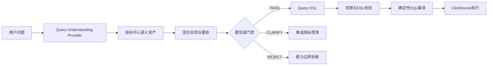

# DataPath 指标语义检索长期架构

> 版本：V1.0  
> 日期：2026-07-12  
> 状态：已实现

## 1. 改造目标

本次改造将指标理解从问数入口的硬编码词表迁移到指标中心，使新增指标、别名和典型问法不再要求修改业务代码。LLM负责可选的结构化语言理解，指标检索、权限、DSL校验和SQL编译继续作为确定性执行门禁。

## 2. 当前链路



## 3. 指标语义资产

每个已发布指标维护：

- 指标名称和业务定义。
- 可维护别名。
- 正向问题样例。
- 反向问题样例。
- 检索策略配置和维护人。

语义资产存放在 `metric_center.metric_alias` 和 `metric_center.metric_semantic_profile`。指标草稿新增正向问法和反向问法字段，发布新版本时同步更新语义资产。

## 4. 混合检索

当前检索组合以下信号：

1. 完整指标名称精确匹配。
2. 指标别名精确匹配。
3. 名称和别名包含匹配。
4. BM25稀疏检索，覆盖关键词、缩写和专有名词。
5. 名称、别名和正例文本相似度。
6. 反例相似度降权。
7. `text-embedding-v3` 向量相似度和 pgvector HNSW 近邻召回。
8. `qwen3-rerank` 对弱匹配Top候选进行精排。
9. 独立的业务域能力边界反例召回。

完整名称包含分值高于短别名包含，避免“真实销售”覆盖“真实销售件数”。弱文本匹配才触发BM25与向量扩召回，并由Reranker对候选的名称、定义、别名和典型问法进行请求内相对排序。Reranker分数不作为绝对置信度，也不能绕过能力边界：边界反例与支持证据接近时返回 `REJECT`，多个指标候选分差小于门限时返回 `CLARIFY`，两种情况都不会生成DSL或执行SQL。

在线链路为：`精确规则 -> BM25 + Embedding候选融合 -> qwen3-rerank -> Confidence Gate`。Embedding或Reranker不可用时分别退回BM25/规则候选及融合前排序。

向量层采用阿里云百炼 `text-embedding-v3` 的 1024 维向量，存放于 PostgreSQL 16 + pgvector。`metric_center.metric_embedding` 保存指标名称、定义、别名、正例和反例向量；`metric_center.semantic_scope_example` 独立保存当前业务域无法回答的问题类型，避免把能力边界混入指标定义。

## 5. 结构化理解Provider

默认Provider为 `metric_center`，完全本地、可复现，适合开发、回归和外部模型不可用场景。

通过环境变量可以切换HTTP LLM/Dify Provider：

```env
QUERY_UNDERSTANDING_PROVIDER=http
QUERY_UNDERSTANDING_URL=https://example.internal/query-understanding
QUERY_UNDERSTANDING_TOKEN=replace-with-secret
QUERY_UNDERSTANDING_TIMEOUT_SECONDS=15
```

HTTP Provider请求包含用户问题、业务域、继承指标和响应Schema。响应可以提供：

- `normalized_query`
- `metric_mentions`
- `dimension_mentions`
- `filter_mentions`
- `time_text`
- `time_start`
- `time_end`

外部Provider异常、超时或返回结构不合法时自动回退到本地指标中心Provider。无论使用哪个Provider，结果都不能绕过指标候选门禁、权限校验、DSL Schema和SQL编译器。

## 6. 维护流程

Badcase应按以下方式修复：

| 问题类型 | 维护位置 |
| --- | --- |
| 指标同义表达未召回 | 指标别名或正向样例 |
| 易混淆指标误选 | 反向样例或共享歧义样例 |
| 候选分差不合理 | 检索重排策略 |
| 时间解析错误 | 通用时间解析器或结构化Provider |
| 维度值未识别 | 维度实体映射 |
| 数据字段不存在或当前产品不支持 | 业务域能力边界样例 |
| 越权或危险查询 | 权限与DSL门禁 |

禁止将每个Badcase直接追加为问数入口中的 `if/else`。

## 7. 索引维护

发布或调整指标语义资产、能力边界样例后执行：

```bash
uv run python -m scripts.rebuild_metric_vector_index
```

索引构建按百炼每批最多10条调用，写入模型名、维度、源文本哈希和启用状态。在线查询在向量服务不可用时自动退回本地文本检索，不绕过既有安全门禁。

## 8. 验证结果

- AI模拟用户盲测：100/100通过。
- 开发业务用例：250/250通过。
- 系统门禁：6/6通过。
- 指标同义词来自数据库语义资产，问数入口不再维护指标词表。

## 9. 后续演进

- 使用新的未见AI问题集持续盲测，避免在同一集合上过拟合。
- 接入真实用户查询后，以匿名日志替换部分AI模拟表达。
- 对检索权重、门限、Provider和Prompt进行版本化并关联测评报告。
- 为在线查询向量增加短期缓存，并对百炼延迟、错误率和调用成本建立监控。
- 多表Join不在当前阶段范围内。
