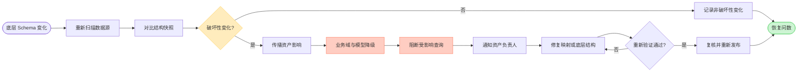
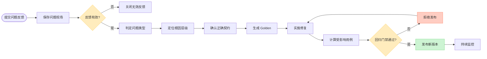
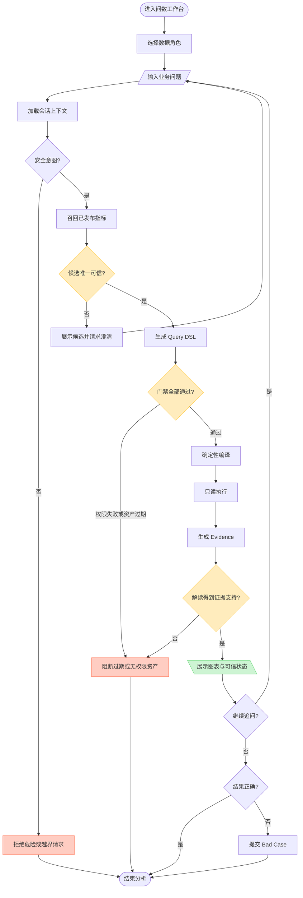
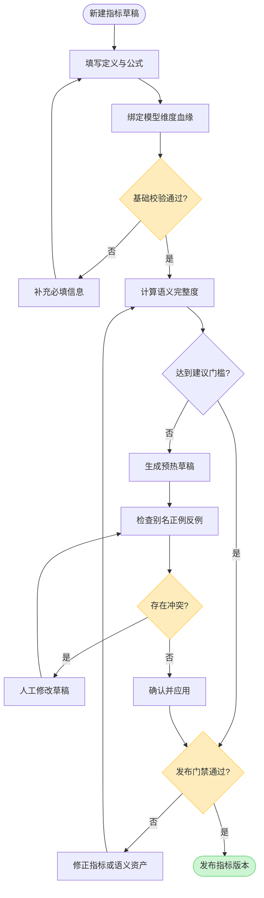
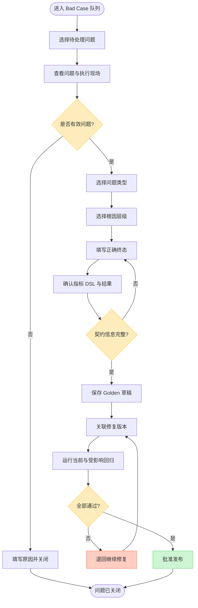
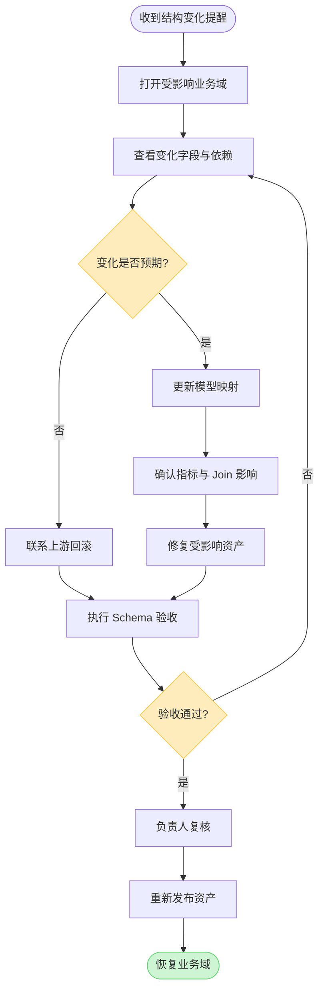

# DataPath 产品流程图

## 1. 角色说明

| 角色 | 主要目标 | 关键操作 |
| --- | --- | --- |
| 业务分析用户 | 快速获得可信的数据答案 | 提问、澄清、追问、查看证据、反馈问题 |
| 指标管理员 | 建立并发布统一业务口径 | 定义指标、配置维度与 Join、审核 AI 预热、发布版本 |
| 质量运营人员 | 发现、归因并关闭线上问题 | 处理 Bad Case、确认正确契约、发起回归、发布修复 |
| 数据平台管理员 | 保证底层数据资产可用 | 接入数据源、扫描 Schema、处理结构变化、恢复资产 |
| 系统 | 执行确定性校验与状态控制 | 召回、编译、鉴权、执行、记录 Evidence、阻断风险 |

## 2. 业务流程图

### 2.1 产品全链路

这张图描述一个业务域从数据接入到持续运营的完整生命周期。

```mermaid
flowchart LR
    source([接入只读数据源])
    scan[扫描物理结构]
    confirm{资产确认?}
    model[建立业务域与模型]
    govern[治理维度 Join 指标]
    preheat[生成 AI 预热草稿]
    review{人工审核?}
    publish[发布语义资产]
    ask[业务用户问数]
    gate{可信门禁通过?}
    answer[返回答案与 Evidence]
    feedback{用户反馈?}
    badcase[进入 Bad Case]
    golden[确认 Golden 契约]
    regression{回归通过?}
    release[发布修复版本]
    repair[修正资产或规则]

    source --> scan --> confirm
    confirm -->|通过| model
    confirm -->|补充信息| scan
    model --> govern --> preheat --> review
    review -->|通过| publish
    review -->|修改| govern
    publish --> ask --> gate
    gate -->|通过| answer
    gate -->|澄清或阻断| ask
    answer --> feedback
    feedback -->|无问题| ask
    feedback -->|发现问题| badcase
    badcase --> golden --> repair --> regression
    regression -->|通过| release --> publish
    regression -->|失败| repair

    style publish fill:#CDF4D3,stroke:#66D575
    style answer fill:#CDF4D3,stroke:#66D575
    style gate fill:#FFECBD,stroke:#FFC943
    style regression fill:#FFECBD,stroke:#FFC943
    style badcase fill:#FFCDC2,stroke:#FF7556
```

### 2.2 Schema 变化业务流程

Schema 变化不是独立的技术告警，而是会影响业务域、模型、Join、指标和问数结果的产品事件。

### 2.3 Bad Case 质量闭环

产品不直接把一次点踩当成正确答案，而是要求治理人员把问题转化为可执行的质量契约。

## 3. 用户操作流程图

### 3.1 业务用户问数流程

业务用户只需要表达业务问题。系统负责将问题转换为受约束的查询，并明确返回成功、澄清、拒绝或阻断状态。

#### 四类产品终态

| 终态 | 触发条件 | 用户看到什么 | 系统行为 |
| --- | --- | --- | --- |
| `SUCCESS` | 指标、权限、Schema、Join、执行和 Reflection 均通过 | 图表、摘要、上下文、Evidence 和可信状态 | 保存完整执行现场 |
| `CLARIFY` | 存在多个合理指标或必要条件缺失 | 候选口径或补充问题 | 不编译、不执行 |
| `REJECT` | 请求包含危险操作或超出产品支持范围 | 拒绝原因与支持边界 | 不进入查询链路 |
| `BLOCKED` | 无权限、资产过期、Schema 受影响或可信门禁失败 | 阻断原因与处理建议 | 失败关闭，不返回猜测结果 |

### 3.2 指标管理员发布与 AI 预热流程

AI 预热只能补充语言资产，不得改变指标计算事实。

#### AI 与人工责任边界

| 内容 | AI 可以生成 | 人工必须确认 |
| --- | --- | --- |
| 指标别名 | 是 | 是否符合企业语言习惯 |
| 典型问法 | 是 | 是否表达正确业务口径 |
| 相邻指标反例 | 是 | 是否能有效区分相似指标 |
| 业务定义 | 可提出补充建议 | 最终定义 |
| 指标公式 | 否 | 公式及计算逻辑 |
| 单位与粒度 | 否 | 单位、粒度和默认时间 |
| 血缘与 Join | 否 | 物理来源和关联关系 |
| 权限与发布 | 否 | 使用范围和发布决定 |

### 3.3 质量运营人员处理 Bad Case 流程

### 3.4 数据平台管理员处理 Schema 变化流程

## 4. 关键跨角色交接

| 上游角色 | 交接物 | 下游角色 | 下游动作 |
| --- | --- | --- | --- |
| 数据平台管理员 | 已确认物理表、字段和结构快照 | 指标管理员 | 建立业务模型、Join 和指标 |
| 指标管理员 | 已发布指标版本与语义资产 | 业务分析用户 | 使用自然语言查询 |
| 业务分析用户 | 带执行现场的问题反馈 | 质量运营人员 | 归因并确认正确契约 |
| 质量运营人员 | Golden 契约和修复要求 | 指标管理员或研发 | 修复语义资产、规则或代码 |
| 数据平台管理员 | Schema 影响清单 | 指标管理员 | 复核受影响模型、Join 和指标 |
| 系统 | 回归结果和安全门禁 | 发布负责人 | 决定允许或拒绝发布 |

## 5. 流程设计原则

### 5.1 先治理，再生成

模型只能在已发布指标、维度和 Join 范围内工作，不从任意物理字段自由拼接查询。

### 5.2 不确定时澄清，危险时阻断

无法确定指标口径时进入 `CLARIFY`；权限、Schema 或安全失败时进入 `BLOCKED` 或 `REJECT`，不返回近似答案。

### 5.3 每次成功都能追溯

成功结果需要关联身份、指标版本、DSL、query id、血缘、结果摘要、Evidence 和 Reflection 状态。

### 5.4 每次错误都能沉淀

有效 Bad Case 必须形成结构化正确契约，并进入后续版本的回归范围。

### 5.5 恢复不等于自动放行

底层字段恢复或代码修复后，仍需执行验收、人工复核和重新发布，防止旧资产未经确认直接回到线上。

## 6. 流程验收要点

| 流程 | 验收重点 |
| --- | --- |
| 数据接入 | 未确认物理资产不能进入业务域发布 |
| 指标发布 | 公式、单位、粒度、血缘和权限缺失时不能发布 |
| AI 预热 | 未经人工确认的草稿不能进入在线召回 |
| 在线问数 | 门禁失败时不得编译或执行危险查询 |
| 成功结果 | 必须展示可信状态并保留 Evidence |
| Bad Case | 缺少正确终态和 Oracle 时不能转为正式 Golden |
| 修复发布 | 当前用例或受影响回归失败时不能发布 |
| Schema 恢复 | 未完成复核和重发时，受影响资产保持阻断 |
