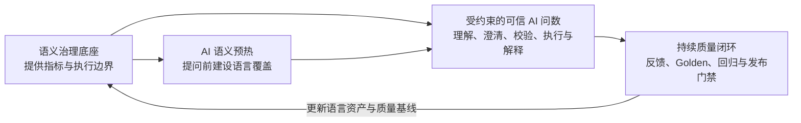
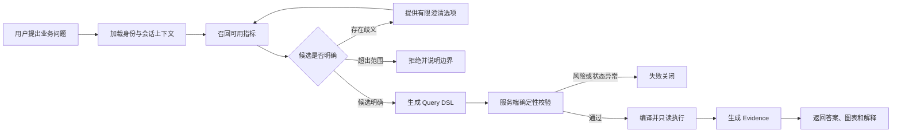

# DataPath 产品概览

## 一句话定位

DataPath 是面向企业数据场景的可信 AI 问数产品：以语义治理为底座，通过受约束的 AI 链路将自然语言问题转化为可验证、可追溯的数据答案，并用 AI 语义预热和持续质量闭环提升产品质量。

DataPath 不以“让大模型直接生成 SQL”为目标，而是解决一个更具体的问题：

> 如何让业务用户更低成本地获得数据答案，同时让系统在不确定时主动澄清，在风险状态下停止执行，并让已经发生的问题不再重复出现。

---

## 1. 产品背景

企业中的一次临时取数，通常需要经过需求沟通、口径确认、数据定位、SQL 编写、结果校验和解释交付。自然语言问数能够缩短这条路径，但如果仅将用户问题交给大模型生成 SQL，会产生新的产品风险：

- 用户使用的是业务语言，系统掌握的却是指标名称和技术字段；
- 多个相似指标可能同时符合一句模糊表达；
- SQL 可以运行，不代表指标、时间、维度和 Join 正确；
- 模型可能在权限不足或资产异常时继续给出答案；
- 结果看起来合理，却无法说明数字使用了什么口径；
- 用户发现错误后，反馈停留在工单，无法约束后续版本。

这些问题分布在用户提问前、系统回答时和用户反馈后，不能仅靠替换更强的模型解决。

DataPath 因此把企业 AI 问数设计为一条完整的产品链路：

```text
提问前建设语言覆盖
→ 回答时约束模型行为与数据执行
→ 回答后将用户反馈沉淀为质量资产
```

---

## 2. 目标用户与核心场景

### 2.1 目标用户

| 用户 | 需要完成的任务 | DataPath 提供的价值 |
| --- | --- | --- |
| 业务用户 | 查询指标、分析趋势、比较区域并继续追问 | 使用业务语言获得答案，并理解答案使用的口径和范围 |
| 指标管理员 | 维护指标语言覆盖，判断哪些内容可以进入线上问数 | 通过 AI 草稿降低语义准备成本，同时保留人工定义权 |
| 质量运营人员 | 还原错误、确认正确答案并验证修复 | 将反馈转化为 Golden，通过回归和发布门禁控制问题复发 |
| 数据平台管理员 | 维护查询所依赖的模型、权限和资产状态 | 为问数链路提供确定性的执行边界 |

### 2.2 核心场景

DataPath 当前聚焦三类高频分析任务：

1. **单指标查询**：查询某项指标在指定时间和范围内的结果；
2. **趋势与分组分析**：按月份、区域、渠道等维度查看变化；
3. **上下文追问**：在上一轮指标、时间和筛选条件基础上继续分析。

产品不试图替代完整 BI 报表、数据开发平台或自由 SQL 工具，而是重点解决从业务问题到可信数据答案的交互链路。

---

## 3. 产品结构：一个底座、一条主线、两个关键创新



### 3.1 一个底座：语义治理

语义治理为 AI 提供可查询的指标、允许使用的维度与关系、用户权限以及资产可用状态。它回答三个基础问题：

- 系统可以查询什么；
- 业务概念应该如何计算；
- 当前用户和当前状态是否允许执行。

DataPath 复用企业指标平台的治理思路，将这些信息转化为问数链路可以直接校验的产品边界。本概览不展开指标建模和治理流程，重点说明它们如何约束 AI。

### 3.2 一条主线：受约束的可信 AI 问数

这是 DataPath 的核心产品链路。AI 不直接面对完整数据库，也不能自由生成 SQL 后交给执行器，而是在已治理、已发布且用户有权访问的范围内工作。

产品成功标准不是“每个问题都有答案”，而是：

- 问题明确且满足规则时，返回可信答案；
- 存在合理歧义时，要求用户澄清；
- 超出治理范围时，明确拒绝；
- 权限、资产或安全状态异常时，失败关闭。

### 3.3 两个关键创新

| 关键创新 | 所处阶段 | 解决的问题 |
| --- | --- | --- |
| AI 语义预热 | 用户提问前 | 指标已经建设，但系统尚未覆盖用户的真实表达 |
| 持续质量闭环 | 用户反馈后 | 反馈无法定义正确答案，也无法持续验证修复效果 |

两个创新分别补足主链路的前端和后端：预热提高新指标进入问数时的语言准备度，质量闭环让真实使用中的错误成为下一版本的验证资产。

---

## 4. 可信 AI 问数主链路

### 4.1 从业务问题到数据答案



一次成功查询包含八个关键步骤：

1. 加载用户身份、业务域和会话上下文；
2. 从已发布且有权访问的指标中召回有限候选；
3. 结合用户表达和上下文完成候选裁决；
4. 候选不明确时提供可选择的澄清项；
5. 候选明确后生成结构化 Query DSL；
6. 服务端校验指标、时间、维度、权限、Join 和资产状态；
7. 校验通过后确定性编译参数化 SQL，并通过只读连接执行；
8. 返回结果、图表、指标口径和 Evidence。

### 4.2 AI 与确定性系统的分工

| 环节 | AI 负责 | 确定性系统负责 |
| --- | --- | --- |
| 理解问题 | 提取业务意图、时间、维度和筛选表达 | 加载用户身份、业务域和可用范围 |
| 选择指标 | 在有限候选中裁决或提出澄清 | 召回候选并校验指标 ID、版本和权限 |
| 组织查询 | 将意图映射为结构化查询要求 | 校验 Query DSL 并确定性编译 SQL |
| 解释结果 | 基于已冻结 Evidence 生成业务解读 | 执行查询、校验结果并保留运行证据 |

这套分工利用 AI 处理业务语言的不确定性，同时把口径、权限和执行安全留在可验证的确定性系统中。

### 4.3 四种产品终态

| 终态 | 触发条件 | 用户获得的反馈 |
| --- | --- | --- |
| `SUCCESS` | 指标、权限、查询结构、执行和 Evidence 均通过 | 数据答案、图表、口径和证据 |
| `CLARIFY` | 多个候选均合理，或缺少必要分析条件 | 有限候选及需要确认的问题 |
| `REJECT` | 问题超出当前业务域或已治理能力 | 拒绝原因和可采取的下一步 |
| `BLOCKED` | 权限、资产状态、Join 或安全门禁失败 | 不泄露敏感信息的阻断原因 |

`CLARIFY`、`REJECT` 和 `BLOCKED` 不是异常页面，而是产品主动控制不确定性和风险的正常结果。

### 4.4 什么是可信答案

DataPath 返回的不只是一个数值。一次成功回答需要关联：

```text
原始问题
→ 用户身份与数据范围
→ 指标及版本
→ 时间、维度与筛选条件
→ Query DSL
→ Query Run 与 SQL
→ 查询结果
→ Evidence 与结果解释
```

业务用户可以看到本轮使用的指标、时间范围、分析维度和可信状态；质量运营人员则可以在出现反馈时还原当时的完整运行现场。

---

## 5. 关键创新一：AI 语义预热

### 5.1 问题

企业已经建设指标，不代表问数系统已经理解用户语言。同一个指标可能存在业务简称、部门习惯表达和相邻概念；如果只依赖指标名称与定义，新业务域上线后需要等待线上错误出现，再由人工逐步补充问法。

### 5.2 方案

DataPath 在指标进入正式问数前增加语义预热：


AI 可以生成：

- 指标别名；
- 典型正向问法；
- 相邻指标反例；
- 需要补充的语义建议。

### 5.3 产品边界

AI 只扩展“用户可能怎样表达”，不能改变“指标应该怎样计算”：

- 不修改指标公式；
- 不修改聚合方式；
- 不修改维度和 Join；
- 不修改业务定义；
- 未经人工审核的内容不能进入线上检索。

### 5.4 产品价值

语义预热将语言建设从错误发生后的被动补充，前移到指标上线前的主动准备，在不转移业务定义权的前提下降低冷启动成本。

---

## 6. 关键创新二：持续质量闭环

### 6.1 问题

用户点赞、点踩或提交问题，只能说明“用户对结果不满意”，不能直接回答：

- 本轮具体错在哪个环节；
- 正确指标、参数和产品终态是什么；
- 修复是否影响了其他问题；
- 新版本是否具备发布条件。

如果反馈只进入工单，团队只能完成一次性修复，无法避免相同问题再次出现。

### 6.2 方案


### 6.3 Golden 契约

有效 Bad Case 经过人工确认后，转化为可重复执行的 Golden。Golden 不复制系统原答案，而是定义：

- 正确的产品终态；
- 正确指标及必要参数；
- 时间、维度和筛选边界；
- 必须出现的 Evidence；
- 必须禁止的错误选择或危险行为。

### 6.4 发布门禁

修复不能以“当前页面看起来正常”作为完成标准。发布前需要运行：

- 当前问题对应的 Golden；
- 与修改资产相关的受影响用例；
- 错误指标和语义冲突用例；
- 权限与危险执行门禁。

只有回归和安全门禁全部通过，新版本才允许发布。用户反馈因此从一条待处理记录，转化为能够长期约束产品质量的验证资产。

---

## 7. 一次完整使用场景

业务用户提出：

> 2024 年每月订单量趋势如何？

产品链路如下：

1. **提问前**：指标管理员发布“订单量”，AI 预热生成“下单数”等别名和典型问法，人工确认后进入检索；
2. **理解问题**：系统加载用户身份与上下文，从授权指标中召回“订单量”等有限候选；
3. **形成查询**：候选明确后生成包含指标、月份粒度和时间范围的 Query DSL；
4. **执行校验**：服务端校验权限、指标版本、分析维度、Join 和资产状态；
5. **返回结果**：系统确定性编译并只读执行，返回趋势图、指标口径和 Evidence；
6. **提交反馈**：如果用户认为系统选择了错误指标，可以基于本轮 Query Run 提交反馈；
7. **确认契约**：质量运营还原现场，确认正确指标和终态，并建立 Golden；
8. **验证发布**：相关资产修复后运行受影响回归，通过门禁后才能发布；
9. **持续改进**：经过确认的表达边界和测试用例进入新的语言资产与质量基线。

这条链路使 DataPath 不只回答一次问题，还能解释答案、处理错误并验证改进。

---

## 8. 功能全景

| 产品区域 | 核心能力 | 主要产物 |
| --- | --- | --- |
| 语义准备 | 语义完整度诊断、AI 预热草稿、人工审核 | 可进入检索的语言资产 |
| 问数工作台 | 提问、追问、澄清、结果图表和 Evidence | Query Run 与可信答案 |
| 可信执行 | 候选约束、Query DSL、服务端校验、确定性编译和只读执行 | 可审计的执行链路 |
| 质量运营 | 用户反馈、Bad Case、归因和 Golden | 问题资产与验证契约 |
| 测评发布 | 受影响回归、安全门禁、报告和版本判断 | 测评证据与可发布版本 |

语义模型、指标、权限、Join 和资产状态为以上区域提供底层输入，但不在本概览中展开为独立产品主线。

---

## 9. 关键产品取舍

### 9.1 不让大模型自由生成并执行 SQL

大模型擅长理解模糊语言，但不独立承担指标口径、权限和执行安全。DataPath 采用“AI 理解与有限裁决 + 确定性校验与执行”的分工。

### 9.2 不追求所有问题都有答案

当问题不明确或不满足执行条件时，系统选择澄清、拒绝或阻断。回答率不是唯一目标，可信答案的有效采用才是产品价值。

### 9.3 不让 AI 修改业务口径

AI 可以生成语言草稿，但公式、聚合和业务定义仍由指标管理员维护和确认。

### 9.4 不把用户反馈直接用于自动学习

反馈可能存在误解和噪声。只有完成现场还原、人工确认和 Golden 定义的案例，才能进入回归和语言资产。

### 9.5 不把单次修复等同于问题关闭

当前问题恢复正常不代表同类问题不会复发。修复必须通过受影响回归和安全门禁，才能成为可发布版本。

---

## 10. 当前实现与验证

### 10.1 已实现链路

- 语义完整度诊断、AI 预热草稿和人工审核；
- 自然语言问数、多轮上下文和有限候选裁决；
- 澄清、拒绝、失败关闭和成功回答四类终态；
- Query DSL、服务端规则、确定性 SQL 编译和只读执行；
- 结果图表、Evidence 和 Reflection；
- 用户反馈、Bad Case、Golden 契约和回归测评；
- 测评总览、分类结果和安全门禁证据；
- 指标、权限、模型关系和资产状态等基础约束。

### 10.2 当前项目资产

| 项目资产 | 当前规模 |
| --- | ---: |
| 模拟生产数据 | 42 张表、442 个字段、约 792.5 万行 |
| 语义模型与关系 | 11 个语义模型、10 个共享维度、6 条安全 Join |
| 指标资产 | 9 个单事实指标、2 个跨事实指标 |
| 语言资产 | 62 个审核别名、11 份语义档案、220 条向量 |
| 测评集 | 2,350 条 |

### 10.3 测评结果

| 指标 | 当前结果 |
| --- | ---: |
| Development 严格通过 | 1,118 / 1,128 |
| Development 严格通过率 | 99.11% |
| 错误指标选择 | 0 |
| 危险执行 | 0 |

测评覆盖指标选择、跨事实查询、查询粒度与扇出、多轮上下文、权限、安全、Evidence 和 Reflection，用于验证受约束问数链路与质量机制是否按照产品规则工作。

---

## 11. 如何定义产品成功

DataPath 的北极星指标是：

> **每周被采用的可信答案数**

只有问数终态为 `SUCCESS`，并通过指标、权限、Query DSL、执行和 Evidence 校验的答案，才具备被采用的前提。用户继续追问、复制、导出或明确确认使用结果，可以作为采用信号。

围绕北极星指标，产品关注四类指标：

| 维度 | 关键指标 |
| --- | --- |
| 使用 | 有效提问用户数、有效问题数、多轮追问率 |
| 转化 | 提问成功率、澄清完成率、可信答案采用率 |
| 质量 | 指标选择正确率、查询结构正确率、危险执行数 |
| 闭环 | Bad Case 可归因率、Golden 完整率、回归覆盖率、复发率 |

---

## 12. 产品边界

DataPath 当前聚焦“语言准备—可信问数—反馈闭环”的产品链路，不试图替代：

- 企业完整指标管理平台；
- 通用 ETL 和数据开发工具；
- 复杂报表设计器与数据大屏；
- 面向任意知识问题的开放式问答；
- 用户自由 SQL 执行工具；
- 无人工确认的指标口径生成和自动发布。

这条边界让产品能够集中验证两个问题：企业 AI 问数能否在风险可控的条件下真正被使用，以及产品能否根据真实反馈持续提高质量。
