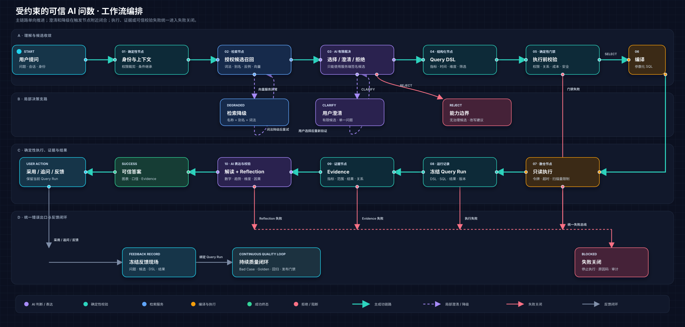
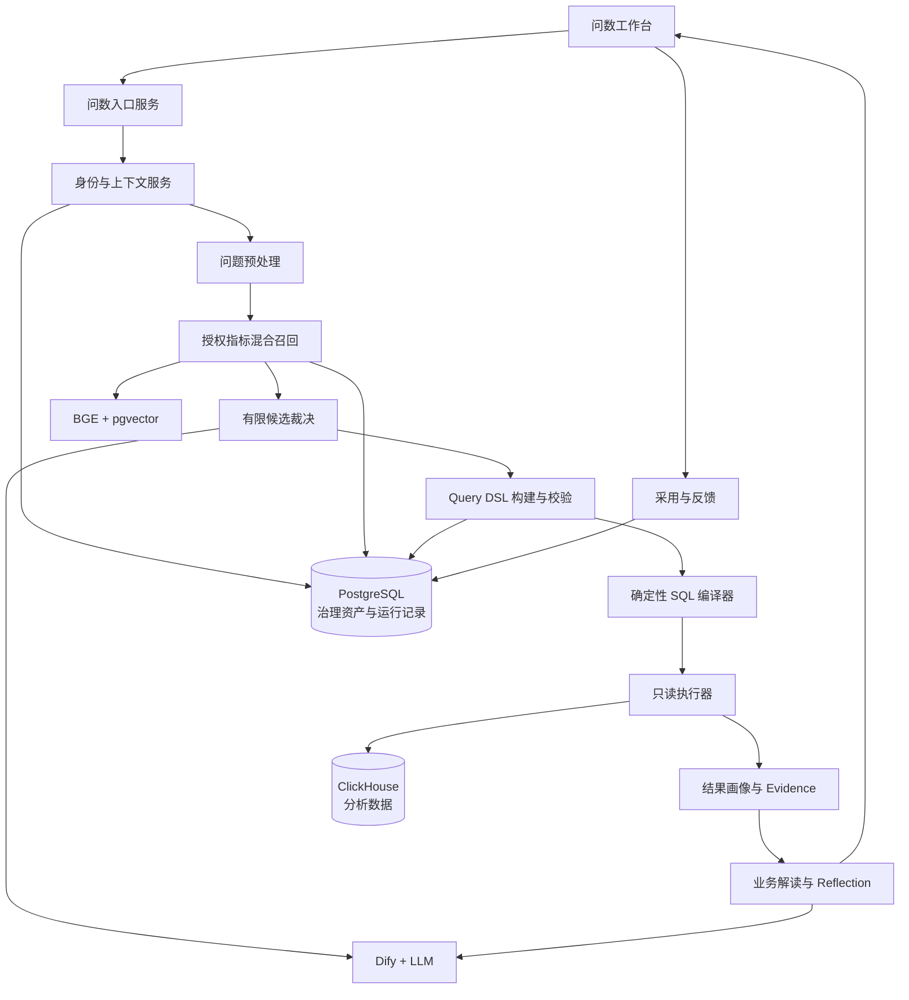

# 受约束的可信 AI 问数 PRD

## 1. 执行摘要

### 1.1 问题陈述

企业临时取数需要经过需求澄清、口径确认、数据定位、SQL 编写、结果校验和解释交付，业务用户难以独立完成。自然语言问数降低了表达门槛，但通用 Text-to-SQL 无法保证系统选对指标、正确继承上下文、遵守数据权限、使用安全的数据关系，也无法证明自然语言结论与真实查询结果一致。

本产品需要解决的不是“能否生成一段可以运行的 SQL”，而是：

> 如何将一个可能存在歧义的业务问题，转化为受指标、权限、查询结构和执行安全约束的数据任务，并向用户返回可以理解、可以追溯、可以反馈的答案。

### 1.2 解决方案

DataPath 将问数链路拆分为“概率判断”和“确定性执行”两部分：

- AI 负责理解业务表达、识别上下文、在有限候选中完成裁决，并基于真实 Evidence 组织业务解读；
- 确定性系统负责身份、权限、候选范围、指标版本、Query DSL、数据关系、SQL 编译、只读执行和 Evidence 校验；
- AI 不能创造候选集之外的指标，不能生成可直接执行的自由 SQL，也不能越过服务端门禁；
- 无法安全回答的请求进入 `CLARIFY`、`REJECT` 或 `BLOCKED`，不生成近似答案。

整条产品链路为：

```text
请求接入
→ 身份与上下文加载
→ 问题预处理
→ 授权候选召回
→ 有限候选裁决
→ 澄清 / 拒绝 / 继续
→ Query DSL 构建
→ 确定性门禁
→ SQL 编译与只读执行
→ Evidence 生成
→ 结果解释与 Reflection
→ 展示、追问与反馈
```

### 1.3 产品目标

1. 让业务用户能够使用自然语言完成指标查询、趋势、排名、筛选和连续追问；
2. 将指标歧义显式转化为可完成的澄清交互，而不是依赖模型猜测；
3. 确保所有数据执行均来自经过验证的 Query DSL，而不是模型自由生成的 SQL；
4. 让每个成功答案都能追溯到身份、指标版本、查询条件、Query Run 和结果证据；
5. 为用户反馈和后续 Golden 回归保留完整运行现场。

### 1.4 成功标准

| 维度 | 指标 | 产品要求 |
| --- | --- | ---: |
| 综合质量 | Development 严格通过率 | ≥ 95% |
| 指标召回 | 正确指标 Recall@3 | ≥ 95% |
| 指标选择 | 错误指标选择 | 0 |
| 澄清体验 | 澄清后正确恢复率 | ≥ 80% |
| 执行安全 | 危险执行、越权放行、未发布资产执行 | 0 |
| 可信门禁 | Evidence 不完整却返回 `SUCCESS` | 0 |
| 性能 | 成功查询端到端 P95 | ≤ 15 秒，不含数仓超时任务 |
| 可追溯性 | 成功请求 Query Run 与 Evidence 完整率 | 100% |

当前项目 Development 测评严格通过 1,118 / 1,128，通过率为 99.11%；错误指标选择和危险执行均为 0。

### 1.5 北极星指标

**每周被采用的可信答案数。**

答案需要同时满足以下条件：

1. 产品终态为 `SUCCESS`；
2. 指标、Query DSL、执行和 Evidence 均通过；
3. 用户继续追问、复制、导出或明确确认结果可用；
4. 自动测评、演示脚本和系统流量不计入。

### 1.6 产品范围

#### 本期范围

- 自然语言提问和会话管理；
- 身份、工作空间、业务域和数据范围预检；
- 指标、时间、维度、筛选、排序和 TopN 意图识别；
- 名称、别名、词法、正反例和向量混合召回；
- 有限候选裁决、歧义澄清和越界拒绝；
- 多轮上下文继承、覆盖、清除和失效；
- Query DSL 构建与服务端确定性校验；
- 单模型、安全 Join 和跨事实指标查询；
- 参数化 SQL 编译、短期执行令牌和只读执行；
- 表格、图表、Evidence、Reflection 和后续建议；
- 结果采用、人工修正和问题反馈；
- Query Run、全链路 trace、产品事件和质量测评。

#### 非目标

- 用户自由输入、编辑或执行 SQL；
- AI 创建或修改指标公式、Join 和权限策略；
- 绕过治理资产直接查询任意物理字段；
- 通用数据探索、数据清洗、ETL 和数据开发；
- 复杂报表设计器和数据大屏；
- 面向外部知识的开放式问答；
- 为了提高回答率而在低置信度情况下猜测答案；
- 将未经确认的用户反馈直接用于更新线上决策。

---

## 2. 用户体验与功能

### 2.1 用户角色

| 角色 | 核心任务 | 在问数链路中的操作 |
| --- | --- | --- |
| 业务查看者 | 查询常见指标并理解结果 | 提问、选择澄清项、查看答案与 Evidence |
| 业务分析师 | 完成趋势、排名、筛选和连续分析 | 提问、追问、修改条件、查看数据表和采用结果 |
| 租户分析用户 | 在所属组织范围内查询数据 | 在系统注入的数据范围中完成问数 |
| 指标管理员 | 验证指标是否能被正确理解和使用 | 查看命中指标、版本、歧义与用户反馈 |
| 质量运营人员 | 还原问题现场并确认错误 | 查看 Query Run、DSL、Evidence 和用户反馈 |

### 2.2 核心用户故事

#### US-01：完成首次指标查询

> 作为业务用户，我希望用业务语言询问一个已治理指标，从而无需了解数据库和 SQL。

验收标准：

- 用户可以输入指标、时间、维度、筛选和分析意图；
- 系统只从当前用户有权访问且状态可用的指标中检索；
- 成功结果展示指标、时间、维度、筛选和数据范围；
- 每次请求生成唯一 `request_id`、`trace_id` 和 Query Run；
- 成功结果支持追问、复制、导出、采用和反馈。

#### US-02：处理指标歧义

> 作为业务用户，当一个表达可能对应多个指标时，我希望系统向我确认，而不是自行猜测。

验收标准：

- 澄清只展示当前用户有权访问的有限候选；
- 候选使用业务名称和差异说明，不展示敏感物理信息；
- 一次澄清只解决一个主要歧义；
- 用户完成选择后重新执行候选验证；
- 澄清完成前不得生成可执行 SQL；
- 澄清过程记录候选、原因码、用户选择和最终结果。

#### US-03：完成多轮追问

> 作为业务分析师，我希望继续说“改成按月”“只看华东”“换成净收入”，从而逐步完成分析。

验收标准：

- 可以继承上一轮已确认的指标、时间、维度和筛选；
- 用户的新条件覆盖同类旧条件；
- “整体”“不拆分”等表达可以清除维度；
- 切换指标后只继承与新指标兼容的条件；
- 不兼容条件不能静默带入；
- 身份、工作空间或授权范围变化后原上下文失效；
- 页面展示本轮实际继承的条件。

#### US-04：理解并核验结果

> 作为业务用户，我希望知道答案使用了什么口径和范围，从而判断结果能否用于业务决策。

验收标准：

- 结果展示业务结论、汇总值或最新值、数据行数和可信状态；
- 表格与图表来自同一 Query Run；
- Evidence 至少包含指标版本、时间、维度、筛选、数据范围和 Query ID；
- 业务解读中的数字、趋势和比较必须关联 Evidence；
- Reflection 未通过时不得返回成功解读；
- 用户可以展开 Evidence 并查看明细表。

#### US-05：安全地拒绝或阻断

> 作为企业用户，我希望系统在不能安全回答时明确说明原因，避免得到看似合理但不可靠的结果。

验收标准：

- 身份无效、没有数据权限或业务域权限时返回 `BLOCKED`；
- 删除、修改数据等危险意图在指标检索前阻断；
- 未发布、废弃或状态异常的资产不能进入执行；
- 未治理 Join、Fanout 风险或非法维度返回 `BLOCKED`；
- 不存在可用指标时返回 `REJECT`，不得临时创造指标；
- 阻断提示不泄露无权访问的指标、表、字段或数据；
- 所有阻断记录原因码、发生阶段和 trace。

#### US-06：提交结果反馈

> 作为业务用户，我希望直接说明答案哪里不对，从而让数据团队能够还原问题，而不是要求我整理 SQL 和截图。

验收标准：

- 支持错误指标、条件错误、结果错误、解释不清、权限疑问和其他分类；
- 反馈自动关联会话、Query Run、指标版本、DSL、Evidence 和结果摘要；
- 敏感明细按原查询权限脱敏；
- 反馈不直接改变线上指标、模型或语义资产；
- 后续进入 Bad Case 流程时保留原运行现场。

### 2.3 页面结构

问数工作台由四个区域组成：

1. **会话区**：新建分析、最近会话、会话标题和上下文状态；
2. **对话区**：用户问题、处理中状态、澄清卡片、阻断提示和结果卡片；
3. **可信链路区**：展示上下文、候选裁决、DSL、校验、执行、Evidence 和 Reflection 状态；
4. **输入区**：自然语言输入、当前继承条件、身份/业务域提示和提交按钮。

页面优先展示业务答案。指标版本、DSL、SQL 和运行证据按需展开，不要求业务用户先理解技术细节。

### 2.4 四类产品终态

| 终态 | 判定条件 | 页面表现 | 是否访问数仓 |
| --- | --- | --- | --- |
| `SUCCESS` | 指标、权限、DSL、执行和 Evidence 全部通过 | 答案、图表、口径、可信状态与反馈入口 | 是 |
| `CLARIFY` | 存在多个合理候选，或缺少必要查询条件 | 有限选项和一个明确澄清问题 | 否 |
| `REJECT` | 问题超出业务域、没有已治理指标或不是数据分析任务 | 能力边界和改写建议 | 否 |
| `BLOCKED` | 身份、权限、资产状态、Join、安全或成本门禁失败 | 不泄露敏感信息的阻断原因和下一步 | 否，执行中超时除外 |

四类终态均为正常产品结果。接口报错、网络错误和服务不可用属于系统异常，需要独立统计。

---

### 2.5 全链路搭建

#### 2.5.1 链路总览



这张工作流图采用接近 AI 编排平台的节点视图，将整条链路分为四层：

- **理解与候选收敛**：身份和上下文先完成权限裁剪，再进行问题预处理、候选召回和 AI 有限裁决；
- **确定性查询与执行**：只有经过确认的指标才能进入 Query DSL、门禁、确定性编译和只读执行；
- **证据与结果**：Query Run 冻结后生成 Evidence，AI 只能基于 Evidence 解读，并经过 Reflection 才能返回成功；
- **错误兜底与闭环**：歧义进入澄清，无法回答进入拒绝，门禁或证据失败进入失败关闭，检索服务异常则降级；成功结果的反馈绑定 Query Run 后进入持续质量闭环。

图中的绿色实线代表成功链路，紫色虚线代表澄清或降级后重新验证，红色连线代表拒绝或失败关闭。任何分支都不能绕过 Query DSL、确定性门禁和 Evidence。

| 阶段 | 核心输入 | 关键处理 | 核心输出 | 失败策略 |
| --- | --- | --- | --- | --- |
| 0. 请求接入 | 问题、会话、身份令牌 | 幂等、限流、危险意图初检 | 请求上下文 | `BLOCKED` 或系统错误 |
| 1. 身份与上下文 | 工作空间、用户、会话 | 鉴权、数据范围、上下文加载 | 有效上下文 | `BLOCKED` |
| 2. 问题预处理 | 原始问题、上下文 | 时间、维度、筛选和指代识别 | 标准化问题 | `CLARIFY/REJECT` |
| 3. 候选召回 | 标准化问题、授权范围 | 词法、别名、正反例和向量检索 | 有限候选集 | `REJECT` |
| 4. 候选裁决 | 签名候选、用户问题 | 规则判断与 AI 有限裁决 | 选择、澄清或拒绝 | `CLARIFY/REJECT/BLOCKED` |
| 5. Query DSL | 已确认指标和查询意图 | 构造结构化查询任务 | 标准化 DSL | `CLARIFY/BLOCKED` |
| 6. 确定性门禁 | DSL、身份、资产版本 | 权限、维度、Join、成本和安全校验 | 已验证 DSL、执行许可 | `BLOCKED` |
| 7. 编译与执行 | 已验证 DSL、执行令牌 | 参数化 SQL、只读执行 | Query Run、结果集 | `BLOCKED/系统错误` |
| 8. Evidence | DSL、结果、运行元数据 | 结果画像与证据冻结 | Evidence 包 | `BLOCKED` |
| 9. 解读与 Reflection | Evidence、用户问题 | 基于证据解读和一致性检查 | 可信解释 | `BLOCKED` 或仅返回数据 |
| 10. 结果呈现 | 结果、Evidence、解释 | 表格、图表、口径展示 | `SUCCESS` 页面 | 系统错误 |
| 11. 追问与反馈 | 用户操作、Query Run | 上下文更新、采用和反馈绑定 | 下一轮上下文或反馈记录 | 保留当前结果 |

#### 阶段 0：请求接入

**目标**：在进入 AI 和检索服务之前，建立唯一、可审计、可幂等的请求。

输入：

- `workspace_id`；
- `conversation_id`；
- 用户身份令牌；
- 原始问题；
- 客户端请求幂等键；
- 时区和界面语言。

处理规则：

1. 校验输入非空、长度和字符规范；
2. 为请求生成 `request_id` 和全链路 `trace_id`；
3. 使用幂等键避免重复点击导致重复执行；
4. 执行速率限制和基础资源配额检查；
5. 对删除、写入、修改权限等明显危险意图进行初检；
6. 标记流量类型：真实交互、自动测评、发布回归或演示。

输出：

- 已标准化的请求对象；
- 请求时间、时区、流量类型和 trace；
- 初始 Query Run 记录。

失败策略：

- 输入不合法时在输入区提示修正；
- 危险意图返回 `BLOCKED`；
- 请求重复时返回原请求状态，不重复访问模型和数仓。

#### 阶段 1：身份、权限与会话上下文加载

**目标**：确定“谁在问、允许问什么、上一轮已经确认了什么”。

服务端校验：

1. 身份是否有效且未过期；
2. 用户是否拥有问数权限；
3. 是否允许访问当前业务域；
4. 当前数据范围和行级权限；
5. 会话是否属于当前工作空间和身份；
6. 上一轮上下文所引用的指标版本是否仍可用。

上下文对象可以包含：

| 字段 | 含义 |
| --- | --- |
| `metric_id` | 上一轮已经确认的指标 |
| `time_range` | 上一轮绝对时间范围 |
| `dimensions` | 已确认的分析维度 |
| `filters` | 已确认的筛选条件 |
| `query_intent` | 汇总、趋势、排名或对比 |
| `source_query_run_id` | 上下文来源 |
| `expires_at` | 上下文失效时间 |

上下文合并规则：

- 用户本轮明确给出的条件覆盖上一轮同类条件；
- “清除地区筛选”“看整体”等表达删除对应条件；
- 切换指标后重新校验原维度和筛选是否兼容；
- 身份、工作空间、权限或资产版本变化时上下文失效；
- 无法确认指代对象时进入 `CLARIFY`。

失败策略：

- 身份或权限失败直接 `BLOCKED`；
- 失效上下文不静默使用，页面提示本轮未继承；
- 不向模型提供用户无权访问的上下文资产。

#### 阶段 2：问题预处理与意图归一化

**目标**：将用户的自然语言表达拆解为可供召回和裁决使用的业务线索，但不在此阶段决定指标。

识别内容：

- 指标表达；
- 绝对或相对时间；
- 分析维度；
- 筛选字段、操作符和值；
- 汇总、趋势、排名、TopN 或对比意图；
- 排序方向；
- 上下文继承、覆盖或清除；
- 是否属于数据分析问题；
- 是否包含危险或越界意图。

关键规则：

- “今年”“上个月”等相对时间依据用户时区解析；
- 解析后的绝对范围会在结果中展示；
- 预处理结果仅为意图提示，不能直接成为执行字段；
- 无法确定缺失条件是否必要时进入后续澄清；
- 与数据分析无关的问题进入 `REJECT`。

输出示例：

```json
{
  "normalized_question": "查询 2024 年订单量的月度趋势",
  "metric_terms": ["订单量"],
  "time_range": ["2024-01-01", "2024-12-31"],
  "dimensions": ["月份"],
  "intent": "trend",
  "context_action": "inherit_compatible"
}
```

#### 阶段 3：授权指标候选召回

**目标**：将开放式自然语言问题收缩为一个有限、授权、可验证的指标候选集。

召回前过滤：

- 仅限当前业务域；
- 仅限当前用户有权访问；
- 仅限已发布且当前可用的指标版本；
- 仅限所属模型与数据关系可用于问数的资产；
- 检索索引版本必须与指标版本一致。

召回信号：

| 信号 | 作用 |
| --- | --- |
| 指标名称 | 识别明确的标准表达 |
| 审核别名 | 覆盖业务简称和常见说法 |
| 中文词法/BM25 | 识别关键词和短语匹配 |
| 正向问法 | 匹配真实业务问题的表达形态 |
| 反例与区分说明 | 降低相邻指标误召回 |
| 向量相似度 | 覆盖非字面相同的语义表达 |
| 会话上下文 | 提升追问中的候选连续性 |

召回输出：

- TopK 有限候选；
- 每个候选的指标 ID、不可变版本、业务名称和定义；
- 召回来源与分数；
- 候选间区分信息；
- 授权和可用状态；
- 服务端候选签名。

召回层不能把完整指标目录交给模型，也不能返回用户无权访问的候选。

降级策略：

- 向量服务不可用时降级到名称、别名和词法召回；
- 降级状态写入 trace；
- 降级后无可靠候选则 `REJECT`，不降低选择门槛。

#### 阶段 4：规则判断与 AI 有限候选裁决

**目标**：判断候选是否足够明确，以及是否需要用户补充信息。

先执行确定性规则：

1. 是否存在精确名称或唯一审核别名命中；
2. 上下文中是否存在仍有效的已确认指标；
3. 候选是否满足权限、版本和可用状态；
4. Top1 与相邻候选的差距是否达到规则阈值；
5. 用户问题是否缺少查询所需的关键条件。

只有规则无法安全做出唯一判断时，才调用 AI 裁决。

AI 允许返回三种结果：

```text
SELECT：从已签名候选中选择一个
CLARIFY：返回一个澄清问题及有限选项
REJECT：确认没有候选能够回答当前问题
```

AI 不允许：

- 输出候选集之外的指标；
- 修改候选版本；
- 扩大用户权限；
- 用物理表或字段代替指标；
- 输出可直接执行的 SQL；
- 在置信度不足时强制选择。

后端二次校验：

- 候选签名是否有效；
- 指标 ID 和版本是否仍一致；
- 选择是否位于候选集；
- 权限与资产状态是否仍有效；
- 决策结构是否符合 Schema；
- 置信条件是否达到要求。

二次校验失败时进入 `BLOCKED` 或 `CLARIFY`，不能进入 Query DSL。

#### 阶段 5：澄清与拒绝

**目标**：把模型不确定性转化为用户可以完成的产品交互。

澄清触发条件：

- 多个相似指标均符合用户表达；
- 缺少必要时间范围；
- 维度指代不明确；
- 多轮追问中的“它”“这个”存在多个来源；
- 新指标与上一轮条件不兼容。

澄清卡片包含：

- 一个明确问题；
- 2–4 个有权访问的候选选项；
- 每个选项的业务名称和关键区分；
- “都不是”或修改问题的入口。

用户选择后：

1. 记录本轮候选与选择；
2. 重新检查候选签名、版本、权限和可用状态；
3. 将确认项写入本轮上下文；
4. 从 Query DSL 阶段继续，而不是直接执行旧计划。

拒绝触发条件：

- 没有已治理指标可以回答；
- 问题超出当前业务域；
- 请求不是数据分析任务；
- 用户要求系统创造指标或查询任意字段。

拒绝页提供能力边界和可行改写建议，但不能暴露未授权资产。

#### 阶段 6：Query DSL 构建

**目标**：将已经确认的业务意图转化为唯一、可校验、不可携带自由 SQL 的数据任务。

核心字段：

| 字段 | 说明 |
| --- | --- |
| `metric_id` | 已确认的指标 ID |
| `metric_version` | 不可变指标版本 |
| `intent` | 汇总、趋势、排名或对比 |
| `time_range` | 绝对开始/结束日期和时区 |
| `dimensions` | 已治理维度 ID |
| `filters` | 字段、操作符和值 |
| `order_by` | 排序字段和方向 |
| `limit` | TopN 或返回行数限制 |
| `query_mode` | 单模型、安全 Join 或跨事实 |
| `context_source` | 本轮继承条件来源 |

示例：

```json
{
  "metric_id": "M_PROD_ORDER_COUNT",
  "metric_version": 3,
  "intent": "trend",
  "time_range": {
    "start": "2024-01-01",
    "end": "2024-12-31",
    "timezone": "Asia/Shanghai"
  },
  "dimensions": ["D_MONTH"],
  "filters": [],
  "order_by": [{"field": "D_MONTH", "direction": "ASC"}],
  "limit": 100,
  "query_mode": "single_model"
}
```

Query DSL 只能引用治理层暴露的稳定标识，不能包含：

- 自由 SQL 片段；
- 任意表名或字段名；
- 模型生成的计算公式；
- 未定义的维度或操作符；
- 前端声明的数据权限范围。

#### 阶段 7：确定性门禁

**目标**：在访问数仓前，以确定性规则证明当前任务可执行。

校验顺序：

1. **身份门禁**：用户、工作空间和会话仍然有效；
2. **指标门禁**：指标及版本存在、已发布且当前可用；
3. **权限门禁**：用户可以查询该指标和对应数据范围；
4. **时间门禁**：范围、时区和粒度有效；
5. **维度门禁**：维度属于指标允许范围；
6. **筛选门禁**：字段、操作符和值满足白名单；
7. **关系门禁**：Join 已治理，基数和 Fanout 策略安全；
8. **跨事实门禁**：跨事实查询采用先聚合后关联路径；
9. **成本门禁**：时间范围、维度数、返回行数和预计成本不超限；
10. **安全门禁**：请求不包含写入、DDL 或危险执行意图。

门禁结果必须输出：

- `PASS/BLOCKED`；
- 原因码；
- 发生阶段；
- 可向用户展示的说明；
- 内部诊断信息；
- 当前规则和资产版本。

任一门禁失败时不签发执行令牌。

#### 阶段 8：确定性编译与只读执行

**目标**：确保数仓只执行由已验证 DSL 确定性生成的安全查询。

编译规则：

- 编译器根据指标版本获取固定表达式和物理映射；
- 时间、维度、筛选和排序来自已验证 DSL；
- 数据范围由服务端注入；
- 所有外部值参数化绑定；
- 跨事实指标按治理路径先聚合、后关联；
- 查询默认设置超时、扫描量和返回行数上限；
- 模型输出不参与 SQL 字符串拼接。

执行令牌绑定：

- `workspace_id`；
- 操作者；
- Query Run；
- DSL 哈希；
- 编译计划哈希；
- 令牌用途；
- 短期有效期。

执行器收到请求后再次校验令牌和 DSL 哈希，使用只读数仓账户运行。前端不获得可编辑 SQL，也不获得数据库连接凭证。

执行结果写入 Query Run：

- 编译 SQL 与参数；
- 执行开始/结束时间；
- 扫描和返回行数；
- 执行状态；
- 结果摘要；
- 使用的指标、模型和关系版本。

异常处理：

| 场景 | 处理 |
| --- | --- |
| SQL 编译失败 | `BLOCKED`，保留编译错误和 DSL |
| 执行令牌无效 | `BLOCKED`，记录安全事件 |
| 查询超时 | 中止执行，建议缩小范围 |
| 成本超限 | 执行前阻断 |
| 结果为空 | 返回真实空结果，不生成趋势结论 |
| 数仓不可用 | 系统异常，不伪装为业务拒绝 |

#### 阶段 9：结果画像与 Evidence 生成

**目标**：把执行结果转化为可验证、可展示、可供解释引用的证据包。

结果画像包括：

- 字段类型、单位和格式；
- 行数、空值和基础分布；
- 汇总值、趋势点、排名或对比关系；
- 表格字段；
- 图表类型和配置建议。

Evidence 至少包含：

| 证据 | 内容 |
| --- | --- |
| 指标证据 | 指标 ID、名称、版本和业务定义 |
| 范围证据 | 时间、维度、筛选和数据权限范围 |
| 查询证据 | Query DSL、Query ID 和执行状态 |
| 结果证据 | 汇总值、行数、趋势点或比较记录 |
| 关系证据 | 使用的模型和安全 Join 摘要 |
| 版本证据 | Prompt、规则、指标和执行版本 |

图表和表格必须使用同一 Query Run 的冻结结果，不能为了视觉展示重新生成或修改数据。

Evidence 生成失败时，本轮不能返回 `SUCCESS`。

#### 阶段 10：业务解读与 Reflection

**目标**：允许 AI 将真实数据结果组织成易理解的业务语言，同时阻止无证据结论。

模型输入仅包含：

- 用户问题；
- 已确认的查询意图；
- 结果画像；
- 结构化 Evidence；
- 表达格式要求。

模型输出：

- 核心结论；
- 趋势、排名或对比发现；
- 对应 Evidence ID；
- 可继续分析的问题建议。

Reflection 检查：

1. 数字是否存在于 Evidence；
2. 趋势方向是否与结果一致；
3. 排名和比较对象是否真实存在；
4. 是否引用未查询的维度；
5. 是否遗漏会改变结论的重要范围；
6. 是否把相关性描述为因果关系；
7. 是否出现 Evidence 之外的新事实。

Reflection 未通过时：

- 优先基于问题清单进行一次受约束修订；
- 修订后仍失败，不返回成功解读；
- 可以按产品策略仅展示原始数据和口径，或将本轮标记为 `BLOCKED`；
- 失败原因写入 Query Run 和测评记录。

#### 阶段 11：结果呈现、上下文更新与反馈

**目标**：让用户先获得可使用的答案，同时为下一轮追问和问题闭环保留状态。

成功结果卡片展示：

- 核心业务结论；
- 最新值、汇总值或排名摘要；
- 图表与数据表；
- 指标名称和版本；
- 时间、维度与筛选；
- 可信状态；
- Evidence 入口；
- 继续追问、复制、导出、采用和反馈操作。

上下文只保存已经确认且可再次验证的条件。保存后关联本轮 Query Run，并设置失效条件。

反馈提交时自动绑定：

```text
用户与会话
→ 原始问题
→ 候选与裁决
→ Query DSL
→ 指标与规则版本
→ SQL 与执行结果
→ Evidence 与 Reflection
→ 用户反馈类型和描述
```

反馈不会直接更新线上模型，而是进入后续 Bad Case—Golden 质量闭环。

---

### 2.6 关键降级与异常策略

| 场景 | 产品处理 |
| --- | --- |
| 向量检索不可用 | 降级到名称、别名和词法检索，并标记降级 |
| AI 裁决不可用 | 规则无法唯一判断时进入 `CLARIFY` |
| 多个候选无法区分 | `CLARIFY`，不猜测 |
| 没有可靠候选 | `REJECT`，说明支持范围 |
| 上下文与新指标不兼容 | 清除不兼容条件并提示，必要时澄清 |
| 未治理 Join 或 Fanout 风险 | `BLOCKED` |
| 权限或资产状态变化 | `BLOCKED`，旧上下文失效 |
| 查询超时或成本超限 | 中止执行，建议缩小范围 |
| 结果为空 | 展示空结果和真实查询范围 |
| Evidence 生成失败 | 不返回 `SUCCESS` |
| Reflection 未通过 | 受约束修订；仍失败则阻断解读 |
| 用户重复提交 | 使用幂等键返回原请求状态 |

### 2.7 产品事件与漏斗

主漏斗：

```text
question_submitted
→ context_validated
→ candidate_retrieved
→ status_decided
→ query_executed
→ answer_rendered
→ result_adopted
```

关键指标：

| 指标 | 计算口径 |
| --- | --- |
| 可信答案率 | `answer_rendered(PASS) / question_submitted` |
| 成功结果采用率 | `result_adopted / answer_rendered(PASS)` |
| 澄清触发率 | `status_decided(CLARIFY) / question_submitted` |
| 澄清继续率 | 澄清后再次提交 / `CLARIFY` |
| 澄清恢复率 | 澄清后成功回答 / `CLARIFY` |
| 拒绝率 | `REJECT / question_submitted` |
| 阻断率 | `BLOCKED / question_submitted` |
| 人工修正率 | `result_corrected / answer_rendered(PASS)` |
| 反馈率 | `feedback_submitted / answer_rendered(PASS)` |

真实交互、自动测评、发布回归和演示流量必须分开统计。

---

## 3. AI 系统要求

### 3.1 AI 与确定性系统的职责边界

| 环节 | AI 可以做 | AI 不可以做 | 确定性系统负责 |
| --- | --- | --- | --- |
| 问题理解 | 归一化表达、识别意图和指代 | 扩大用户权限 | 加载身份和允许范围 |
| 指标判断 | 在有限候选中选择或澄清 | 创造候选外指标 | 检索、签名和验证候选 |
| 查询构造 | 输出结构化意图 | 输出可执行自由 SQL | 校验 DSL 和编译 SQL |
| 结果表达 | 基于 Evidence 生成解读 | 引用证据外数字 | 结果画像和 Evidence |
| 质量控制 | 根据问题清单修订表达 | 绕过失败门禁 | Reflection、终态和审计 |

### 3.2 模型输入边界

模型只能读取完成权限裁剪后的信息：

- 当前用户问题和允许继承的上下文；
- 当前业务域；
- 已签名的有限候选；
- 候选的业务名称、定义、单位、版本和区分说明；
- 已确认的时间、维度和筛选要求；
- Query DSL 输出结构；
- 当前 Query Run 的结果画像与 Evidence。

模型不直接读取数据源连接凭证，不自行访问物理表，也不获得用户无权访问的候选资产。

### 3.3 模型输出契约

所有 AI 输出必须符合固定结构：

| 场景 | 允许输出 |
| --- | --- |
| 意图理解 | 标准化问题、指标词、时间、维度、筛选和上下文动作 |
| 候选裁决 | `SELECT/CLARIFY/REJECT`、候选 ID、置信度、原因码和澄清问题 |
| 结果解读 | 结论、发现、Evidence ID 和后续建议 |

出现未知字段、非法候选 ID、版本不一致、置信度不足或结构校验失败时，后端拒绝继续执行。

### 3.4 Prompt 设计原则

- Prompt 不承载权限和执行安全；
- 候选、版本和可用范围由服务端注入；
- 明确要求模型只能从给定候选中选择；
- 明确允许模型输出“不确定”和“无法回答”；
- 结果解读必须逐项绑定 Evidence ID；
- Prompt、模型、温度和输出 Schema 全部版本化；
- Prompt 变化必须进入同一套离线评测与发布门禁。

### 3.5 工具与服务依赖

| 能力 | 当前依赖 |
| --- | --- |
| 语言理解与候选裁决 | Dify 编排和大模型服务 |
| 混合召回 | 名称/别名索引、BM25、BGE 和 pgvector |
| 指标与治理状态 | PostgreSQL 中的业务域、模型、指标、Join 和版本资产 |
| 查询执行 | Query DSL 校验器、确定性编译器和 ClickHouse 只读连接 |
| 结果解释 | 结果画像、Evidence 和 Reflection |
| 可观测 | Query Run、trace、产品事件和评测记录 |

AI 服务不可用时，身份、权限、DSL、编译和执行门禁仍然有效；系统不能通过关闭门禁维持回答率。

### 3.6 评测策略

每条评测用例至少包含：

- 原始问题和会话上下文；
- 用户身份、业务域和数据范围；
- 预期产品终态；
- 正确指标和版本；
- 预期时间、维度、筛选和 Query DSL 形态；
- Oracle 数值、集合、行数或性质断言；
- 必须出现的 Evidence；
- 禁止行为。

用例分类：

| 分类 | 核心验证 |
| --- | --- |
| 核心指标 | 名称、别名和常见问法能否选对指标 |
| 相邻指标 | 易混淆口径能否澄清或正确裁决 |
| 趋势与排名 | 时间粒度、维度、排序和 TopN |
| 筛选与操作符 | 等于、不等于、包含和排除 |
| 多轮上下文 | 条件继承、覆盖、清除和指标切换 |
| Join 与跨事实 | 是否遵守关系和聚合粒度 |
| 权限与租户 | 是否注入正确数据范围并阻断越权 |
| 拒绝与阻断 | 超范围、资产异常和危险意图是否失败关闭 |
| Evidence | 指标、范围和结果是否完整可追溯 |
| Reflection | 解读是否只使用真实结果 |

一条用例只有同时满足预期终态、指标、DSL、Oracle、Evidence 和禁止行为才算严格通过。

以下指标为独立硬门禁，不能被总体平均通过率抵消：

- 危险执行数为 0；
- 越权放行数为 0；
- 错误指标选择为 0；
- 未发布或不可用资产执行数为 0；
- Evidence 不完整却返回 `SUCCESS` 的数量为 0。

---

## 4. 技术规格

### 4.1 架构概览



### 4.2 核心实体

| 实体 | 关键内容 |
| --- | --- |
| `ConversationContext` | 会话、身份、业务域、指标、时间、维度、筛选和失效条件 |
| `MetricCandidate` | 指标 ID、版本、定义、分数、召回来源、权限状态和签名 |
| `AdjudicationDecision` | 选择、澄清或拒绝、置信度、原因码和澄清问题 |
| `QueryDsl` | 指标、时间、维度、筛选、排序、限制和查询模式 |
| `ExecutionToken` | 操作者、DSL 哈希、计划哈希、用途和有效期 |
| `QueryRun` | 请求、操作者、DSL、SQL、参数、状态、行数和版本 |
| `EvidenceRecord` | 证据类型、指标范围、结果引用和来源 |
| `ReflectionValidation` | 校验状态、问题清单和修订记录 |
| `UserFeedback` | Query Run、反馈类型、描述和权限范围 |
| `ProductEvent` | 事件、产品终态、阶段、时延和流量类型 |

### 4.3 核心集成点

| 集成点 | 输入 | 输出 | 失败策略 |
| --- | --- | --- | --- |
| 身份与上下文 | 工作空间、会话、身份令牌 | 角色、业务域、数据范围和上下文 | `BLOCKED` |
| 指标召回 | 问题、上下文和授权范围 | 有限候选、分数和签名 | `REJECT` 或降级 |
| 候选裁决 | 签名候选和问题 | 选择、澄清或拒绝 | 服务端二次校验 |
| DSL 校验 | 结构化意图、身份和资产版本 | 已验证 DSL 或原因码 | `BLOCKED` |
| 编译执行 | DSL、操作者和执行令牌 | Query Run、结果和血缘 | 失败关闭 |
| Evidence | DSL 和执行结果 | 结构化证据包 | 不返回 `SUCCESS` |
| Reflection | Evidence 和解读 | PASS 或问题清单 | 修订或阻断 |
| 反馈 | Query Run 和用户说明 | 反馈编号 | 保留原权限范围 |

### 4.4 安全与隐私

- 分离业务用户身份、内部服务身份和数仓执行身份；
- 身份令牌、候选签名和执行令牌均校验用途、操作者和有效期；
- 数据范围由服务端编译器注入，不接受前端或模型声明；
- 所有 SQL 使用参数化查询和只读账户；
- 未发布或不可用资产默认不能执行；
- 前端不获得可编辑 SQL 和数据库连接凭证；
- 日志不记录令牌、连接密钥和未经处理的敏感结果；
- Evidence 和反馈继承原查询的数据可见范围；
- 管理员查看运行现场时按角色脱敏；
- Query Run、终态、阻断原因和关键操作可审计。

### 4.5 性能与可靠性

| 阶段 | 目标 |
| --- | ---: |
| 请求接入与权限预检 P95 | ≤ 500 ms |
| 指标召回 P95 | ≤ 1 秒 |
| AI 裁决 P95 | ≤ 3 秒 |
| DSL 校验与编译 P95 | ≤ 1 秒 |
| 成功查询端到端 P95 | ≤ 15 秒，不含数仓超时任务 |
| Query Run 写入成功率 | ≥ 99.9% |
| 权限、签名和执行令牌服务端校验 | 100% |
| 危险执行与越权放行 | 0 |

系统需要分阶段记录时延，从而区分输入处理、召回、模型、编译和数仓执行瓶颈。非敏感检索结果可以在同一治理版本内缓存，但行级数据结果不能跨身份复用。

### 4.6 可观测与审计

统一 `trace_id` 关联：

```text
问题与身份
→ 会话上下文
→ 预处理结果
→ 召回候选
→ 裁决结果
→ Query DSL
→ 门禁与编译
→ Query Run
→ Evidence
→ Reflection
→ 产品终态
→ 采用或反馈
```

系统分别记录：

- 业务终态；
- 系统异常；
- 安全阻断；
- 各阶段时延；
- 规则、Prompt、模型和资产版本；
- 真实交互、自动测评和发布回归流量。

### 4.7 版本一致性

以下对象需要在一次 Query Run 中被冻结：

- 用户身份和数据范围版本；
- 指标和语言资产版本；
- 召回索引版本；
- 候选裁决 Prompt 和模型版本；
- Query DSL Schema 和校验规则版本；
- SQL 编译器版本；
- Evidence 和 Reflection 规则版本。

若候选召回后资产版本发生变化，当前请求必须重新验证，不能继续执行旧候选。

---

## 5. 风险与路线图

### 5.1 分阶段建设

#### MVP：可信问数最小闭环

- 单业务域和高频已发布指标；
- 自然语言提问和基础上下文；
- 混合召回、有限候选裁决和澄清；
- Query DSL、权限校验、确定性编译和只读执行；
- 四类终态、表格、基础图表、Evidence 和反馈；
- 核心指标、权限与危险执行测评。

#### V1.1：复杂问题与采用体验

- 更完整的上下文冲突解释和条件编辑；
- 多指标比较和复杂澄清；
- 结果采用、复制、导出和后续建议漏斗；
- 分阶段时延和低置信度监控；
- 基于 Golden 的受影响回归。

#### V2.0：企业范围扩展

- 多业务域路由和跨域权限；
- 企业身份、组织和可配置数据范围；
- 更复杂的跨事实查询规划；
- 查询成本预算、异步任务和结果订阅；
- 线上质量趋势、灰度策略和版本回滚。

### 5.2 灰度策略

1. 在固定业务域和固定指标集运行离线评测；
2. 以影子模式记录候选、DSL 和终态，不访问数仓；
3. 对内部分析用户开放只读查询；
4. 观察错误指标、越权、澄清恢复、时延和采用；
5. 达到质量与安全门禁后逐步扩大用户和指标范围。

### 5.3 回滚策略

召回、Prompt、模型、DSL 规则、指标或权限发生变化时保留上一冻结版本。

出现以下任一情况时停止新版本流量并恢复上一版本：

- 危险执行；
- 越权数据放行；
- 错误指标选择；
- 核心 Golden 回退；
- Evidence 缺失却返回成功；
- P95 时延超过门槛且持续影响主要用户。

回滚只能恢复软件、Prompt、规则和索引版本，不能绕过已生效的权限或资产阻断。

### 5.4 主要风险

| 风险 | 产品影响 | 缓解措施 |
| --- | --- | --- |
| 相似指标边界不清 | 选错口径但答案看似合理 | 反例、有限候选、澄清和错误指标硬门禁 |
| 多轮上下文污染 | 旧条件错误带入新问题 | 显式继承提示、兼容校验和身份变化失效 |
| 权限信息进入模型 | 敏感资产或数据泄露 | 先做权限裁剪、候选签名和服务端复验 |
| Join 或粒度错误 | 重复计算和结果放大 | 治理关系、Fanout 校验和先聚合后关联 |
| AI 解读幻觉 | 用户误用不存在的数字或结论 | Evidence 引用和 Reflection |
| 链路过长 | 等待时间高、用户放弃 | 阶段状态、时延监控、缓存和异步策略 |
| 过度澄清 | 用户认为系统缺乏能力 | 改善候选区分信息，跟踪继续率与恢复率 |
| 为提高成功率放宽门禁 | 短期指标变好、长期失去信任 | 安全指标作为独立硬门禁 |
| 版本不一致 | 旧候选与新资产混合执行 | 全链路版本冻结和执行前复验 |

### 5.5 后续验证重点

下一阶段优先验证：

1. 用户能否理解并完成澄清；
2. 澄清是否提高正确恢复率，而不是增加放弃；
3. 多轮上下文是否减少重复输入，同时不引入条件污染；
4. Evidence 是否真正影响用户对结果的判断和采用；
5. 阻断原因和下一步是否足够清晰；
6. 用户反馈能否完整还原 Query Run 并进入 Golden 回归。
