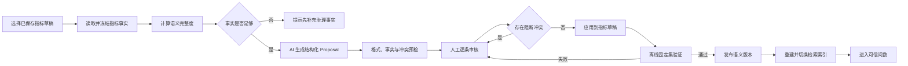
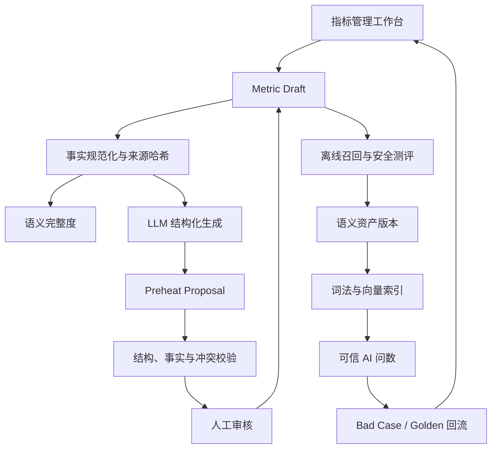

# AI 语义预热 PRD

## 1. 执行摘要

### 1.1 问题陈述

企业完成指标建设后，通常已经具备标准名称、业务定义、公式、单位和可用维度，但这些治理事实并不能完整覆盖用户的自然语言表达。真实用户会使用缩写、口语、部门习惯表达和相邻概念提问，例如同一个指标可能被称为“订单量”“下单数”或“成交单数”。

如果完全依赖人工枚举，语义准备成本会随指标数量持续增长；如果等待线上问数错误发生后再补充表达，第一批用户就会承担语言冷启动带来的召回失败和指标误选。

传统语义补充还容易只关注“应该命中什么”，忽视“不应该命中什么”：增加大量正向别名可能提高召回，却同时放大相邻指标误召回。

AI 语义预热要解决的是：

> 如何在用户提问前，基于已经确认的指标事实主动建设语言覆盖，同时不把指标口径和语义资产生效权交给大模型。

### 1.2 解决方案

DataPath 在指标进入正式问数前增加一条人机协同的语义预热链路：

```text
冻结已确认指标事实
→ 诊断语言资产完整度
→ AI 生成别名、正向问法和反向问法草稿
→ 结构、事实和冲突预检
→ 指标管理员逐条审核
→ 应用到指标草稿
→ 发布语义版本并重建检索索引
→ 通过固定集验证后进入可信问数
```

AI 的作用是降低“从空白开始写语言资产”的成本，而不是替代业务定义：

- AI 只能使用服务端提供的指标事实；
- AI 只能生成允许修改的语言字段；
- AI 输出先进入隔离草稿，不能直接影响线上召回；
- 人工审核、冲突规则和离线测评共同决定内容能否生效；
- 指标公式、聚合、模型、维度和权限始终由确定性系统控制。

### 1.3 产品价值

AI 语义预热不是独立的内容生成器，而是可信问数的提问前准备机制：


产品价值需要由两个结果共同证明：

1. 是否降低指标管理员准备语义资产的人力成本；
2. 是否提高正确指标召回，同时不增加相邻指标误召回。

“生成了多少条内容”只代表模型产量，不代表产品价值。

### 1.4 成功标准

| 维度 | 指标 | 产品要求 |
| --- | --- | ---: |
| 生成稳定性 | 结构化草稿生成成功率 | ≥ 95% |
| 建议价值 | 直接接受或修改后接受的建议占比 | ≥ 60% |
| 治理效率 | 单指标语义准备时长 | 较纯人工流程下降 ≥ 30% |
| 冷启动质量 | 新业务域首次发布 Recall@3 | ≥ 90% |
| 边界质量 | 错误指标选择 | 0 |
| 人工门禁 | 未审核语义进入线上召回 | 0 |
| 事实边界 | 预热导致公式、聚合、模型、维度或权限变化 | 0 |
| 可追溯性 | 已应用草稿具备来源哈希、模型和审核记录 | 100% |

当前项目已经形成 62 个审核别名、11 份语义档案和 220 条向量，并实现从生成草稿、人工应用到检索生效的基础链路。

### 1.5 产品范围

#### 本期范围

- 指标语义完整度诊断；
- 基于已保存指标草稿的单指标预热；
- 规范化指标事实快照和来源哈希；
- AI 生成别名、正向问法和反向问法；
- JSON 结构校验、清洗、去重、长度和数量限制；
- AI Proposal 与线上语言资产隔离；
- 人工接受、编辑、删除和应用；
- 同业务域别名冲突检查；
- 公式、聚合、模型、时间维度和可用维度不可变校验；
- 语义档案、词法索引和向量索引；
- 固定集测评、语义版本发布和召回追溯；
- 人工确认的 Bad Case 与 Golden 回流。

#### 非目标

- AI 自动创建指标；
- AI 修改指标公式、聚合方式、单位、维度、血缘、权限或发布状态；
- 未经审核自动将生成内容用于在线召回；
- 抓取或学习用户无权访问的问数内容；
- 使用所有线上问法直接训练模型；
- 用生成数量代替召回收益和误召回评测；
- 建设通用企业知识库；
- 在预热模块处理指标公式、数据关系或权限问题。

---

## 2. 用户体验与功能

### 2.1 用户角色

| 角色 | 核心目标 | 主要操作与权限 |
| --- | --- | --- |
| 指标管理员 | 降低语义准备成本并控制生效内容 | 诊断、生成、编辑、审核、应用和撤回 |
| 业务负责人 | 确认业务表达符合真实使用习惯 | 查看、评论、确认高风险表达 |
| 质量运营人员 | 将已确认的错误回流为语言边界 | 提供 Bad Case、Golden 和修复建议 |
| 只读审核员 | 检查生成依据和应用记录 | 查看草稿、差异、测评与审计 |
| 系统 | 控制事实、冲突、版本和发布门禁 | 生成任务、状态校验、索引和评测 |

### 2.2 核心用户流程



### 2.3 页面结构

预热能力位于指标草稿编辑页，不作为与指标脱离的独立内容后台。

页面包含六个区域：

1. **语义完整度**：当前得分、建议线、缺失项和硬门禁；
2. **指标事实摘要**：标准名称、定义、单位、模型和可用维度，仅只读展示；
3. **当前语言资产**：已有别名、正向问法和反向问法；
4. **AI 预热 Proposal**：生成状态、来源哈希、模型、生成时间和建议内容；
5. **人工审核区**：逐条接受、编辑、删除、拒绝和批量操作；
6. **冲突与发布区**：冲突对象、固定集结果、审核人、语义版本和索引状态。

用户必须先保存指标草稿才能发起生成，避免 AI 使用尚未形成版本的页面临时状态。

### 2.4 用户故事与验收标准

#### US-01：诊断语义完整度

> 作为指标管理员，我希望在生成前看到语言资产缺口，从而知道这个指标是否已经具备进入问数的基础条件。

验收标准：

- 完整度至少检查业务定义、Owner、别名、正向问法和反向问法；
- 每个扣分项说明缺少什么以及建议补充多少；
- 得分规则与版本可追溯；
- 完整度评分只用于诊断，不能改变指标公式和口径；
- 缺少标准名称、定义、公式、单位、模型或维度事实时禁止生成；
- 来源指标或模型不可用时禁止生成；
- 达到建议分数不代表自动发布。

#### US-02：生成 AI 语义草稿

> 作为指标管理员，我希望 AI 基于已确认事实生成语言草稿，从而不必从空白开始枚举用户表达。

验收标准：

- 生成前必须存在已保存的指标草稿；
- 输入只包含当前工作空间、业务域和允许比较的治理事实；
- 当前实现生成 5–12 条别名、8–20 条正向问法和 5–12 条反向问法；
- 输出必须符合固定 JSON Schema；
- 列表内容完成去空、去重和长度校验；
- 每次任务记录来源哈希、模型和生成时间；
- 结果状态为 `PROPOSED`，不能直接进入线上索引；
- 生成失败不能覆盖现有语言资产或产生半生效数据。

#### US-03：人工审核和编辑

> 作为指标管理员，我希望逐条修改或拒绝 AI 建议，从而确保语言资产符合真实业务习惯。

验收标准：

- 用户可以保留、编辑或删除每条建议；
- 页面区分模型原建议与人工最终值；
- 应用结果以人工提交内容为准；
- 系统记录审核人和审核时间；
- 可以标记拒绝原因：重复、不准确、过泛、边界错误或其他；
- 未生成 Proposal 时不能直接调用应用动作；
- 人工操作不会修改指标事实区的只读字段。

#### US-04：应用预热 Proposal

> 作为指标管理员，我希望审核完成后把语言内容应用到指标草稿，同时确保指标口径没有变化。

验收标准：

- 应用前重新计算来源事实哈希；
- 应用前重新校验指标版本和资产状态；
- 来源哈希变化时 Proposal 标记为 `STALE`，禁止应用；
- 应用前执行别名冲突和不可变字段校验；
- 应用只更新别名、正向问法和反向问法；
- 公式、聚合、模型、时间维度和可用维度保持不变；
- 状态从 `PROPOSED` 变为 `HUMAN_APPLIED`；
- 应用失败不改变现有草稿内容。

#### US-05：处理相邻指标冲突

> 作为指标管理员，我希望看到建议与哪些指标发生冲突，从而避免增加语言覆盖后选错业务口径。

验收标准：

- 同业务域内归一化别名完全一致时阻断应用；
- 正向问法同时高置信命中多个相邻指标时进入专项检查；
- 反向问法仍高置信命中本指标时标记自冲突；
- 时间、单位和维度等系统保留词不能成为独立别名；
- 页面展示冲突指标、冲突内容、风险级别和处理建议；
- 用户修改后可以重新运行冲突检查；
- 未解决的阻断冲突不能进入发布。

#### US-06：验证预热收益

> 作为指标管理员，我希望比较应用前后的检索表现，从而确认预热内容真正改善了问数质量。

验收标准：

- 冻结指标版本、语义版本、召回规则、向量模型和评测集；
- 至少运行目标指标正例、相邻指标反例、澄清和安全用例；
- 对比应用前后的 Top-1、Recall@3、错误指标和澄清结果；
- Recall@3 提升不能以错误指标增加为代价；
- 目标正例、相邻指标和安全门禁全部通过后才能发布；
- 测评失败保留原问题、预期指标、实际候选和失败原因；
- 测评报告与待发布语义版本关联。

#### US-07：处理来源变化和回滚

> 作为指标管理员，我希望指标事实变化后旧 Proposal 自动失效，从而避免过期表达进入检索。

验收标准：

- 生成时保存规范化来源事实哈希；
- 审核、应用和发布时重新计算哈希；
- 标准名称、定义、公式、模型、维度或资产状态变化后，未应用 Proposal 标记为 `STALE`；
- 已应用语言资产不被新 Proposal 自动覆盖；
- 索引切换失败时保留上一稳定语义版本；
- 回滚后恢复上一稳定版本并重建索引；
- 历史 Proposal、人工修改、审核和发布记录继续可查。

#### US-08：接收 Bad Case 和 Golden 回流

> 作为质量运营人员，我希望将人工确认的正确问法和错误边界回流给指标管理员，从而把线上问题转化为下一版语言资产。

验收标准：

- 回流内容必须关联已确认 Bad Case 和 Golden；
- 区分正确指标正例、原错误指标反例和指标区分说明；
- AI 可以基于回流证据生成修复 Proposal，但不能自动应用；
- Proposal 标明来源问题、根因和适用指标版本；
- 发布前运行目标 Golden、相邻指标和安全门禁；
- Golden 验证失败时禁止发布语义版本。

### 2.5 语义资产类型

| 类型 | 作用 | 示例 |
| --- | --- | --- |
| 标准名称 | 指标唯一、正式的业务名称 | 退款后净收入 |
| 别名 | 用户常用的等价表达 | 扣除退款后的收入 |
| 正向问法 | 应召回该指标的真实问题 | 2024 年退款后实际收入是多少 |
| 反向问法 | 看似相近但不应命中该指标的问题 | 2024 年订单原始金额是多少 |
| 区分说明 | 向用户或裁决模型解释相邻指标边界 | 关注扣除退款后的收入时使用 |

当前实现生成并持久化别名、正向问法和反向问法。区分说明属于后续增强资产，可与相邻指标审核和澄清体验联动。

### 2.6 为什么必须同时建设正例和反例

仅增加别名和正向问法会扩大目标指标的匹配范围，但无法说明边界。如果“收入”“销售额”“净收入”等相邻指标都只补充正向表达，召回层可能同时提高多个候选的分数，最终把压力转移给裁决模型。

DataPath 将语言资产设计为双向边界：

```text
正向问法：哪些表达应该把目标指标送入候选集
反向问法：哪些相似表达不应该把目标指标推到前面
```

反向问法同时用于：

- 召回特征中的负向信号；
- 相邻指标冲突检查；
- 离线负例测评；
- AI 有限候选裁决的区分上下文。

### 2.7 语义完整度

完整度用于提示准备情况，不直接代表业务口径正确。

| 组成项 | 建议权重 | 最低要求 |
| --- | ---: | --- |
| 业务定义 | 25% | 描述统计对象、业务动作和含义 |
| Owner 与治理事实 | 10% | Owner、单位、模型和维度完整 |
| 业务别名 | 20% | 至少覆盖一个非缩写业务表达 |
| 正向问法 | 25% | 覆盖适用的查值、趋势、排名或筛选 |
| 反向问法 | 20% | 至少覆盖一个相邻指标或超范围表达 |

建议发布线为 80 分。以下硬门禁不能被总分抵消：

- 指标公式、单位、时间字段或模型事实缺失；
- 可用维度与指标事实不一致；
- 来源资产未发布、已过期或不可用；
- 存在未解决的同名或相邻指标阻断冲突；
- 未完成人工审核；
- 固定集或安全门禁失败。

### 2.8 冲突规则

| 冲突类型 | 判定 | 级别 | 产品处理 |
| --- | --- | --- | --- |
| 完全同名 | 同业务域归一化别名一致 | 阻断 | 删除、限定表达或设计澄清 |
| 正反例自冲突 | 反向问法仍高置信命中本指标 | 阻断 | 修改别名、反例或边界 |
| 相邻指标混淆 | 正向问法同时命中多个相似指标 | 阻断 | 补充区分信息并重新测评 |
| 保留词冲突 | 时间、单位、维度等系统词成为独立别名 | 阻断 | 删除该建议 |
| 跨业务域同名 | 不同业务域存在相同表达 | 提示/澄清 | 依赖业务域上下文 |
| 高语义相似 | 未同名但超过相似阈值 | 提示 | 人工复核并记录结论 |

归一化至少处理大小写、全半角、空格、常用标点和登记缩写。规则、阈值和向量模型均需版本化。

### 2.9 状态机

完整状态设计：

```text
NOT_GENERATED
→ GENERATING
→ PROPOSED
→ HUMAN_REVIEWED
→ VALIDATING
→ VALIDATED
→ APPLIED
→ PUBLISHED
```

补充状态：

| 状态 | 含义 |
| --- | --- |
| `FAILED` | 模型调用、解析或结构校验失败 |
| `REJECTED` | Proposal 被人工整体拒绝 |
| `CONFLICTED` | 存在未解决阻断冲突 |
| `VALIDATION_FAILED` | 固定集或安全门禁失败 |
| `STALE` | 来源事实或资产状态变化 |
| `ROLLED_BACK` | 已恢复上一稳定语义版本 |

当前项目已经实现 `PROPOSED → HUMAN_APPLIED` 的基础状态。完整审核、验证、发布和回滚状态用于后续运营增强。

### 2.10 关键页面状态

| 页面状态 | 必须展示的信息 |
| --- | --- |
| 不可生成 | 缺失事实、资产状态或权限原因 |
| 未生成 | 当前完整度、缺失项和生成入口 |
| 生成中 | 任务状态和等待提示，不展示半成品 |
| 待审核 | 原建议、人工编辑值、类型和生成来源 |
| 冲突 | 冲突对象、级别、原因和修改入口 |
| 验证中 | 用例范围、基线版本和进度 |
| 验证失败 | 失败问法、实际候选、预期指标和修复入口 |
| 已应用 | 审核人、来源哈希、应用时间和当前内容 |
| 已发布 | 语义版本、索引版本和测评结果 |
| 来源过期 | 变化字段、旧/新哈希和重新生成入口 |

### 2.11 关键异常与降级

| 异常 | 产品处理 |
| --- | --- |
| 指标草稿未保存 | 阻止生成并提示先保存 |
| 生成服务未配置 | 标记失败，不改变当前语言资产 |
| 模型超时或响应无法解析 | `FAILED`，允许有限重试 |
| 输出缺失、重复或超长 | 结构校验失败，不进入审核 |
| 同一来源重复点击生成 | 使用幂等键返回原任务或创建明确新版本 |
| 审核期间指标事实变化 | 标记 `STALE`，禁止应用 |
| 应用时发现别名冲突 | 标记 `CONFLICTED` |
| 测评出现错误指标 | 阻断发布 |
| 索引重建失败 | 不切换线上语义版本 |
| AI 服务不可用 | 允许管理员继续人工维护语义资产 |

### 2.12 产品事件与漏斗

```text
metric_draft_saved
→ preheat_generation_started
→ preheat_generation_completed
→ preheat_review_completed
→ preheat_applied
→ preheat_validation_passed
→ semantic_version_published
→ retrieval_index_activated
```

| 指标 | 计算口径 |
| --- | --- |
| 预热使用率 | 发起预热的指标 / 满足生成条件的指标 |
| 生成成功率 | 结构化生成成功任务 / 已完成任务 |
| 直接采纳率 | 未修改接受建议 / 已审核建议 |
| 修改后采纳率 | 修改后接受建议 / 已审核建议 |
| 审核拒绝率 | 拒绝建议 / 已审核建议 |
| 单指标准备时长 | 首次生成至可发布的有效时长中位数 |
| 应用后发布率 | 发布指标 / 已应用预热指标 |
| 首次发布 Recall@3 | 正确指标进入前三候选 / 可回答冷启动用例 |
| 相邻指标误召回率 | 错误指标进入 Top-3 的相邻负例 / 相邻负例 |
| 预热来源命中率 | 使用预热语言资产召回的 Query Run / 全部 Query Run |

生成成功率和建议数量是过程指标，必须与采纳率、召回收益和误召回共同观察。

---

## 3. AI 系统要求

### 3.1 AI 输入

模型输入来自当前指标草稿的规范化事实快照：

- 指标 ID、标准名称和业务域；
- 业务定义、指标类型和单位；
- 公式的只读结构化摘要；
- 主语义模型和允许使用的字段摘要；
- 可用时间维度和分析维度；
- 已有别名、正向问法和反向问法；
- 允许比较的相邻指标摘要。

输入不包含：

- 原始业务明细数据；
- 数据库连接凭证；
- 用户无权访问的业务域资产；
- 离线评测问题和标准答案；
- 允许 AI 修改指标口径的操作指令。

### 3.2 事实快照与来源哈希

服务端在调用模型前对输入进行规范化：

1. 按固定字段顺序构造事实对象；
2. 对列表排序并去除不影响语义的格式差异；
3. 序列化为规范 JSON；
4. 计算 `source_sha256`；
5. 将哈希、指标版本和模型版本写入 Proposal。

审核和应用时重新计算来源哈希。哈希不一致意味着模型建议基于旧事实，必须重新生成或人工确认新版本，不能直接应用。

### 3.3 Prompt 设计

Prompt 由三部分组成：

#### 任务约束

- 只扩展用户表达，不修改指标定义；
- 不得杜撰字段、维度、业务规则和枚举；
- 必须同时生成正向和反向语言资产；
- 信息不足时输出空列表或警告，不补造事实。

#### 事实输入

- 当前指标的规范化事实；
- 现有语言资产；
- 经授权的相邻指标摘要。

#### 输出约束

- 只允许固定 JSON 字段；
- 别名 5–12 条；
- 正向问法 8–20 条；
- 反向问法 5–12 条；
- 不输出解释性正文、Markdown 或 SQL。

Prompt、模型、温度和输出 Schema 全部版本化。

### 3.4 AI 输出契约

当前输出：

```json
{
  "aliases": [],
  "positive_examples": [],
  "negative_examples": []
}
```

增强输出可以增加：

```json
{
  "distinctions": [],
  "warnings": []
}
```

结构规则：

- 每项必须是非空字符串；
- 单项长度不超过 200 字；
- 去除重复项并限制最大数量；
- 不允许出现未知字段；
- 不允许出现 SQL、公式修改或未提供维度；
- 结构校验失败时整份 Proposal 失败，不部分应用。

### 3.5 AI 能力边界

| AI 可以做 | AI 不可以做 |
| --- | --- |
| 扩展同义、口语和场景化表达 | 改写最终业务定义 |
| 生成应命中目标指标的典型问题 | 修改公式、聚合、单位、模型或维度 |
| 生成容易混淆但不应命中的问题 | 生成或执行 SQL |
| 基于相邻指标生成区分草稿 | 推断未提供的业务规则和枚举 |
| 根据格式问题重新生成 Proposal | 决定语义资产是否生效 |

AI 生成是建议权，人工审核和确定性校验共同拥有生效权。

### 3.6 模型与工具依赖

| 能力 | 当前依赖 |
| --- | --- |
| 事实读取 | 指标草稿、语义模型、维度、公式和资产状态服务 |
| 完整度 | 确定性评分规则 |
| 草稿生成 | DeepSeek 模型服务、低温度和 JSON 输出 |
| 冲突检查 | 名称/别名归一化、相邻指标和向量相似度 |
| 人工审核 | 指标管理工作台和服务端权限 |
| 检索索引 | BGE、pgvector 和词法索引 |
| 效果验证 | 正式指标召回、候选裁决和评测服务 |

模型不可用时，已有在线语言资产和问数能力不受影响，管理员仍可人工维护草稿。

### 3.7 生成安全

- 只发送完成任务所需的最小业务元数据；
- 工作空间和业务域在服务端完成裁剪；
- 公式只作为只读事实，不能成为可修改输出；
- 模型响应经过 JSON、字段、长度、数量和事实边界校验；
- Prompt 注入式文本不能改变输出 Schema 和允许修改字段；
- 模型密钥不写入页面、日志或 Proposal；
- 重试只针对传输或模型服务故障；
- 语义错误不能通过无限重试被隐藏；
- 生成内容始终停留在草稿层，应用动作由服务端权限控制。

### 3.8 评测策略

#### 生成结构层

| 评测项 | 通过条件 |
| --- | --- |
| JSON Schema | 100% 合法才进入人工审核 |
| 事实一致性 | 不改变名称、公式、单位、模型和维度 |
| 去重与长度 | 无空项、重复项和超长项 |
| 来源可追溯 | 具有来源哈希、模型、Prompt 和时间 |

#### 人工质量层

| 指标 | 说明 |
| --- | --- |
| 直接采纳率 | 无修改接受建议比例 |
| 修改后采纳率 | 修改后接受建议比例 |
| 拒绝率 | 不适用、错误或重复建议比例 |
| 审核时长 | 从 Proposal 生成到审核完成的有效操作时间 |

#### 检索收益层

- 使用同一固定集比较应用前后的 Top-1 和 Recall@3；
- 正向问法应召回目标指标；
- 反向问法不得错误选择目标指标；
- 相邻指标问题应正确选择或进入澄清；
- 超范围和权限问题保持原终态；
- 预热不能打开原本不支持的 Query DSL 形态；
- 错误指标、危险执行和越权放行均为 0。

#### 数据隔离

生成只使用规范化指标事实，不读取评测集问题和标准答案。评测集与预热输入隔离，避免根据答案反向构造语言资产。

---

## 4. 技术规格

### 4.1 架构概览



### 4.2 核心实体

| 实体 | 关键字段 |
| --- | --- |
| `MetricDraft` | 指标事实、当前语言资产、状态和校验结果 |
| `PreheatProposal` | 状态、来源哈希、模型、生成时间和建议列表 |
| `MetricAlias` | metric_id、alias、来源和生效状态 |
| `MetricSemanticProfile` | 正向问法、反向问法、更新人和时间 |
| `MetricEmbedding` | 指标、来源类型、文本哈希、模型、向量和版本 |
| `SemanticAssetVersion` | 人工审核内容、测评结果、生效时间和上一版本 |
| `PreheatEvaluationRun` | 基线、新版本、用例范围、结果和门禁状态 |

当前实现将 Proposal 保存在指标草稿的校验信息中，将审核后的别名、正向问法和反向问法发布到指标及语义档案。独立语义版本、建议项和回滚实体属于后续运营增强。

### 4.3 生成接口

生成接口：

```text
POST /api/chatbi/metrics/manage/drafts/{metric_id}/preheat/generate
```

处理流程：

1. 校验指标草稿存在；
2. 校验操作者具备指标管理权限；
3. 读取并规范化事实；
4. 计算 `source_sha256`；
5. 调用模型生成 JSON；
6. 清洗、去重和结构校验；
7. 保存 `PROPOSED` Proposal；
8. 返回完整度、建议内容和来源信息。

生成接口不得修改草稿中的现有语言资产。

### 4.4 应用接口

应用接口：

```text
POST /api/chatbi/metrics/manage/drafts/{metric_id}/preheat/apply
```

输入为人工最终确认的：

- `aliases`；
- `positive_examples`；
- `negative_examples`。

处理流程：

1. 校验 Proposal 存在；
2. 校验人工审核权限；
3. 重新校验指标事实和来源哈希；
4. 清洗并去重人工提交内容；
5. 校验同业务域别名冲突；
6. 比较不可变字段；
7. 更新指标草稿中的语言资产；
8. 将 Proposal 标记为 `HUMAN_APPLIED`；
9. 记录审核人和应用时间。

应用动作不等同于正式发布。线上召回只使用完成发布和索引切换的语义版本。

### 4.5 不可变字段门禁

预热应用和发布前，下列字段必须与来源事实保持一致：

- 工作空间和业务域；
- 指标标准名称；
- 指标类型和单位；
- Owner；
- 主语义模型；
- 公式和默认聚合；
- 时间维度；
- 可用维度集合。

预热只允许修改别名、正向问法和反向问法。需要修改不可变字段时，应退出预热流程并进入正式指标治理与回归流程。

### 4.6 索引构建与切换

审核并发布的语言资产进入两类检索结构：

| 索引 | 内容 | 作用 |
| --- | --- | --- |
| 词法索引 | 标准名称、别名和正向问法 | 精确、短语和 BM25 匹配 |
| 向量索引 | 指标定义、正向问法和反向边界 | 语义相似召回与区分特征 |

索引构建要求：

- 每条向量关联指标、来源类型、文本哈希和语义版本；
- 新索引构建完成前不切换线上版本；
- 切换时保证词法与向量索引使用同一语义版本；
- 切换失败保留上一稳定索引；
- Query Run 记录实际使用的索引与语言资产版本。

### 4.7 核心集成点

| 集成点 | 输入 | 输出 | 失败策略 |
| --- | --- | --- | --- |
| 指标草稿 | 已保存业务事实 | 规范化输入和来源哈希 | 不存在则拒绝生成 |
| 模型服务 | 规范化事实 | 结构化 Proposal | 不改变已有资产 |
| 完整度与冲突 | 事实和候选内容 | 分数、缺口和冲突 | 阻断应用或发布 |
| 人工审核 | Proposal 和编辑内容 | `HUMAN_APPLIED` 内容 | 记录审核人与差异 |
| 语义发布 | 审核内容和测评结果 | 语义资产版本 | 门禁失败则不发布 |
| 检索索引 | 已发布语言资产 | 词法项和向量 | 切换失败保留旧版本 |
| 可信问数 | 问题和语义版本 | 候选与召回来源 | Query Run 保留来源 |
| 质量闭环 | Bad Case 与 Golden | 修复 Proposal 来源 | 不自动应用 |

### 4.8 权限与安全

- 只有指标管理角色可以发起生成和应用；
- 核心指标可以要求业务负责人二次确认；
- 前端按钮状态不能替代服务端鉴权；
- 工作空间和业务域之间的输入、Proposal 和索引隔离；
- 不向模型发送原始明细数据和连接凭证；
- 生成输入、模型、响应摘要、人工修改和应用动作可审计；
- 已发布版本关联发布人、测评和来源事实；
- 资产不可用状态由服务端控制，不能在预热页面绕过。

### 4.9 性能与可靠性

| 场景 | 目标 |
| --- | ---: |
| 完整度计算 P95 | ≤ 1 秒 |
| 单指标生成 P95 | ≤ 30 秒 |
| 冲突检查 P95 | ≤ 2 秒 |
| 草稿保存成功率 | ≥ 99.9% |
| 未审核语义生效 | 0 |
| 应用失败对线上版本影响 | 0 |

生成任务需要超时、有限重试和幂等键。服务异常时不产生部分应用；索引重建成功并完成版本切换后，新语言资产才能进入在线召回。

### 4.10 可观测与审计

```text
指标事实版本
→ 来源哈希
→ Prompt / 模型版本
→ 原始 Proposal
→ 人工修改与审核
→ 冲突和测评结果
→ 语义资产版本
→ 索引版本
→ Query Run 召回来源
→ Bad Case / Golden
```

每次线上指标命中都应能反查使用的别名、正例、反例、索引和语义版本，从而判断预热内容是否带来收益或误召回。

---

## 5. 风险与路线图

### 5.1 当前实现基线

当前项目已经具备：

- 指标语义完整度和待完善项；
- 保存指标草稿后发起 AI 预热；
- 使用指标定义、公式、模型、字段和维度构造规范化输入；
- DeepSeek JSON 结构化生成；
- 5–12 条别名、8–20 条正向问法和 5–12 条反向问法的生成约束；
- 内容清洗、去重和长度限制；
- Proposal 来源哈希、模型、生成时间和人工审核要求；
- `PROPOSED → HUMAN_APPLIED` 状态；
- 人工提交内容覆盖模型原始建议；
- 同业务域别名冲突检查；
- 公式、聚合、模型、时间维度和可用维度不可变校验；
- 语义档案、BGE 向量和 pgvector 索引；
- 预热资产进入指标召回和有限候选判断；
- 预热事实与评测问题隔离；
- 跨事实指标预热及相关测评。

### 5.2 分阶段演进

#### MVP：完善生成、审核和可控生效

- 建议逐条审核和模型/人工差异视图；
- 固化完整度和冲突规则；
- 增加独立语义资产版本；
- 将固定集验证接入发布门禁；
- 支持回滚上一稳定语义版本。

#### V1.1：批量治理和效果分析

- 批量生成与风险排序；
- 相邻指标自动推荐和区分说明；
- 不影响线上排序的影子召回；
- 采纳率、审核时长、召回收益和误召回看板；
- 核心指标双人审核。

#### V2.0：质量闭环驱动预热

- 基于人工确认 Bad Case 和 Golden 推荐语义修复；
- 跨版本语义收益和复发趋势；
- 按业务域推荐最需要治理的指标；
- 多模型候选对比和成本质量路由；
- 继续保持人工审核与确定性发布。

### 5.3 灰度策略

1. 先只生成 Proposal，不开放应用；
2. 使用固定冷启动和相邻指标用例离线验证；
3. 对非核心指标开放人工应用；
4. 通过影子召回比较新旧语义版本；
5. 门禁稳定后按业务域扩大范围。

灰度期间重点观察：

- 草稿采纳率；
- 人工修改率；
- Recall@3 变化；
- 相邻指标误召回；
- 澄清触发与恢复；
- 索引切换失败。

### 5.4 回滚策略

出现以下情况停止新语义版本并恢复上一稳定版本：

- 错误指标选择出现；
- 相邻指标误召回显著上升；
- 权限或未发布资产门禁失败；
- 索引版本与语义版本不一致；
- 核心 Golden 回退；
- 来源指标或模型进入不可用状态。

回滚需要同时恢复语言资产版本、词法索引和向量索引，不能只回滚其中一项。

### 5.5 主要风险

| 风险 | 产品影响 | 缓解措施 |
| --- | --- | --- |
| 生成内容丰富但无检索收益 | 增加审核成本 | 固定集 A/B、采纳率和召回收益共同评估 |
| 只增加正例，忽视反例 | 相邻指标误召回 | 强制反向问法和冲突专项集 |
| AI 杜撰业务表达 | 错误语言进入草稿 | 最小事实输入、结构校验和人工审核 |
| 审核成为新瓶颈 | 指标发布速度没有改善 | 差异视图、批量操作和风险分层 |
| 人工一键全量接受 | 低质量建议进入生产 | 逐条审核、冲突检查和测评门禁 |
| 来源事实变化 | 过期 Proposal 污染检索 | 来源哈希、`STALE` 和不可变字段校验 |
| 评测数据泄漏进生成 | 离线结果虚高 | 生成输入与评测问题严格隔离 |
| 索引切换失败 | 新旧语言资产不一致 | 原子切换和旧索引保留 |
| 预热被理解为自动建指标 | 业务口径失控 | 产品提示、权限和不可变字段门禁 |
| 生成成本随指标增长 | 批量使用成本高 | 幂等缓存、变化触发和批量调度 |

### 5.6 后续验证重点

下一阶段优先验证：

1. AI Proposal 是否真正减少指标管理员从零编写的时间；
2. 直接采纳和修改后采纳分别反映哪些生成问题；
3. 正向覆盖提高时，相邻指标误召回能否保持为零；
4. 真实用户表达能否在指标上线前被固定集和影子召回覆盖；
5. 用户是否因为更准确的首次召回减少澄清和放弃；
6. Bad Case 回流后，语义修复能否降低同类问题复发；
7. 来源版本、语义版本、索引版本和 Query Run 能否完整追溯。

