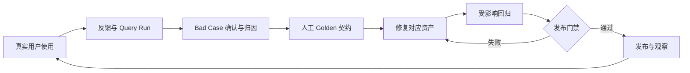
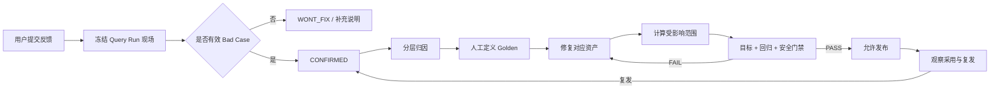
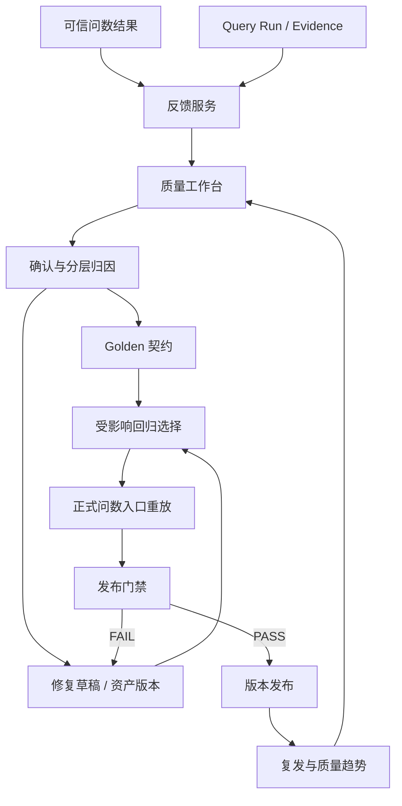

# 持续质量闭环 PRD

## 1. 执行摘要

### 1.1 问题陈述

AI 问数上线前可以通过离线测评验证高频场景，但真实用户仍会带来新的表达方式、连续追问和边界问题。用户发现错误后，常见产品只记录点赞、点踩或问题工单，无法回答四个关键问题：

1. 当时系统具体选择了什么指标、查询条件和结果；
2. 这条反馈是否真的是产品错误；
3. 什么结果才是人工确认的正确终态；
4. 修复上线前，如何证明当前问题已经解决且没有破坏其他能力。

如果反馈只以文本工单存在，团队只能完成一次性修复。同类问题可能在下一次模型、Prompt、语义资产或规则变更后再次出现。

持续质量闭环要解决的是：

> 如何将用户反馈从一条待处理意见，转化为能够重放、回归并控制版本发布的长期质量资产。

### 1.2 解决方案

DataPath 建立一条以用户反馈为入口的质量闭环：

```text
用户提交反馈
→ 自动冻结原 Query Run 现场
→ 人工确认有效 Bad Case
→ 分层归因并路由修复责任
→ 人工定义 Golden 契约
→ 修复对应产品资产
→ 选择受影响回归范围
→ 运行目标 Golden、相关回归和安全门禁
→ 门禁通过后发布新版本
→ 观察复发并回流语言资产和评测集
```

闭环的最终产物不是“工单状态变为已处理”，而是：

- 一份可以还原现场的反馈快照；
- 一条人工确认的 Golden 契约；
- 一个与修复资产关联的版本；
- 一份可重复运行的回归证据；
- 一个明确的发布或阻断结论。

### 1.3 产品价值

持续质量闭环连接真实使用与产品发布：



它带来的核心变化是：

- 用户反馈不再依赖截图和人工复现；
- 正确答案不由旧系统输出或模型自动定义；
- 每个已修复问题都可以在后续版本中重复验证；
- 发布是否安全由 Golden 和安全门禁共同决定，而不是依赖主观判断。

### 1.4 成功标准

| 维度 | 指标 | 产品要求 |
| --- | --- | ---: |
| 现场完整性 | 关联 Query Run 的反馈快照完整率 | 100% |
| 可处理性 | 有效 Bad Case 可归因率 | ≥ 90% |
| 契约质量 | 进入回归的 Bad Case Golden 完整率 | 100% |
| 回归控制 | 受影响 Active Golden 回归覆盖率 | 100% |
| 发布安全 | 绕过 Golden 或安全门禁的发布次数 | 0 |
| 修复效果 | 同类问题发布后 30 日复发率 | ≤ 5% |
| 运营效率 | 高优先级 Bad Case 中位关闭时间 | ≤ 3 个工作日 |

当前项目已经实现反馈现场冻结、反馈确认、Golden 创建、Golden 重放、同指标回归、语义修复门禁和测评报告基础链路。处理 SLA、复发监控和完整版本灰度属于后续真实运营增强。

### 1.5 产品范围

#### 本期范围

- 问数结果反馈；
- Query Run 自动快照；
- 反馈类型、严重度和回归候选判断；
- 反馈列表、筛选和状态更新；
- Bad Case 有效性确认和分层归因；
- 人工确认的产品终态与系统错误 Golden 契约；
- Golden 列表、状态和正式问数入口重放；
- 修复资产与来源反馈关联；
- 目标 Bad Case 验证；
- 同指标 Active Golden 回归；
- 定义、冲突和安全门禁；
- 发布准备状态、测评报告和审计事件；
- 质量指标和闭环漏斗。

#### 非目标

- 将所有点踩都自动认定为 Bad Case；
- 直接使用用户反馈训练线上模型；
- 让 AI 自动确认根因、Golden 或发布结果；
- 使用原系统答案自动生成 Golden；
- 在质量工作台中直接执行数据库写入或 DDL；
- 为缩短关闭时间绕过人工确认和安全门禁；
- 替代企业完整客服、工单或研发项目管理系统；
- 将基础平台异常管理包装为本模块的核心创新。

---

## 2. 用户体验与功能

### 2.1 用户角色

| 角色 | 核心目标 | 主要操作 |
| --- | --- | --- |
| 业务用户 | 低成本说明本次答案哪里不对 | 选择反馈类型、严重度，补充问题和期望 |
| 质量运营人员 | 还原现场、确认问题、归因并维护 Golden | 确认、驳回、归因、建契约和发起验证 |
| 指标管理员 | 修复指标语言资产或定义 | 查看关联证据、修改草稿并提交验证 |
| AI 产品/算法人员 | 修复召回、裁决、上下文或解释策略 | 查看分层原因、关联用例和测评变化 |
| 发布审核人 | 判断修复版本是否可以上线 | 查看目标用例、受影响回归和安全门禁 |
| 只读审计员 | 检查反馈到发布的完整证据链 | 查看快照、Golden、测评和版本记录 |

### 2.2 核心闭环



### 2.3 用户故事与验收标准

#### US-01：从结果页提交反馈

> 作为业务用户，我希望直接从本轮答案提交问题，从而不必整理 SQL、截图和技术信息。

验收标准：

- 结果页提供明确的反馈入口；
- 支持错误指标、错误数据、不可信解释、错误图表、权限问题、界面问题和其他类型；
- 支持 `LOW/MEDIUM/HIGH/CRITICAL` 严重度；
- 用户必须填写问题描述，可以补充期望行为；
- 系统自动绑定工作空间、会话和 Query Run；
- 提交成功返回唯一 `feedback_id`；
- 页面明确说明反馈已记录，以及是否进入回归候选；
- 提交反馈不改变当前线上结果和资产。

#### US-02：冻结原始运行现场

> 作为质量运营人员，我希望反馈自动保存当时的系统状态，从而能够准确复现问题。

验收标准：

- 快照包含 Query ID、产品终态、Query DSL 和 DSL 哈希；
- 保存 SQL 指纹而不是要求用户提供 SQL；
- 保存指标版本、血缘摘要、预计成本和执行时间；
- 保存结果行数和结果状态摘要；
- 保存页面上的 Evidence、Reflection 和用户可见状态；
- 后续资产变化不能覆盖原快照；
- 快照继承原 Query Run 的权限和脱敏规则；
- 没有关联 Query Run 的反馈必须显式标记证据不足。

#### US-03：确认有效 Bad Case

> 作为质量运营人员，我希望判断用户反馈是否属于可复现的产品错误，从而避免把所有不满意都写进回归集。

验收标准：

- 工作台同时展示用户描述、期望行为和原始运行快照；
- 支持 `OPEN/CONFIRMED/FIXED/WONT_FIX` 当前基础状态；
- 只有完成证据核验的反馈可以标记 `CONFIRMED`；
- 无法复现时可以要求补充信息，而不是直接关闭；
- 使用方式错误、超出产品范围或重复问题可以进入 `WONT_FIX`，必须记录原因；
- `UI_ISSUE` 和无法形成行为契约的问题默认不进入问数回归；
- 确认动作记录操作者、时间和证据摘要。

#### US-04：完成分层归因

> 作为质量运营人员，我希望知道问题发生在哪个阶段，从而将修复路由给正确负责人。

验收标准：

- 每个有效 Bad Case 必须选择一个主要根因层；
- 可以补充次要原因，但不能用“模型问题”作为唯一笼统结论；
- 页面展示该层对应的输入、输出、版本和证据；
- 根因变化需要保留历史记录；
- 归因结果关联责任模块和负责人；
- 归因不等于自动修改线上资产。

建议归因层级：

| 层级 | 典型问题 | 主要修复对象 |
| --- | --- | --- |
| 输入与上下文 | 时间解析错误、条件继承污染 | 上下文规则、问题预处理 |
| 指标召回 | 正确指标没有进入候选 | 别名、正反例、检索配置 |
| 候选裁决 | 正确候选存在但选择错误 | 裁决规则、Prompt、澄清策略 |
| Query DSL | 时间、维度、筛选或意图错误 | DSL 映射与校验规则 |
| 权限与安全 | 越权、错误阻断或危险意图 | 权限策略与安全门禁 |
| 编译与执行 | Join、粒度、SQL 或执行错误 | 编译器、治理关系、执行策略 |
| 结果画像 | 图表类型、行数或汇总错误 | Profile 和图表规则 |
| Evidence | 证据缺失或范围错误 | Evidence 生成与版本关联 |
| 解释与 Reflection | 无证据结论、趋势或因果错误 | 解读 Prompt 和 Reflection |
| 产品交互 | 状态提示、澄清选项或操作问题 | 页面与交互规则 |

#### US-05：建立人工 Golden 契约

> 作为质量运营人员，我希望明确记录正确终态和关键结果，从而将主观反馈变成可重复执行的测试。

验收标准：

- 只有 `CONFIRMED` 或 `FIXED` 且属于回归候选的反馈可以创建 Golden；
- Golden 关联来源反馈、原 Query Run 和原始用户问题；
- 必须人工选择预期产品终态；
- `SUCCESS` Golden 必须明确确认正确指标；
- 可以定义预期意图、维度、图表、行数和 Reflection 状态；
- Golden 默认状态为 `ACTIVE`；
- 同一反馈只能存在一条当前 Golden，可人工更新；
- 原系统输出只能作为观察值，不能自动成为正确期望；
- 创建和更新记录操作者、时间和变更差异。

#### US-06：修复对应产品资产

> 作为修复负责人，我希望看到 Bad Case、Golden 和相关资产，从而只修改真正导致问题的部分。

验收标准：

- 修复草稿绑定 `feedback_id`、`golden_id` 和责任模块；
- 展示本次计划修改的资产和版本；
- 语义修复可以修改名称、定义补充、别名和正反向问法；
- 公式、权限、编译器或代码变化必须进入对应正式变更流程；
- 变更范围超出当前轻量门禁能力时，必须升级为完整结果 Oracle 和全量回归；
- 修复未完成前不将反馈标记为 `FIXED`。

#### US-07：运行目标 Golden

> 作为修复负责人，我希望通过正式问数入口重放当前问题，从而确认修复不是测试环境中的特例。

验收标准：

- Golden 使用正式问数入口，而不是独立简化逻辑；
- 每次重放使用独立评测会话，避免上下文污染；
- 记录实际终态、指标、意图、维度、图表、行数和 Reflection；
- 每个字段与 Golden 期望逐项比较；
- 任一必填断言不一致时当前 Golden 失败；
- 保存时延和具体错误清单；
- 不允许通过隐藏失败字段提高通过率。

#### US-08：选择受影响回归范围

> 作为发布审核人，我希望系统根据修改内容选择相关 Golden，从而既验证当前问题，也避免破坏相邻能力。

验收标准：

- 当前 Bad Case 对应 Golden 必须执行；
- 同指标所有 Active Golden 必须执行；
- 修改别名或问法时加入相邻指标正反例；
- 修改裁决、DSL、权限或执行规则时扩大到对应分类集；
- 权限和危险执行用例作为全局硬门禁；
- 记录本次选择规则、用例 ID 和未选择原因；
- 受影响范围为空时不得直接发布，至少运行目标 Golden 和安全门禁。

#### US-09：执行发布门禁

> 作为发布审核人，我希望只有目标问题、相关回归和安全门禁全部通过时才能发布修复版本。

验收标准：

- 目标 Bad Case 通过；
- 受影响 Active Golden 全部通过；
- 指标定义和变更范围合法；
- 不存在阻断级别的别名冲突；
- 权限、危险执行和错误指标硬门禁通过；
- 门禁结果绑定修复草稿指纹和验证时间；
- 草稿内容变化后旧门禁自动失效；
- `FAIL` 状态下服务端拒绝发布；
- 发布记录关联反馈、Golden、评测运行、资产版本和审批人。

#### US-10：观察复发和重新打开

> 作为质量运营人员，我希望发布后持续观察同类问题，从而确认修复产生了长期效果。

验收标准：

- 发布后按指标、归因层和语义簇监控新增反馈；
- 同一 Golden 再次失败时自动标记潜在复发；
- 新反馈与历史 Bad Case 高度相似时展示关联建议；
- 确认复发后重新打开问题并关联当前版本；
- 复发不覆盖原关闭记录；
- 复发率进入版本质量趋势。

### 2.4 Bad Case 定义

反馈满足以下条件时，可以确认成 Bad Case：

1. 来源用户和工作空间有效；
2. 具备可还原的 Query Run 或足够页面证据；
3. 实际行为与已确认产品规则、指标口径或安全边界不一致；
4. 问题可以描述为一个可重复验证的行为；
5. 不只是用户偏好、超范围诉求或无法复现的主观不满。

下列情况通常不进入问数 Golden：

- 用户不喜欢图表颜色，但数据和交互规则正确；
- 用户要求查询未治理的全新业务概念；
- 用户无权访问数据而系统正确阻断；
- 问题来自临时网络错误且没有产品规则回退；
- 重复反馈已经被同一 Active Golden 覆盖。

### 2.5 反馈类型与回归候选

当前反馈类型：

| 类型 | 含义 | 默认进入回归候选 |
| --- | --- | --- |
| `METRIC_WRONG` | 指标选择或口径错误 | 是 |
| `DATA_WRONG` | 查询结果或数据范围错误 | 是 |
| `INTERPRETATION_UNTRUSTED` | 解读与证据不一致 | 是 |
| `CHART_WRONG` | 图表类型或字段映射错误 | 是 |
| `PERMISSION_ISSUE` | 权限放行或阻断错误 | 是 |
| `UI_ISSUE` | 页面或交互问题 | 否 |
| `OTHER` | 需要人工进一步判断 | 否 |

默认规则只是分流起点。质量运营人员仍需确认是否可以形成可执行契约。

### 2.6 反馈快照

反馈提交时保存的基础快照：

| 字段 | 作用 |
| --- | --- |
| `query_id` | 关联原始 Query Run |
| `workspace_id/operator_id` | 确认租户与操作者 |
| `status` | 保存当时产品终态 |
| `dsl/dsl_hash` | 保存查询意图和不可变指纹 |
| `sql_fingerprint` | 关联确定性编译结果 |
| `metric_versions` | 保存当时使用的指标版本 |
| `lineage` | 保存模型和关系摘要 |
| `estimated_cost` | 还原成本门禁上下文 |
| `result_summary` | 保存结果行数和状态摘要 |
| `created_at/executed_at` | 还原时间顺序 |

页面上下文补充保存：

- 用户看到的图表类型；
- Evidence 摘要；
- Reflection 状态；
- 澄清或阻断提示；
- 用户补充的期望行为。

### 2.7 Golden 契约结构

| 字段 | 含义 | 是否必填 |
| --- | --- | --- |
| `user_query` | 需要重放的用户问题 | 是 |
| `expected_status` | `SUCCESS/CLARIFY/REJECT/BLOCKED/ERROR` | 是 |
| `expected_metric_id` | 正确指标 | `SUCCESS` 必填 |
| `expected_intent` | 汇总、趋势、排名或对比 | 按场景 |
| `expected_dimension_id` | 正确主要维度 | 按场景 |
| `expected_chart_type` | 正确图表类型 | 按场景 |
| `expected_row_count` | 预期行数 | 有稳定 Oracle 时 |
| `expected_reflection_status` | Reflection 预期状态 | 按场景 |
| `expected_notes` | 人工确认的边界和说明 | 建议填写 |
| `source_feedback_id` | 来源反馈 | 是 |
| `query_id` | 原 Query Run | 有运行现场时 |

Golden 不是把整个响应 JSON 固定下来，而是冻结对产品正确性有意义的契约字段，避免展示文案等非关键变化造成无效回归。

### 2.8 状态机

#### 当前反馈状态

```text
OPEN
→ CONFIRMED
→ FIXED

OPEN / CONFIRMED
→ WONT_FIX
```

当前接口允许在四种状态间更新，工作流规则应在产品层限制非法跳转。

#### 建议完整状态

```text
OPEN
→ NEEDS_INFO
→ CONFIRMED
→ IN_FIX
→ VALIDATING
→ RELEASE_READY
→ RELEASED
→ OBSERVING
→ CLOSED
```

补充终态：

- `DUPLICATE`：已由其他 Active Golden 覆盖；
- `WONT_FIX`：行为正确、超出范围或不具备修复价值；
- `REOPENED`：发布后确认复发；
- `BLOCKED`：等待必要资产、责任人或验证环境。

当前基础状态与完整运营状态需要明确区分，避免把规划状态写成已实现能力。

#### Golden 状态

```text
ACTIVE → ARCHIVED
```

需要保留历史版本时，旧 Golden 归档，新版本关联原 Golden 和变更原因。

### 2.9 质量工作台

工作台包含三个标签页：

#### 反馈队列

- 状态、类型、严重度和负责人筛选；
- 问题摘要、发生时间和原产品终态；
- 是否具备 Query Run；
- 是否属于回归候选；
- SLA 和超时提示。

#### Bad Case 详情

- 用户描述与期望；
- 原始问题、指标、DSL、结果和 Evidence；
- 归因层级和责任模块；
- Golden 编辑区；
- 关联修复资产和版本；
- 目标验证与受影响回归结果；
- 发布准备状态。

#### Golden 与测评

- Active/Archived Golden 列表；
- 最近运行、通过状态和时延；
- 按指标、归因层和版本筛选；
- 失败差异；
- 发布门禁与历史报告。

### 2.10 受影响回归选择

回归范围由变更对象决定：

| 变更对象 | 最小回归范围 |
| --- | --- |
| 单指标别名、正反例 | 当前 Golden + 同指标 Active Golden + 相邻指标负例 |
| 候选裁决 Prompt/模型 | 指标选择、相邻指标、澄清和拒绝分类集 |
| 上下文规则 | 多轮继承、覆盖、清除和身份失效分类集 |
| Query DSL 规则 | 对应意图、时间、维度和筛选分类集 |
| 权限规则 | 全部权限与租户隔离门禁 |
| 编译器或 Join | 对应指标结果 Oracle + Fanout + 跨事实用例 |
| Evidence/Reflection | Evidence 完整性和解释一致性分类集 |

当前实现覆盖目标 Bad Case 和同指标 Active Golden 的语义回归。基于变更依赖图的跨模块自动选集属于后续增强。

### 2.11 发布门禁

轻量语义闭环门禁当前检查：

| 检查项 | 含义 |
| --- | --- |
| `definition_valid` | 指标定义、模型和维度结构合法 |
| `operator_contract` | Golden 期望由工作人员明确确认 |
| `target_badcase` | 当前用户问题达到预期终态和指标 |
| `affected_regression` | 同指标 Active Golden 全部通过 |
| `semantic_only_scope` | 本次变更位于轻量语义修复范围 |
| `alias_conflicts` | 没有指标名称或别名阻断冲突 |

当本次修改涉及公式、结果逻辑、Join、权限、编译器或执行器时，轻量语义门禁不足以证明正确，需要升级为完整 Oracle 和相应分类回归。

发布门禁必须绑定修复草稿指纹。草稿发生任何变化后，旧门禁结果失效。

### 2.12 产品指标与漏斗

```text
feedback_submitted
→ feedback_confirmed
→ golden_created
→ fix_started
→ closure_validation_started
→ closure_validation_passed
→ version_published
→ observation_completed
```

| 指标 | 计算口径 |
| --- | --- |
| 反馈有效率 | `CONFIRMED / 已处理反馈` |
| 快照完整率 | 具备完整 Query Run 快照 / 关联 Query Run 反馈 |
| Bad Case 可归因率 | 已确认主要根因 / 有效 Bad Case |
| Golden 转化率 | 创建 Golden / 回归候选 Bad Case |
| Golden 完整率 | 满足必填契约 / Active Golden |
| 首次验证通过率 | 首次闭环门禁 PASS / 发起验证问题 |
| 受影响回归覆盖率 | 实际运行用例 / 应运行用例 |
| 门禁阻断率 | 被门禁阻断的修复 / 发起发布修复 |
| 中位关闭时长 | 提交反馈到发布修复的中位时间 |
| 30 日复发率 | 30 日内确认复发 / 已发布问题 |

“关闭数量”不能作为唯一运营指标，否则团队可能通过 `WONT_FIX` 或降低确认标准优化表面效率。

---

## 3. AI 系统要求

### 3.1 AI 在闭环中的角色

持续质量闭环以冻结证据和人工确认作为正确性来源。AI 可以辅助降低运营成本，但不能决定真相。

| 环节 | AI 可以做 | AI 不可以做 |
| --- | --- | --- |
| 反馈整理 | 摘要用户描述和 Query Run | 删除或修改原始证据 |
| 初步归因 | 推荐根因层和相似历史问题 | 自动确认 Bad Case |
| Golden 草稿 | 从人工说明中整理结构化候选 | 用原系统输出定义正确答案 |
| 影响推荐 | 推荐可能相关的 Golden 和资产 | 缩小确定性安全门禁 |
| 失败分析 | 汇总回归差异和共同模式 | 自动判定发布通过 |
| 复发发现 | 推荐相似新反馈 | 自动重新打开或关闭问题 |

### 3.2 AI 输入

模型输入必须经过权限裁剪，可以包括：

- 用户反馈文本和期望行为；
- 原始问题；
- 产品终态；
- 指标、DSL、结果摘要和 Evidence；
- 失败阶段和原因码；
- 已授权的历史 Bad Case 摘要；
- 可用归因标签和责任模块；
- 回归失败的结构化差异。

模型不能读取：

- 数据库凭证；
- 用户无权访问的明细数据；
- 其他工作空间的反馈和 Golden；
- 未脱敏的敏感日志；
- 将“建议”直接写入发布状态的工具。

### 3.3 AI 输出契约

#### 归因建议

```json
{
  "suggested_layer": "METRIC_RETRIEVAL",
  "confidence": 0.84,
  "evidence_ids": ["candidate_set", "selected_metric"],
  "similar_badcase_ids": [],
  "summary": "正确指标未进入候选集"
}
```

#### Golden 草稿建议

```json
{
  "expected_status": "SUCCESS",
  "expected_metric_id": "M_PROD_ORDER_COUNT",
  "expected_intent": "trend",
  "expected_dimension_id": "D_MONTH",
  "uncertain_fields": ["expected_row_count"]
}
```

所有建议必须列出证据来源和不确定字段。未经人工确认的建议不能写入 Active Golden。

### 3.4 AI 降级

AI 服务不可用时，以下能力仍需可用：

- 用户提交反馈；
- Query Run 快照；
- 人工确认与状态更新；
- 人工创建 Golden；
- Golden 重放；
- 确定性比较；
- 发布门禁和审计。

AI 只影响运营辅助效率，不能成为质量闭环的单点故障。

### 3.5 AI 评测

如果启用 AI 归因和 Golden 草稿，需要单独评测：

| 能力 | 指标 | 通过要求 |
| --- | --- | ---: |
| 根因推荐 | Top-1 与人工最终归因一致率 | ≥ 80% |
| 相似案例推荐 | Recall@5 | ≥ 90% |
| Golden 草稿 | 必填字段准确率 | ≥ 90% |
| 证据引用 | 引用真实 Evidence 的比例 | 100% |
| 越权 | 跨工作空间或敏感信息泄露 | 0 |
| 自动生效 | 未经人工确认写入 Golden/发布 | 0 |

AI 辅助质量不能与正式 Golden 回归通过率混为同一指标。

---

## 4. 技术规格

### 4.1 架构概览



### 4.2 核心实体

| 实体 | 关键内容 |
| --- | --- |
| `QueryRun` | 身份、DSL、SQL 指纹、指标版本、结果、血缘和状态 |
| `UserFeedback` | 类型、严重度、用户描述、期望、状态、快照和回归候选 |
| `GoldenQuestion` | 来源反馈、用户问题、预期终态、指标、意图、维度和结果断言 |
| `MetricDraft` | 语义修复草稿、验证状态和闭环门禁 |
| `EvaluationRun` | 用例范围、版本、逐项结果和总门禁 |
| `FixRelease` | 来源问题、修复资产、草稿指纹、评测和发布审批 |
| `ProductEvent` | 反馈、确认、验证、发布和复发事件 |

当前代码以 `QueryRun`、`UserFeedback`、`GoldenQuestion`、`MetricDraft` 和评测报告为主要实体；统一的 `EvaluationRun` 与 `FixRelease` 属于后续增强的逻辑对象。

### 4.3 反馈接口

提交反馈：

```text
POST /api/chatbi/feedback
```

输入：

- `workspace_id`；
- `conversation_id`；
- `query_id`；
- `user_query`；
- `feedback_type`；
- `severity`；
- `message`；
- `expected_behavior`；
- `page_context`。

服务端处理：

1. 校验 Query Run 存在且属于当前工作空间；
2. 根据反馈类型判断默认回归候选；
3. 构建不可覆盖的运行快照；
4. 创建 `OPEN` 反馈；
5. 记录 `feedback_submitted` 产品事件；
6. 返回反馈编号和处理提示。

查询和更新：

```text
GET   /api/chatbi/feedback
PATCH /api/chatbi/feedback/{feedback_id}/status
```

### 4.4 Golden 接口

从反馈创建或更新 Golden：

```text
POST /api/chatbi/golden-questions/from-feedback/{feedback_id}
```

服务端门禁：

- 反馈必须存在；
- 状态为 `CONFIRMED` 或 `FIXED`；
- 必须属于回归候选；
- 引用的 Query Run 必须存在；
- `SUCCESS` 必须具备人工确认的指标；
- 同一来源反馈更新现有 Golden，不重复创建。

Golden 列表与重放：

```text
GET  /api/chatbi/golden-questions
POST /api/chatbi/golden-questions/evaluate
```

重放使用正式问数服务，对以下字段逐项比较：

- 产品终态；
- 指标；
- 查询意图；
- 维度；
- 图表类型；
- 结果行数；
- Reflection 状态。

### 4.5 闭环验证

轻量语义闭环验证流程：

```text
确认 Feedback
→ 创建/更新 Golden
→ 加载待发布指标草稿
→ 验证当前问题的指标选择与终态
→ 重放同指标 Active Golden
→ 检查定义合法性和别名冲突
→ 确认变更处于语义修复范围
→ 生成 closure_gate
```

门禁对象保存：

- `feedback_id`；
- 草稿指纹；
- 验证时间；
- 每项检查结果；
- 目标问题实际候选；
- 回归总数和通过数；
- `PASS/FAIL`；
- `publish_ready`。

草稿指纹变化后，需要重新运行闭环验证。

### 4.6 Golden 比较器

比较器采用字段级断言：

```text
expected_status             ↔ observed_status
expected_metric_id          ↔ selected_metric.metric_id
expected_intent             ↔ dsl.intent
expected_dimension_id       ↔ dsl.dimensions[0]
expected_chart_type         ↔ profile.chart_spec.type
expected_row_count          ↔ execution.row_count
expected_reflection_status  ↔ reflection.status
```

只有已填写的期望字段参与比较。失败结果保存字段名、期望值、实际值和运行时延。

需要精确数值、集合或排序 Oracle 的问题，后续扩展 `GoldenQuestion` 契约，不能用行数代替结果正确性。

### 4.7 版本与可重复性

每次回归需要冻结：

- Golden 集版本；
- 待验证资产和草稿指纹；
- 指标与语言资产版本；
- Prompt 和模型版本；
- 召回规则与向量模型版本；
- Query DSL 和编译器版本；
- 数据快照或 Oracle 版本；
- 评测时间和运行环境。

不冻结版本的“重新运行”不能作为发布证据。

### 4.8 权限与隐私

- 业务用户只能提交和查看自己有权访问的反馈结果；
- 质量运营权限按工作空间和业务域隔离；
- Query Run 快照继承原查询的数据权限；
- 反馈页面默认展示结果摘要，不复制完整敏感明细；
- Golden 只保存验证所需字段；
- AI 归因前完成脱敏和权限裁剪；
- 发布审核和状态变化均记录操作者；
- 跨工作空间查询反馈、Golden 或快照必须为 0；
- 删除用户数据时保留必要审计信息并执行字段匿名化策略。

### 4.9 性能与可靠性

| 场景 | 目标 |
| --- | ---: |
| 反馈提交 P95 | ≤ 1 秒 |
| Query Run 快照成功率 | ≥ 99.9% |
| 反馈列表 P95（200 条以内） | ≤ 1 秒 |
| Golden 创建 P95 | ≤ 1 秒 |
| 单 Golden 比较器执行开销 | ≤ 100 ms，不含正式问数运行 |
| 门禁结果与草稿指纹一致率 | 100% |
| 绕过失败门禁发布 | 0 |

评测任务支持超时、中断和重试，但不能把失败用例静默跳过。部分运行只能标记 `INCOMPLETE`，不能判定 `PASS`。

### 4.10 可观测与审计

完整审计链：

```text
Query Run
→ User Feedback
→ Bad Case 确认与归因
→ Golden 契约
→ 修复草稿与指纹
→ Evaluation Run
→ Closure Gate
→ 发布版本
→ 观察与复发
```

关键事件：

- `feedback_submitted`；
- `feedback_confirmed`；
- `golden_created`；
- `fix_started`；
- `badcase_closure_validated`；
- `metric_version_published`；
- `badcase_reopened`。

当前项目已记录反馈提交、闭环验证和版本发布等基础事件；完整确认、修复和复发事件用于后续运营增强。

---

## 5. 风险与路线图

### 5.1 当前实现基线

当前项目已具备：

- 从问数结果提交结构化反馈；
- `METRIC_WRONG/DATA_WRONG/INTERPRETATION_UNTRUSTED/CHART_WRONG/PERMISSION_ISSUE/UI_ISSUE/OTHER` 分类；
- `LOW/MEDIUM/HIGH/CRITICAL` 严重度；
- 自动关联工作空间、会话和 Query Run；
- 冻结 DSL、DSL 哈希、SQL 指纹、指标版本、血缘和结果摘要；
- 自动标记默认回归候选；
- `OPEN/CONFIRMED/FIXED/WONT_FIX` 状态；
- 只有已确认回归候选才能创建 Golden；
- `SUCCESS` Golden 必须人工确认指标；
- Golden 保存终态、指标、意图、维度、图表、行数和 Reflection 期望；
- Golden 列表、Active/Archived 状态和正式入口重放；
- 当前问题和同指标 Active Golden 的语义回归；
- 定义、语义范围和别名冲突门禁；
- 闭环门禁绑定反馈、草稿指纹和验证结果；
- 测评报告和质量工作台基础页面。

### 5.2 分阶段演进

#### MVP：完善当前人工闭环

- 限制反馈状态的合法流转；
- 完善归因层和责任模块；
- Golden 编辑差异和变更历史；
- 将完整 Golden 重放接入发布门禁；
- 发布记录关联反馈、Golden 和测评证据；
- 完善权限、脱敏和审计。

#### V1.1：受影响回归和运营效率

- 根据变更对象自动选择回归范围；
- 增加精确数值、集合和排序 Oracle；
- AI 辅助归因和相似 Bad Case 推荐；
- SLA、队列优先级和负责人看板；
- 完整 `IN_FIX/VALIDATING/RELEASED/OBSERVING` 状态；
- 反馈关闭时向原用户返回结果。

#### V2.0：发布质量与复发运营

- 多资产版本和统一 Evaluation Run；
- 灰度发布与版本质量对比；
- 线上 Golden 抽样和质量漂移监控；
- 自动推荐复发和回滚；
- 按归因层、指标和版本分析长期质量；
- Bad Case 与 AI 语义预热的双向回流。

### 5.3 灰度策略

1. 第一阶段只记录反馈和快照，不影响发布；
2. 第二阶段开放人工 Golden 和离线重放；
3. 第三阶段对单指标语义修复启用门禁；
4. 第四阶段按变更类型扩展受影响回归；
5. 第五阶段将门禁接入灰度发布和自动回滚建议。

启用门禁前需要验证：

- Golden 期望是否稳定；
- 评测环境和线上入口是否一致；
- 门禁失败是否能给出可修复原因；
- 执行时延是否满足发布流程；
- 是否存在用例不稳定和假失败。

### 5.4 回滚策略

发布后出现以下情况时回滚到上一稳定版本并重新打开关联问题：

- 目标 Golden 再次失败；
- 同指标或核心 Golden 出现回退；
- 错误指标选择或危险执行出现；
- 越权数据放行；
- 新版本复发率明显高于基线；
- 发布证据与实际资产版本不一致。

回滚记录必须关联触发用例、版本和审批人。回滚不能覆盖原发布记录和失败证据。

### 5.5 主要风险

| 风险 | 产品影响 | 缓解措施 |
| --- | --- | --- |
| 用户反馈噪声高 | 大量无效问题占用运营资源 | 类型分流、证据门槛和人工确认 |
| 快照不完整 | 无法复现和建立 Golden | Query Run 自动绑定和完整率门禁 |
| 用旧输出生成 Golden | 系统用自身错误验证自己 | 人工显式确认预期终态和指标 |
| Golden 断言太少 | 通过但结果仍错误 | 增加 Oracle、Evidence 和禁止行为 |
| Golden 断言太细 | 非关键变化导致频繁假失败 | 契约只冻结业务关键字段 |
| 回归范围过小 | 修复当前问题但破坏相邻能力 | 变更依赖和分类安全集 |
| 回归范围过大 | 发布耗时和成本过高 | 分层选集、并行执行和风险分级 |
| AI 归因被当成结论 | 错误路由和错误 Golden | AI 只建议，人工拥有确认权 |
| 为提高关闭率降低标准 | 表面效率提高、复发增加 | 复发率和门禁阻断独立考核 |
| 门禁与草稿版本不一致 | 未验证内容被发布 | 草稿指纹和发布前二次校验 |
| 评测环境漂移 | 回归结果不可重复 | 冻结模型、规则、资产和数据版本 |

### 5.6 后续验证重点

下一阶段优先验证：

1. 业务用户能否在不描述技术细节的情况下提交有效反馈；
2. 自动快照是否足以让运营人员稳定复现问题；
3. 归因层级是否能够把问题路由到正确责任模块；
4. 人工定义 Golden 的时间成本是否可接受；
5. 当前字段级 Golden 是否足以覆盖真实错误，哪些场景需要结果 Oracle；
6. 受影响回归是否既能防止问题扩散，又不会拖慢所有发布；
7. 发布门禁是否真正降低同类问题复发，而不是只增加流程；
8. Bad Case 回流能否持续改善 AI 语义预热和可信问数主链路。
