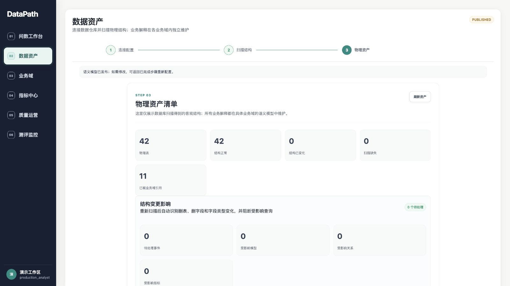
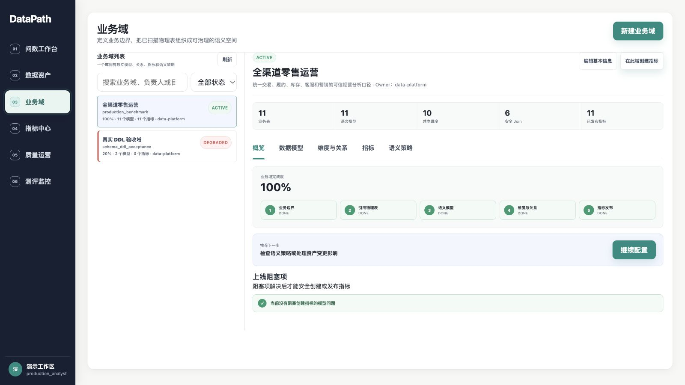
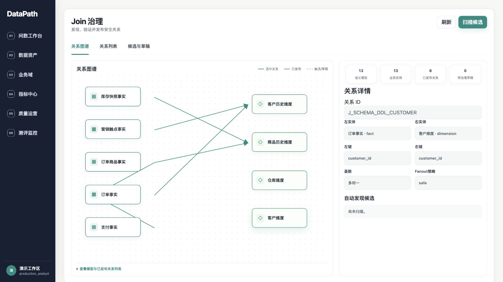
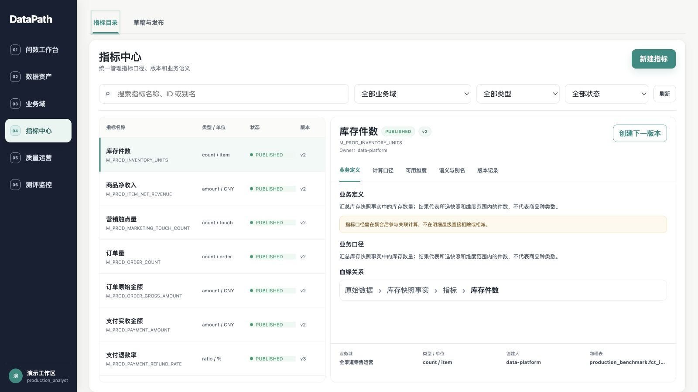
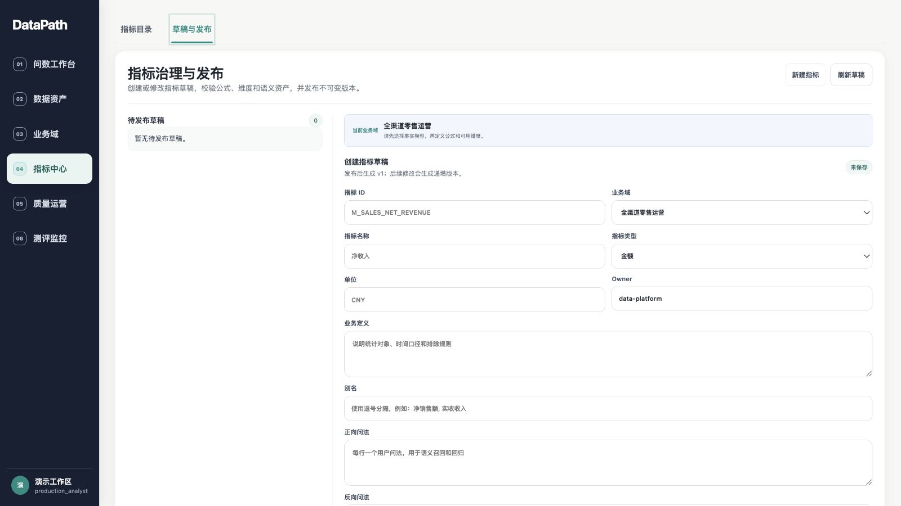
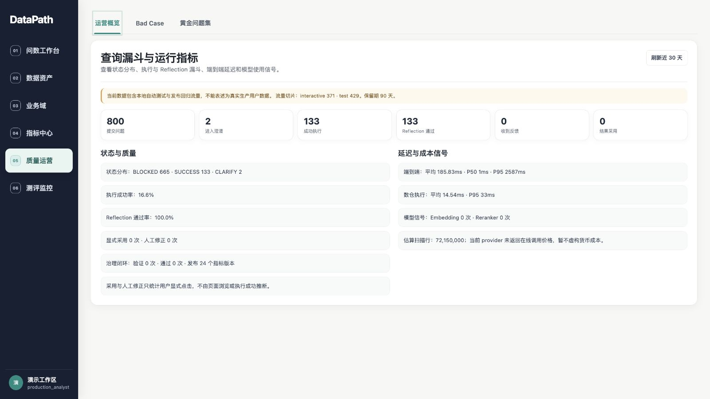
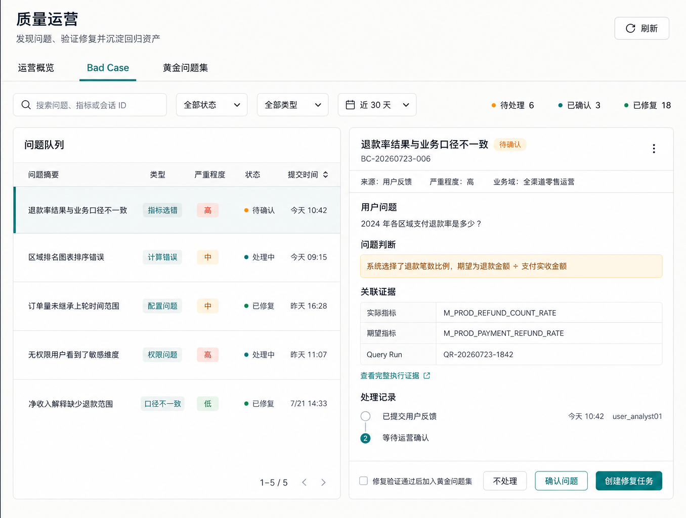
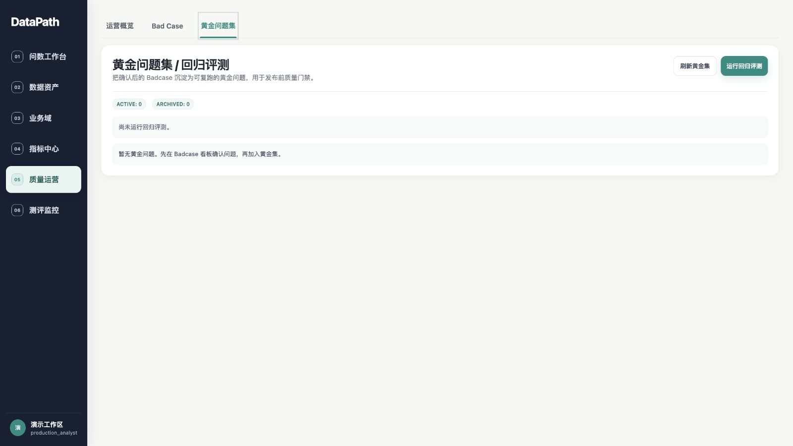
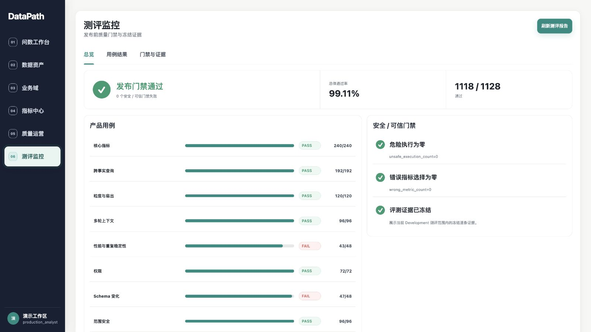

# DataPath 产品页面截图

本图册集中展示 DataPath 当前已经实现的 10 个主要产品页面。README 负责说明各页面在产品中的作用，这里保留完整界面，便于继续查看功能细节。

## 1. 数据资产

配置并扫描数据源，查看物理表、字段、Schema 状态以及结构变化带来的影响。

## 2. 业务域

围绕业务边界组织语义模型、共享维度、指标和语义策略，形成相互隔离的治理空间。

## 3. Join 治理

以关系图谱查看模型连接，维护连接键、基数和 Fanout 策略，只有通过治理的安全关系才能进入跨事实查询。

## 4. 指标中心

统一检索指标，并查看业务定义、计算口径、可用维度、血缘、版本和发布状态。

## 5. 指标治理与发布

创建和校验指标草稿，配置公式、维度与语义资产；AI 语义预热生成的内容需要经过人工确认后才能应用和发布。

## 6. 问数工作台

用户通过自然语言提出业务问题，在同一会话中查看指标结果、趋势图、数据表并继续追问。

## 7. 查询漏斗与运行指标

汇总提交、澄清、成功执行、Reflection、反馈和采用等环节，并展示状态、延迟及模型使用信号。

## 8. Bad Case 工作台

保存用户反馈对应的原始运行现场，用于确认问题、归因和后续修复。没有待处理反馈时，页面明确显示当前队列状态。

## 9. Golden 与回归

将确认后的问题沉淀为 Golden 问题，重放目标用例和相关回归，作为修复验证与发布判断的依据。

## 10. 测评监控

集中展示分类用例结果、安全与可信门禁、冻结证据和发布状态。

